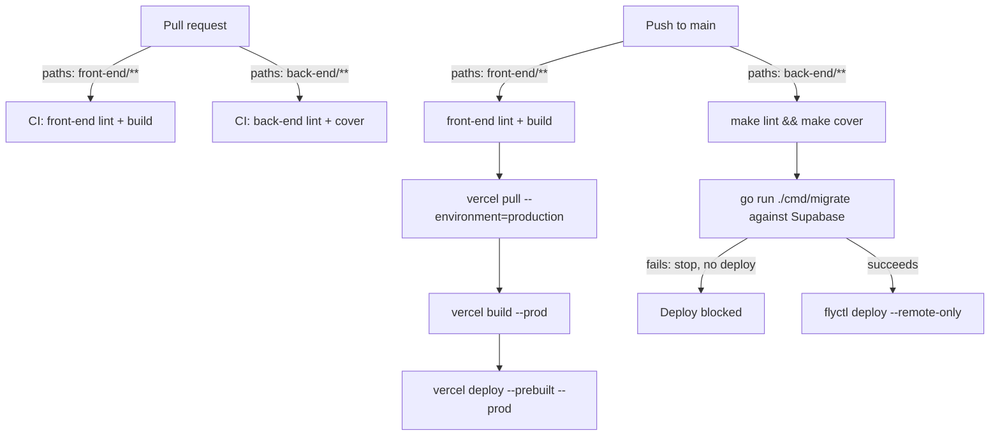

# CI/CD: deploy front-end to Vercel, back-end to Fly.io, migrate Supabase

Status: Ready
Last updated: 2026-10-09
Depends on: none

## Summary
Two GitHub Actions pipelines: one lints, tests and deploys `front-end/` to Vercel via the Vercel CLI; one lints, tests, migrates and deploys `back-end/` to Fly.io. The database moves from local-only Postgres to a Supabase Postgres project; schema migrations run as an explicit, blocking CI step against Supabase before the new back-end image is deployed — never implicitly on app boot.

## Problem
Today there is no automated deployment at all: no `.github/`, no `Dockerfile`, no `fly.toml`, no `vercel.json` (confirmed empty by globbing the repo). Shipping a change means manual, undocumented steps on someone's machine, against a database that only exists in `back-end/docker-compose.yml` on localhost. That doesn't scale past one person and has no safety net (no test gate before a change reaches users, no record of what was deployed when).

## Goals
- A push to `main` that touches `front-end/**` lints, builds and deploys that app to Vercel production automatically.
- A push to `main` that touches `back-end/**` lints and tests the Go app, applies any pending Supabase schema migration, and only then deploys the new image to Fly.io — a failed migration blocks the deploy.
- A pull request touching either side gets a fast lint+test signal before merge, without deploying anything.
- The production database is a real Supabase Postgres project, reachable by both the deployed Fly app and the CI migration step.
- Nothing in this spec changes local development: `make db-up`/`make run` against the docker-compose Postgres keeps working exactly as today.

## Non-goals
- Preview/staging environments (Vercel PR previews, a second Fly app, a Supabase branch). Deferred to a follow-up spec once the team wants them — see Out of scope.
- Automated rollback on a bad deploy. Deferred — see Out of scope.
- A migration review/approval gate (e.g. a manual "approve this SQL" step). Deferred — see Out of scope.
- Monitoring/alerting beyond what GitHub Actions, Fly and Supabase show natively. Out of scope for this spec.
- Any change to the application's business logic, routes or domain model. This is infrastructure only.

## Current state
- No CI/CD exists: `.github/`, `Dockerfile`, `fly.toml`, `vercel.json` all absent from the repo.
- `back-end/cmd/webapp/main.go:42` calls `postgres.Migrate(ctx, pool)` on every process boot — this must be removed as part of this spec (see Decision log #1).
- Migrations are goose SQL files embedded in the binary via `//go:embed migrations/*.sql` in `back-end/internal/src/infrastructure/postgres/postgres.go:14`, applied by `postgres.Migrate`/`postgres.MigrateFS` (`postgres.go:34-48`). Four migrations exist today: `0001_users.sql`, `0002_rules.sql`, `0003_seed_dev_users.sql` (dev-only seed, explicitly marked "not production-safe" in its own header comment), and `0004_guilds.sql` (creates `guilds`/`guild_members` and seeds the `familia` guild with the same four users `0003` seeds). Both `0003` and `0004` are expected to run against Supabase too, per Business rule #4 — see that rule for why this is an accepted interim state, not a bug.
- `back-end/cmd/webapp/main.go:29` defaults `DATABASE_URL` to the local docker-compose connection string; `JWT_SECRET` is required and has no default in `main.go` (`log.Fatal` if unset) — the Makefile injects a dev-only default (`Makefile:10`) for `make run`/`make dev` only.
- `back-end/go.mod:3` pins `go 1.26.2`. No Dockerfile exists to build a container image yet.
- Back-end tests: `make test` (unit + integration) and `make cover` (same, enforcing 100% coverage of `./internal/...` and `./cmd/webapp/routes/...` via `back-end/scripts/check-coverage.sh`). Integration tests (`back-end/test/integration/main_test.go:43-59`) start their own throwaway Postgres via testcontainers and use a hardcoded test JWT secret (`main_test.go:28`) — they need Docker on the runner but need no real `JWT_SECRET`/`DATABASE_URL` secret.
- `back-end/Makefile:38-40` defines `lint` (`go vet` + `gofmt -l`), already CI-ready as-is.
- Front-end: `front-end/package.json` scripts are `dev`, `build`, `start`, `lint` (ESLint only, Next's built-in type-checking happens during `next build`). Node `>= 22` per `front-end/.nvmrc:1`.
- `front-end/next.config.ts:4,11` reads `process.env.BACKEND_URL` (default `http://localhost:8080`) to build the `rewrites()` destination that proxies `/api/v1/*` to the Go API. Per `node_modules/next/dist/docs/01-app/02-guides/environment-variables.md`, non-`NEXT_PUBLIC_` variables are server-only and resolved when the config/server evaluates — in Vercel's case that means **build time**, so `BACKEND_URL` must be present when `vercel build` runs, which means it must be set as a **Production environment variable in the Vercel project** before the first deploy (see Business rule #7 and Edge cases — if it's missing, the build still succeeds silently and proxies to `localhost`, breaking every API call in production).
- `front-end/lib/api.ts`, `lib/auth.ts`, `app/entrar/page.tsx`, `components/AuthGate.tsx` already implement login end-to-end against the real back-end (see the earlier login spec discussion in this session) — nothing there changes.
- No CORS setup exists on the back-end, and none is needed: the browser only ever talks to the Vercel-hosted Next.js origin; Next.js's server-side `rewrites()` does the proxying to Fly.io, so the Fly API only ever sees same-service traffic from Vercel's infrastructure plus the CI migration step. Do not add CORS middleware for this.

## User stories
- As the maintainer, I want a push to `main` to ship automatically, so that I don't run deploy commands by hand.
- As the maintainer, I want a pull request to show me a failing check before I merge a broken change, so that `main` stays deployable.
- As the maintainer, I want a schema change to apply to the real database before the code that depends on it goes live, so that the deployed app never sees a schema it doesn't expect.
- As the maintainer, I want deploy failures (bad migration, failed build, bad credentials) to be visible and to stop the rollout, so that a broken change never silently reaches users.

## UX flow
N/A — this spec has no end-user-facing UI. The "user" here is the maintainer interacting with GitHub Actions run logs and, for one-time setup, the Fly/Vercel/Supabase dashboards. Those one-time setup steps are listed in **Implementation plan → Prerequisites** below.



## Copy (pt-BR)
N/A — no user-facing strings. This spec touches no screen.

## Business rules
1. **Migration is a standalone CI step, not app-boot behavior.** `postgres.Migrate` must no longer be called from `cmd/webapp/main.go`. A new `cmd/migrate` binary is the only thing that applies migrations, and it only runs as a step in the back-end deploy workflow (or manually, via the same binary, for one-off operational work).
2. **Migrations run before the new image is deployed, and a failed migration blocks the deploy.** The GitHub Actions job that deploys to Fly depends on (`needs:`) the migration job; if migration fails, `flyctl deploy` never runs and the previously-deployed Fly release keeps serving traffic.
3. **Migrations must be backward-compatible with the previously-deployed back-end version** (additive: new tables/columns/indexes; never a same-deploy drop/rename of something the currently-running code still reads) — because migration and deploy are two separate steps, there is a window where the new schema exists but the old binary is still serving traffic. This is the expand/contract pattern; a breaking (contract) migration must ship in a later, separate deploy only after the code that depended on the old shape is gone. This is a convention for whoever writes migrations going forward, not something CI enforces mechanically.
4. **The dev-user seed migration (`0003_seed_dev_users.sql`) does not run against Supabase production** in the sense that it's fine for it to apply (it's idempotent-ish via goose's version tracking — it runs once, like any other migration), but the four seeded accounts and their shared dev password (`boraquest-dev`) must not be treated as real production credentials. This spec does not add real sign-up; that gap is already called out in `front-end/README.md:44` ("Not done yet: Backend, accounts and a real guild") and is explicitly out of scope here.
5. **Migrations and the app runtime both connect to Supabase's direct connection (port 5432), never the transaction pooler (port 6543).** One connection string, stored once per side (see Business rule #6). Do not switch the app to the pooled connection without re-checking pgx's prepared-statement behavior against Supavisor's transaction mode first.
6. **Secret values live in exactly two places, never synced between them by CI:**
   - GitHub Actions secrets (`FLY_API_TOKEN`, `SUPABASE_DB_URL`, `VERCEL_TOKEN`, `VERCEL_ORG_ID`, `VERCEL_PROJECT_ID`) — consumed only by the workflows in this spec.
   - Fly app secrets (`DATABASE_URL`, `JWT_SECRET`) — set once, manually, via `fly secrets set`, and never touched by any workflow.
   `SUPABASE_DB_URL` (GitHub) and `DATABASE_URL` (Fly) hold the *same* Supabase direct-connection string by convention, but are two independent values that must each be updated by hand if the connection string ever changes (e.g. password rotation).
7. **`BACKEND_URL` must be set as a Production environment variable in the Vercel project before the first deploy**, pointing at the Fly app's public URL (e.g. `https://<fly-app-name>.fly.dev`). Because `next.config.ts` falls back to `http://localhost:8080` when unset, a missing `BACKEND_URL` is not a build error — it's a silent production outage for every API call. Verify it explicitly after the first deploy (see Test plan).
8. **Each deploy workflow is path-filtered and independent.** A commit to `main` touching only `front-end/**` never triggers a back-end deploy or migration, and vice versa. A commit touching both triggers both workflows, running in parallel with no coupling between them.
9. **Deploys of the same side never overlap.** Each deploy workflow uses a GitHub Actions `concurrency` group (`deploy-frontend-production` / `deploy-backend-production`) with `cancel-in-progress: false`, so a second push while a deploy is running queues behind it instead of racing it.
10. **The Fly machine may scale to zero when idle** (`auto_stop_machines = "stop"`, `min_machines_running = 0`); the first request after idle time pays a cold start. This is an accepted cost/latency trade-off for a low-traffic household app, not a bug.
11. **The Supabase free-tier project may pause after 7 days with no traffic** and does not auto-wake; un-pausing is a manual step in the Supabase dashboard. This is an accepted risk for now (see Decision log #6), not something this spec automates around.

## Data model
No domain types change. Infrastructure-level additions only:
- New file `back-end/cmd/migrate/main.go` — not a domain type, a CLI entrypoint. See Architecture.
- No changes to `back-end/internal/src/domain/**` or `lib/data.ts`.

## Architecture & technical decisions

### Back-end: Fly.io
- **New `back-end/Dockerfile`** (multi-stage, matches `go.mod`'s `go 1.26.2`):
  ```dockerfile
  # syntax=docker/dockerfile:1
  FROM golang:1.26-alpine AS builder
  ARG VERSION=dev
  WORKDIR /src
  COPY go.mod go.sum ./
  RUN go mod download
  COPY . .
  RUN CGO_ENABLED=0 GOOS=linux go build -ldflags "-X main.version=${VERSION}" -o /out/webapp ./cmd/webapp

  FROM alpine:3.20
  RUN apk add --no-cache ca-certificates && adduser -D -u 10001 appuser
  COPY --from=builder /out/webapp /usr/local/bin/webapp
  USER appuser
  EXPOSE 8080
  ENTRYPOINT ["/usr/local/bin/webapp"]
  ```
  `ca-certificates` is required for TLS to Supabase. `CGO_ENABLED=0` is safe here — pgx and bcrypt are pure Go, no cgo dependency exists in `go.mod`. The `VERSION` build arg feeds `main.version` (`cmd/webapp/main.go:20-21`, `var version = "dev"`, overridable only via `-ldflags "-X main.version=..."`) — without it, every image reports `"dev"` at `/api/v1/health` forever, and there would be no way to confirm from the outside which commit is actually live. The CD workflow passes the deploying commit's short SHA as this arg (see CD below), so `GET /api/v1/health` reflects the exact deployed commit.
- **New `back-end/.dockerignore`**: `.git`, `bin/`, `coverage.out`, `coverage.html`, `tmp/`, `*_test.go` (test files aren't needed in the image and shrink the build context — mirror `back-end/.gitignore`'s entries plus test files).
- **New `back-end/fly.toml`**:
  ```toml
  app = "boraquest-api"       # placeholder: replace with the name chosen when the Fly app is created
  primary_region = "gru"      # São Paulo; change if the team is elsewhere

  [http_service]
    internal_port = 8080
    force_https = true
    auto_stop_machines = "stop"
    auto_start_machines = true
    min_machines_running = 0

  [[http_service.checks]]
    grace_period = "10s"
    interval = "15s"
    method = "GET"
    timeout = "5s"
    path = "/api/v1/health"
  ```
  The health check reuses the existing `GET /api/v1/health` route (`cmd/webapp/routes/routes.go:25`) — no new endpoint needed.
- **New `back-end/cmd/migrate/main.go`**: a standalone CLI that reads `DATABASE_URL` (required, no default — fail fast if unset) and `context.Background()`, opens a pool with `postgres.Open`, calls `postgres.Migrate`, logs the result, and exits non-zero on any error. It must not read `JWT_SECRET` or start an HTTP server — it only migrates and exits. Reuses `internal/src/infrastructure/postgres` exactly as `cmd/webapp` does; no new package needed.
- **`back-end/cmd/webapp/main.go` change**: remove the `postgres.Migrate(ctx, pool)` call and its error handling (currently `main.go:42-44`). `postgres.Open` still runs (and still pings the DB on boot, so a misconfigured `DATABASE_URL` still fails fast at startup) — only the migration call is removed.
- **New Makefile target** (`back-end/Makefile`): `migrate: go run ./cmd/migrate` — for the CI step and for anyone running a migration by hand against Supabase.

### Front-end: Vercel
- **New `front-end/vercel.json`**: `{ "github": { "enabled": false } }` — disables Vercel's own Git-push auto-deploy so the GitHub Actions workflow is the only thing that deploys. Without this, every push would trigger two independent deploys (Vercel's native one and the Actions one), racing each other.
- **Vercel project settings** (one-time, dashboard, see Prerequisites): Root Directory = `front-end`; Framework Preset = Next.js (auto-detected); Production environment variable `BACKEND_URL` = the Fly app's public URL.
- **CLI flow**, per the official Vercel guide (`https://vercel.com/kb/guide/how-can-i-use-github-actions-with-vercel`): `vercel pull` → `vercel build` → `vercel deploy --prebuilt`, all run with `working-directory: front-end` and `--token=${{ secrets.VERCEL_TOKEN }}`, with `VERCEL_ORG_ID`/`VERCEL_PROJECT_ID` set as job-level env vars from secrets. `vercel pull --environment=production` is what makes the Production `BACKEND_URL` env var available to the subsequent `vercel build` (this is how the build-time env var requirement from `next.config.ts` gets satisfied in CI — see Current state). Using `--prebuilt` means Vercel doesn't rebuild server-side; the GitHub Actions runner does the `next build`, matching Next's own guidance that `rewrites()` resolves `process.env.BACKEND_URL` wherever the build runs.

### CI (pull requests)
- **New `.github/workflows/ci.yml`**, two independent jobs, each path-filtered:
  - `front-end`: triggers on `pull_request` touching `front-end/**`; `actions/setup-node@v4` with `node-version-file: front-end/.nvmrc`; `npm ci`; `npm run lint`; `npm run build` (catches type errors too, since `next build` type-checks).
  - `back-end`: triggers on `pull_request` touching `back-end/**`; `actions/setup-go@v5` with `go-version-file: back-end/go.mod`; `make lint`; `make cover` (runs on `ubuntu-latest`, which has Docker preinstalled for the testcontainers-based integration tests).
  - Neither job deploys anything.

### CD (push to main)
- **New `.github/workflows/deploy-frontend.yml`**: trigger `push` to `main`, `paths: ['front-end/**']`; `concurrency: { group: deploy-frontend-production, cancel-in-progress: false }`; job runs lint + build, then the `vercel pull`/`build`/`deploy --prebuilt --prod` sequence above.
- **New `.github/workflows/deploy-backend.yml`**: trigger `push` to `main`, `paths: ['back-end/**']`; `concurrency: { group: deploy-backend-production, cancel-in-progress: false }`; three sequential jobs:
  1. `test`: `make lint && make cover`.
  2. `migrate` (`needs: test`): `go run ./cmd/migrate` with `DATABASE_URL: ${{ secrets.SUPABASE_DB_URL }}`.
  3. `deploy` (`needs: migrate`): first a step computing the short SHA (`echo "sha_short=${GITHUB_SHA::7}" >> "$GITHUB_OUTPUT"`, `id: vars`), then `superfly/flyctl-actions/setup-flyctl@master`, then `flyctl deploy --remote-only --wait-timeout 600 --build-arg VERSION=${{ steps.vars.outputs.sha_short }}` run with `working-directory: back-end` (so it picks up `back-end/fly.toml` and `back-end/Dockerfile`), with `FLY_API_TOKEN: ${{ secrets.FLY_API_TOKEN }}`. `--build-arg` works with Fly's default remote builder and is not persisted on Fly's servers; it threads the commit's short SHA into the Dockerfile's `VERSION` arg (see Back-end: Fly.io above), so the deployed `/api/v1/health` reports exactly which commit is live.
  Per Fly's official guide (`https://fly.io/docs/app-guides/continuous-deployment-with-github-actions`), pin the `setup-flyctl` action to a released version rather than `@master` for a production pipeline — use the latest tagged release at implementation time.

## API / contracts
No HTTP API changes. The only new "contract" is the `cmd/migrate` CLI:
- **Input**: `DATABASE_URL` env var (required; process exits 1 immediately if unset, before attempting to connect).
- **Behavior**: connects, applies every pending goose migration found in the embedded `migrations/*.sql` (same source as `cmd/webapp`), logs each applied migration's version.
- **Output**: exit code 0 on success (including "nothing to do"); exit code 1 and a logged error on any failure (connection, migration SQL error).
- **Side effects**: none beyond the schema change itself — it never seeds or deletes application data.

## Edge cases
| Case | Expected behavior |
| --- | --- |
| Migration SQL fails (bad syntax, constraint violation) | `migrate` job fails, exit code 1; `deploy` job never runs (`needs: migrate`); previous Fly release keeps serving; GitHub Actions run shows red. |
| `BACKEND_URL` not set in Vercel production env before first deploy | Build succeeds silently; deployed site proxies `/api/v1/*` to `http://localhost:8080`, so every API call fails in production. Must be caught by the manual post-deploy check in Test plan, not by CI. |
| Two pushes to `main` touching `back-end/**` in quick succession | Second workflow run queues behind the first via the `deploy-backend-production` concurrency group (`cancel-in-progress: false`); no overlapping migration or `flyctl deploy`. |
| Push to `main` touches both `front-end/**` and `back-end/**` | Both workflows trigger and run independently in parallel; no ordering guarantee or dependency between them (they ship unrelated services). |
| Push to `main` touches neither path (e.g. only `TODO/**` or root files) | Neither deploy workflow triggers. |
| Supabase free project is paused (7+ days idle) when `migrate` runs | Connection fails, `migrate` job fails, deploy blocked. Fix: un-pause the project from the Supabase dashboard, then re-run the failed workflow. |
| `SUPABASE_DB_URL` secret is stale (password rotated in Supabase but not in the GitHub secret) | `migrate` job fails with an auth error; deploy blocked until the secret is updated. |
| Fly app's `DATABASE_URL`/`JWT_SECRET` secrets were never set (fresh app) | The deployed machine fails to boot (`postgres.Open` ping fails, or `main.go`'s `JWT_SECRET` check `log.Fatal`s) and Fly's health check never turns healthy; `flyctl deploy` reports the rollout as failed. Fix: run the one-time `fly secrets set` from Prerequisites before the first deploy. |
| A later migration needs to drop/rename something the currently-running code reads | Not handled automatically — see Business rule #3 (expand/contract). Author the migration as additive-only in this deploy; ship the removal in a later deploy after the dependent code is gone. |
| `go.mod`'s Go version is bumped past what `back-end/Dockerfile`'s `golang:1.26-alpine` builder supports | Docker build fails with a version-mismatch error. The Dockerfile's builder tag must be bumped in the same change that bumps `go.mod` (manual coupling, not automated by this spec). |

## Accessibility, privacy & performance
- Accessibility: N/A — no UI.
- Privacy: no new personal data is introduced. Supabase stores the same `users` table (names, emails, bcrypt hashes) that already exists; no additional PII. Dev-seeded users' shared password remains a known, documented limitation (Business rule #4), unchanged by this spec.
- Performance: Fly's scale-to-zero (Business rule #10) trades a cold-start delay (roughly 1-3s for this small Go binary) for near-zero idle cost; acceptable for a 4-person household app. No performance budget changes on the front-end.

## Decision log
| # | Decision | Rationale | Alternatives rejected |
| --- | --- | --- | --- |
| 1 | Remove migrate-on-boot from `main.go`; add a dedicated `cmd/migrate` run as a blocking CI step | One source of truth for when migrations run; a failed migration blocks the deploy instead of crash-looping the running app; avoids races if Fly ever runs more than one machine | Keep both — redundant, two code paths, no real benefit for this app's scale |
| 2 | App and migrations both use Supabase's direct connection (port 5432); never the transaction pooler | pgx defaults to prepared statements, which Supavisor's transaction-mode pooler doesn't support without extra config; a single long-lived Fly machine with a small connection pool is exactly what the direct connection is for | Pooler for the app + direct for migrations — only earns its keep at far higher connection counts than a 4-user app has |
| 3 | Production-only CD on push to `main`, path-filtered per side; no previews/staging in this spec | Smallest correct slice; previews/staging roughly double the secrets and environments to manage | Also wire Vercel PR previews + a staging Fly app/Supabase branch now — real value, but a clearly separable follow-up |
| 4 | Front-end deploys exclusively via GitHub Actions + Vercel CLI; Vercel's native Git integration disabled via `vercel.json` | Matches what was asked; one deploy mechanism for both sides (Fly has no competing native integration); CI's own checks gate the deploy | Keep Vercel's native Git auto-deploy — ships on push regardless of front-end lint/build state, and runs through a different mechanism than the back-end |
| 5 | Fly machine scales to zero when idle (`min_machines_running = 0`) | Fly bills per-second; a household app is idle most of the day; cold start (~1-3s) is an acceptable trade for near-zero idle cost | Always-on (`min_machines_running = 1`) — pays for 24/7 compute a 4-user app doesn't need |
| 6 | Accept Supabase free-tier's 7-day inactivity pause as a known risk for now | A chores app is realistically used multiple times a week; the fix (manual un-pause) is cheap and rare; $25/mo for Pro isn't justified yet | Pay for Supabase Pro now to remove the pause entirely — real recurring cost against a risk that hasn't materialized |
| 7 | Fly secrets (`DATABASE_URL`, `JWT_SECRET`) set once manually via `fly secrets set`, never written by CI | These values barely change; keeping them out of every workflow run means they never appear in CI logs and a bad workflow can't overwrite them | Sync from GitHub Secrets to Fly on every deploy — one more place the values flow through, for no benefit here |
| 8 | Add a PR-only `ci.yml` (lint + test, no deploy) separate from the deploy workflows | Fast feedback before merge; `main` only ever receives code that already passed its own side's checks | Only test as part of the deploy workflow — broken code could sit on an unreviewed PR with no red check until someone merges |
| 9 | Stamp the deployed image's `main.version` with the deploying commit's short SHA, via a Dockerfile `ARG VERSION` + `-ldflags` and `flyctl deploy --build-arg VERSION=...` in CD | Without it, `/api/v1/health` always reports the hardcoded `"dev"` fallback (`main.go:21`), so there's no way to confirm from outside the pipeline which commit is actually live — undermines the spec's own goal of visible, verifiable deploys | Leave `version` as `"dev"` — simpler Dockerfile, but makes the health check useless for confirming a rollout |

## Implementation plan

### Prerequisites (manual, one-time, outside CI — do these before the first workflow run)
1. Create the Supabase project. Copy its **direct connection** string (port 5432, `sslmode=require`), not the pooled one.
2. Create the Fly app (`fly apps create <chosen-name>`) in the same region as `fly.toml`'s `primary_region`. Update `fly.toml`'s `app` field to match.
3. Run `fly secrets set DATABASE_URL="<supabase direct url>" JWT_SECRET="<a new, strong, production-only secret>"` against the new Fly app. Never reuse the Makefile's dev default (`boraquest-dev-secret`) or commit this value anywhere.
4. Create a Fly deploy token (`fly tokens create deploy -x 999999h` per Fly's own guide) and store it as the GitHub repo secret `FLY_API_TOKEN`.
5. Store the Supabase direct connection string as the GitHub repo secret `SUPABASE_DB_URL`.
6. From inside `front-end/`, run `vercel link` once (requires a Vercel account/login) to create the Vercel project and generate `.vercel/project.json`. Read `orgId`/`projectId` from that file and store them as GitHub repo secrets `VERCEL_ORG_ID` and `VERCEL_PROJECT_ID`. Create a Vercel API token and store it as `VERCEL_TOKEN`.
7. In the Vercel project's dashboard: set Root Directory to `front-end`; add a Production environment variable `BACKEND_URL` = `https://<fly-app-name>.fly.dev`.

### Steps (can start once prerequisites 1-3 are done; 4-7 are needed before the workflows can run green)
1. `back-end/cmd/migrate/main.go`: new file, the standalone migration CLI described in Architecture. Done when `DATABASE_URL=<local docker-compose url> go run ./cmd/migrate` applies migrations against the local Postgres with no error.
2. `back-end/cmd/webapp/main.go`: remove the `postgres.Migrate` call (keep `postgres.Open`/its ping). Done when `make run` still boots correctly against a database migrated by step 1 (or by the existing `cmd/migrate`).
3. `back-end/Makefile`: add the `migrate` target. Done when `make migrate` (with `DATABASE_URL` exported) behaves identically to step 1's direct `go run`.
4. `back-end/Dockerfile` and `back-end/.dockerignore`: new files, as specified in Architecture. Done when `docker build --build-arg VERSION=test123 -t boraquest-api back-end/` succeeds locally and `docker run -e DATABASE_URL=... -e JWT_SECRET=... -p 8080:8080 boraquest-api` serves `GET /api/v1/health` with `200` and `"version":"test123"`. *(Can be done in parallel with steps 1-3.)*
5. `back-end/fly.toml`: new file, as specified in Architecture, `app` matching the name created in Prerequisites step 2.
6. `.github/workflows/ci.yml`: new file, the two PR-only jobs described in Architecture. Done when opening a PR that touches only `front-end/**` runs just the front-end job, and one touching only `back-end/**` runs just the back-end job. *(Can be done in parallel with steps 1-5.)*
7. `.github/workflows/deploy-backend.yml`: new file, the three-job pipeline (test → migrate → deploy) described in Architecture. Depends on steps 1-5 and Prerequisites 1-5 being complete.
8. `front-end/vercel.json`: new file, `{ "github": { "enabled": false } }`.
9. `.github/workflows/deploy-frontend.yml`: new file, the lint/build → vercel pull/build/deploy pipeline described in Architecture. Depends on step 8 and Prerequisites 6-7.
10. Push a trivial, reversible change to `back-end/` on `main` (e.g. a comment) to verify `deploy-backend.yml` end to end; then do the same for `front-end/` to verify `deploy-frontend.yml`. Run the manual checks in Test plan immediately after.

## Acceptance criteria
- [ ] Given a PR that only touches `front-end/**`, when it's opened, then `ci.yml`'s front-end job runs (lint + build) and no deploy workflow runs.
- [ ] Given a PR that only touches `back-end/**`, when it's opened, then `ci.yml`'s back-end job runs (`make lint && make cover`) and no deploy workflow runs.
- [ ] Given a push to `main` touching `back-end/**`, when the `test` job passes, then the `migrate` job runs against Supabase before any `flyctl deploy` happens.
- [ ] Given a push to `main` touching `back-end/**`, when the `migrate` job fails, then the `deploy` job does not run and the previously-deployed Fly release keeps serving.
- [ ] Given a push to `main` touching `back-end/**`, when `migrate` and the subsequent `flyctl deploy` both succeed, then `GET https://<fly-app>.fly.dev/api/v1/health` returns `200` with `version` equal to the deploying commit's short SHA (the first 7 characters of `${{ github.sha }}`, passed via `--build-arg VERSION=...`).
- [ ] Given a push to `main` touching `front-end/**`, when the lint/build job passes, then `vercel pull --environment=production` → `vercel build --prod` → `vercel deploy --prebuilt --prod` run in order and the production Vercel URL serves the new build.
- [ ] Given the Vercel production environment variable `BACKEND_URL` is set correctly, when the deployed front-end calls `POST /api/v1/auth/login`, then the request reaches the Fly-hosted API (not `localhost`) and returns the real response.
- [ ] Given two pushes to `main` touching `back-end/**` arrive within seconds of each other, when both workflow runs start, then the second one queues and starts only after the first finishes (no overlapping `flyctl deploy`).
- [ ] Given a push to `main` touching only `TODO/**`, when it lands, then neither `deploy-frontend.yml` nor `deploy-backend.yml` runs.
- [ ] Given the Fly app has been idle long enough to stop, when the next request arrives, then it cold-starts and still responds successfully (slower, not broken).

## Test plan
No automated test runner changes beyond what already exists (`make test`/`make cover` for the back-end, `npm run lint`/`npm run build` for the front-end — both already wired into the new CI/CD workflows, not new tooling). Manual verification, once per workflow, after first standing it up:
1. Open a throwaway PR touching only `front-end/**`; confirm only the front-end `ci.yml` job runs and goes green.
2. Open a throwaway PR touching only `back-end/**`; confirm only the back-end `ci.yml` job runs (including `make cover` actually starting a testcontainers Postgres) and goes green.
3. Merge a trivial back-end change to `main`; watch `deploy-backend.yml` run all three jobs in order; confirm `fly logs` shows the new release and `GET /api/v1/health` on the Fly URL returns a `version` matching that merge commit's short SHA (first 7 characters of the commit hash shown in GitHub's UI).
4. Deliberately break a migration (e.g. push one with invalid SQL) on a throwaway branch merged to `main`; confirm the `migrate` job fails red and the `deploy` job is skipped; confirm the Fly app is still serving the previous release throughout. Revert before leaving `main` in that state.
5. Merge a trivial front-end change to `main`; watch `deploy-frontend.yml` run; confirm the production Vercel URL updates.
6. On a 390px viewport, open the deployed Vercel production URL, go to `/entrar`, and log in with a seeded dev user (`lia@boraquest.dev` / `boraquest-dev`) to confirm the full chain (Vercel → rewrite → Fly → Supabase) works end to end. This is the concrete check for Business rule #7 / the `BACKEND_URL` edge case.
7. Manually leave the Fly app idle past its auto-stop window (or `fly scale count 0` temporarily) and confirm the next request cold-starts successfully.

## Out of scope / follow-ups
- Preview/staging environments (Vercel PR previews, a staging Fly app, a Supabase branch) — real value, deferred to keep this first spec small (Decision log #3).
- Automated rollback on a failed or bad deploy — for now, rollback is manual (`fly releases` + `fly deploy --image <previous>` on the back-end; Vercel's dashboard "Promote to Production" on a prior deployment for the front-end).
- A migration review/approval gate before it auto-applies in CD — currently any migration merged to `main` applies automatically; adding a manual approval step is a reasonable future hardening, not done here.
- Supabase Pro upgrade to remove the free-tier pause risk — deferred per Decision log #6; revisit if the pause becomes a recurring problem.
- Structured logging/alerting/monitoring beyond GitHub Actions' pass/fail and Fly's/Supabase's own dashboards.
- Real user sign-up / replacing the dev-seeded users — already tracked as a known gap in `front-end/README.md:44`, unrelated to this spec.

## Open questions
None.

## Notes for the implementing agent
- Read `AGENTS.md`-equivalent context first: `front-end/AGENTS.md` (Next.js breaking-changes notice) and the root `CLAUDE.md` (back-end DDD rules, test coverage requirements, Makefile commands) before writing anything.
- Do not touch `internal/src/domain/**`, `app/service/**` business logic, or any route/controller behavior — this spec is infrastructure only. The only back-end Go changes are: delete two lines in `main.go`, add `cmd/migrate/main.go`, add a Makefile target.
- `make cover` requires Docker on the machine running it (testcontainers starts its own Postgres) — this is already true locally and is true on `ubuntu-latest` GitHub runners by default; no extra setup needed in the workflow for that.
- Pin `superfly/flyctl-actions/setup-flyctl` to a released version, not `@master`, when writing `deploy-backend.yml` — check Fly's current docs at implementation time for the latest tag.
- Double-check the exact `golang:1.26-alpine` and `alpine:3.20` tags still exist/are current at implementation time; if `go.mod`'s version has moved past 1.26.2 by then, bump the Dockerfile's builder tag to match in the same change.
- After the very first production deploy of the front-end, do not skip Test plan step 6 — a missing `BACKEND_URL` is the one failure mode in this whole spec that produces no error anywhere and just quietly breaks the app.
