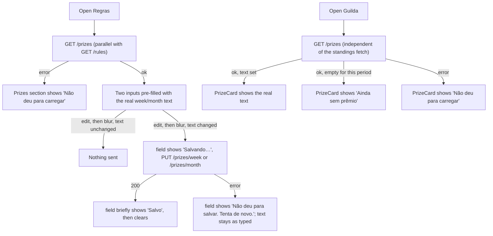

# Prize definitions: real weekly and monthly prizes on Regras and Guilda

Status: Ready
Last updated: 2026-10-09
Depends on: none (independent of `quest-entries.md`/`scoreboard.md`/`profile-avatar.md` — see Notes for the one file both this spec and `scoreboard.md` touch, `app/(tabs)/guilda/page.tsx`, and why that's low-risk)

## Summary
A guild has exactly two prizes — one for the week, one for the month — each a short free-text description, editable by any guild member on the Regras page and shown on Guilda's `PrizeCard`. Today both are hardcoded sample strings in `front-end/lib/data.ts`; this spec makes them real, persisted, guild-scoped data with a small backend and the existing inline inputs saving on blur.

## Problem
`front-end/app/(tabs)/regras/page.tsx:161-169` already renders two `Field`-wrapped `<input>`s for "Prêmio da semana" and "Prêmio do mês", but they only update a `useState` seeded from `front-end/lib/data.ts`'s `prizes` constant (`prizes = { week: "...", month: "..." }`) — nothing is ever sent anywhere, so a reload (or another member's screen) never sees the change. `app/(tabs)/guilda/page.tsx:33` and `app/fim-de-semana/page.tsx:57` both render a `PrizeCard` from that same hardcoded constant, so even a persisted change on Regras would have nowhere real to show up without also wiring the display side.

## Goals
- Any guild member can type a week prize and/or a month prize into Regras and have it actually saved, surviving a reload and visible to every member of the guild.
- Guilda's `PrizeCard` shows the real, current prize for whichever period (`Semana`/`Mês`) is selected.
- A guild that hasn't set a prize yet shows an honest, friendly empty state rather than a blank or missing card.
- Editing stays as low-friction as it is today: type into the field, nothing else — no new button, no new sheet.

## Non-goals
- **`app/fim-de-semana`'s `PrizeCard`.** That whole screen is driven by `weekStandings`/the audit flow (`leader.auditPending`), none of which is real yet (already deferred in `quest-entries.md`/`scoreboard.md`). Wiring its `PrizeCard` to the real week prize is a one-line change for whoever eventually wires the rest of that screen — not duplicated here.
- **More than two prizes, or prizes per member, or a history of past prizes.** Exactly one week slot and one month slot per guild, always — matches the existing `PrizeCard` usage exactly (one per period, nothing else).
- **Any kind of prize "redemption" or marking a prize as claimed/awarded.** A prize here is just a description shown on a card; nothing about winning, approving, or redeeming it is part of this spec (depends on the deferred audit/winner flow).
- **Images or rich text for a prize.** Plain text only, same as today's sample strings.
- **Permissions beyond "any guild member can edit."** Mirrors `rule`'s existing permission model exactly (`rule_controller.go`'s comment: "Any member of the rule's guild may update it") — no owner/admin concept is introduced.

## Current state
- `front-end/lib/data.ts:31`: `export const prizes = { week: "Escolher o filme de sábado", month: "Jantar no restaurante favorito" };` — a plain object, no backing type, no id.
- `front-end/app/(tabs)/regras/page.tsx:21`: `const [prizes, setPrizes] = useState(initialPrizes)`; lines 161-169 render the two inputs, each `onChange={(e) => setPrizes({ ...prizes, week: e.target.value })}` (or `month`) — fires on every keystroke, never persisted, no loading/error/saved state of any kind.
- `front-end/app/(tabs)/guilda/page.tsx:5,33`: imports `prizes` from `lib/data.ts`; renders `<PrizeCard label="Prêmio da semana" prize={prizes.week} />` or the month equivalent (with `icon="gift"`) depending on the `view` Segmented control. **This exact file is also being rewired by `scoreboard.md`** (its `weekStandings`/`monthStandings` → real `GET /scoreboard` data) — but that spec only touches the `RankRow` list and its own fetch; the `PrizeCard` line is a separate, adjacent piece of the same render function. This spec's change there is additive (its own fetch, its own state variable) and should merge cleanly regardless of which of the two specs lands first.
- `front-end/components/ui.tsx:238-250`: `PrizeCard({ label, prize, icon = "trophy" })` renders `prize` as plain text inside `<p className="bq-heading">` — no truncation/line-clamp in `.bq-prize`'s CSS (`app/globals.css:214-216`), so long text simply wraps; no component change needed.
- No backend concept of a prize exists at all today — no domain package, no table, no endpoint.
- `back-end/internal/src/domain/rule/rule.go` is the closest existing reference for a guild-scoped, validated, free-text domain value (`MaxNameLen = 32`, trimmed, rune-counted) — this spec's `prize` domain package follows the same shape at a smaller scale (no list/limit concept, since there are always exactly two slots).

**Update, 2026-10-09 — most of this spec is already implemented in the working tree** (uncommitted, per `git status`), matching the design below almost exactly:
- Backend: `domain/prize/prize.go`, `app/service/prize_service.go`, `infrastructure/postgres/prize_repository.go`, `infrastructure/postgres/migrations/0005_prizes.sql`, `interface/http/controllers/prize_controller.go` all exist and match the Data model/Architecture sections verbatim. `cmd/webapp/routes/routes.go` and `cmd/webapp/main.go` are already wired (the `/prizes` group with `GET`, `PUT /week`, `PUT /month`, `RequireAuth`; `PrizeService` constructed with the real `postgres.NewPrizeRepository`/`postgres.NewGuildRepository`). Unit tests exist: `back-end/test/unit/prize_test.go`, `prize_service_test.go`, `prize_controller_test.go`.
- Still missing on the backend: an integration test (`back-end/test/integration/prizes_test.go` — doesn't exist yet), `Prizes` registered in whatever constructs the integration test server (check the equivalent of `newServer()`/`main_test.go` for the current test harness), and the `api/openapi.yaml` schemas/paths. **`make lint && make cover` have not been confirmed passing** — do not assume 100% coverage just because unit test files exist; run it.
- Frontend: `front-end/lib/api.ts` already has `Prizes`/`PrizePeriod`/`getPrizes`/`setPrize` exactly as specified. `front-end/app/(tabs)/regras/page.tsx` already has the fetch-on-mount + per-field blur-save behavior (`weekInput`/`monthInput`, `weekStatus`/`monthStatus`, `prizeFieldCaption`, timeouts cleaned up on unmount) matching the UX flow below closely. `front-end/app/(tabs)/guilda/page.tsx` already has its own independent `getPrizes()` effect and renders `PrizeCard` per period, additive to the existing standings code — confirmed it does not conflict with `scoreboard.md`'s changes to that file.
- **One real bug found in the existing `regras/page.tsx` that the implementer must fix**: the "Prêmios" block (lines ~257-289) is nested *inside* the same ternary branch as the quests list, i.e. inside `rules.length === 0 ? <EmptyState .../> : (<>...</>)`. That means on a brand-new guild with zero quests (or while quests are still loading, or if loading quests fails), the entire Prêmios section — including both prize inputs — never renders at all, even though prizes load and save completely independently of the quest list. See Business rules/UX flow below: the Prêmios section must be a sibling of that conditional, not nested inside it, so a guild with no quests yet can still set its prizes.

## User stories
- As any guild member, I want to type this week's prize into Regras and have it stick, so that everyone sees the real reward, not a placeholder.
- As any guild member looking at Guilda, I want to see the actual prize for the period I'm looking at, so that I know what I'm playing for.
- As a brand-new guild, I want it to be obvious that no prize has been set yet, rather than looking broken.

## UX flow



### Screen: Regras — prize section (unchanged layout, new behavior)
- **Placement**: the Prêmios section is a sibling block below the quests section, rendered in every state of the quests list — loading, load-error, empty, and populated. It must not be nested inside the quests `rules.length === 0 ? ... : ...` branch (or any other quests-state branch); a brand-new guild with zero quests still gets a fully working Prêmios section. (The spec previously left this implicit; it is now Business rule 6 below because the existing draft implementation got it wrong — see Current state.)
- **Loading**: while prizes haven't loaded yet (independent of the rules list's own loading state), each `Field`'s input is disabled and shows a `bq-caption` "Carregando…" beneath it in place of any status.
- **Load error**: both inputs disabled; a single `<p className="bq-note" role="alert">Não deu para carregar. Tenta de novo.</p>` with a small `Button variant="small" onClick={retry}>Tentar de novo</Button>` beneath the two fields (one retry for both, since they come from one `GET /prizes` call).
- **Success**: both inputs enabled, pre-filled with the real `week`/`month` text (empty string is a valid, normal value — an empty input, same as today visually).
- **Saving** (per field, independent of the other): on blur, if the trimmed value differs from the last-saved value, the field shows "Salvando…" beneath it and is briefly disabled; on success it shows "Salvo" for ~2 seconds then clears back to nothing; on failure it shows "Não deu para salvar. Tenta de novo." and stays until the next successful save (the field itself is re-enabled immediately so the member can just try again by blurring it again, or editing and blurring).
- **Primary action**: none added — Regras' one primary button stays "Nova quest" (unchanged); prize editing has no button at all, consistent with BRAND's one-primary-action rule and with how these two fields already behave today.

### Screen: Guilda — `PrizeCard` (small addition)
- Guilda fetches `GET /prizes` once on mount, independently of whatever standings-loading logic exists at implementation time (see Current state).
- **Loading**: the `PrizeCard` is simply not rendered until prizes have loaded (brief, sub-second absence — this is a secondary card, not the page's primary content, so no dedicated spinner is warranted).
- **Error**: `PrizeCard label="Prêmio da semana"` (or "do mês") `prize="Não deu para carregar"` — degrades gracefully in place, no separate retry button (reloading the page is enough for a non-critical card; Guilda's main retry affordance, if any, belongs to the standings list per `scoreboard.md`, not duplicated here).
- **Success, text set**: unchanged from today — the real text.
- **Success, empty for this period**: `prize="Ainda sem prêmio"`.

## Copy (pt-BR)
| Key / location | Text |
| --- | --- |
| Regras, prize field loading | Carregando… |
| Regras, prize field saving | Salvando… |
| Regras, prize field saved | Salvo |
| Regras, prize field save error | Não deu para salvar. Tenta de novo. |
| Regras, prizes section load error | Não deu para carregar. Tenta de novo. |
| Regras, prizes retry button | Tentar de novo |
| Guilda, `PrizeCard` empty | Ainda sem prêmio |
| Guilda, `PrizeCard` load error | Não deu para carregar |
| Field labels (unchanged) | Prêmio da semana / Prêmio do mês |

## Business rules
1. **A guild has exactly one week prize and one month prize**, each independently settable to any string from empty up to 60 characters (trimmed before validation and storage) — chosen as roughly double `rule.MaxNameLen` (32), since a prize is a short phrase ("Jantar no restaurante favorito" is 31 characters) rather than a single word, with headroom to spare.
2. **Any member of the guild may read or edit either prize** — same permission model as `rule` (no owner/admin concept).
3. **An empty string is a valid, saved value** — "no prize set" is not a special null/missing state, just an empty string, which simplifies both storage (`NOT NULL DEFAULT ''`) and the API (no 404 case for "prizes don't exist yet" — see Edge cases).
4. **Each field saves independently.** Saving the week prize never reads or re-sends the month prize, and vice versa — two separate `PUT` calls, two separate request bodies, each touching exactly one column.
5. **A field only saves on blur, and only if its trimmed value differs from the last value that server round-trip confirmed.** Typing and tabbing back and forth without changing the text never sends a request.
6. **The Prêmios section's loading/error/success state is entirely independent of the quests list's state**, including whether the quests list is empty. Regras always renders the Prêmios section (in whichever of its own states applies) regardless of what the quests section above it is doing.

## Data model

### Backend (new domain package)
```go
// back-end/internal/src/domain/prize/prize.go
package prize

import (
	"errors"
	"strings"
	"time"
	"unicode/utf8"
)

// Period selects which of a guild's two prize slots is being read or written.
type Period string

const (
	PeriodWeek  Period = "week"
	PeriodMonth Period = "month"
)

const MaxLen = 60

var ErrTooLong = errors.New("prize: must be at most 60 characters")

// Prizes holds both of a guild's prize slots. Either may be empty.
type Prizes struct {
	GuildID   string
	Week      string
	Month     string
	UpdatedAt time.Time
}

// Clean trims text and validates its length. Empty is always valid.
func Clean(text string) (string, error) {
	text = strings.TrimSpace(text)
	if utf8.RuneCountInString(text) > MaxLen {
		return "", ErrTooLong
	}
	return text, nil
}
```

### Frontend (new, `front-end/lib/api.ts` additions)
```ts
export type Prizes = { week: string; month: string; updatedAt: string };
export type PrizePeriod = "week" | "month";

export const getPrizes = () => apiFetch<Prizes>("/prizes");
export const setPrize = (period: PrizePeriod, text: string) =>
  apiFetch<Prizes>(`/prizes/${period}`, "PUT", { text });
```

### Diff against `front-end/lib/data.ts`
No changes. `prizes` stays exported, unused by Regras/Guilda after this spec, still used by `app/fim-de-semana/page.tsx` (Non-goals).

## Architecture & technical decisions

### Backend
| Layer | File | Notes |
| --- | --- | --- |
| Domain | `back-end/internal/src/domain/prize/prize.go` | As in Data model. |
| App | `back-end/internal/src/app/service/prize_service.go` | `PrizeRepository` interface, `PrizeService.Get`/`Set`. Reuses `GuildRepository`/`Clock` from the `service` package (same reuse pattern as `entry_service.go`/`scoreboard_service.go`). |
| Infrastructure | `back-end/internal/src/infrastructure/postgres/prize_repository.go` | New. |
| Infrastructure | `back-end/internal/src/infrastructure/postgres/migrations/0005_prizes.sql` | New table. **Already created** (see Current state) — `0005` was the next free number when this spec's migration landed. `quest-entries.md`/`profile-avatar.md` must each take the next free number (`0006`/`0007`, in whichever order they're actually implemented) when their turn comes, not `0005`. |
| Interface | `back-end/internal/src/interface/http/controllers/prize_controller.go` | `Get`, `SetWeek`, `SetMonth`. |
| Routes | `back-end/cmd/webapp/routes/routes.go` | New `/prizes` group (`RequireAuth`): `GET ""`, `PUT "/week"`, `PUT "/month"` (two fixed routes rather than one `PUT /prizes/:period`, so there is no "invalid period" case to validate at all — routing itself only exposes the two that exist). |
| Wiring | `back-end/cmd/webapp/main.go` | Construct `postgres.NewPrizeRepository(pool)` and `service.NewPrizeService(...)`, reusing the existing `guild.NewStaticRepository(guild.Default)` instance. |

```go
// back-end/internal/src/app/service/prize_service.go
package service

import (
	"context"
	"time"

	"github.com/gabrielsp92/boraquest/back-end/internal/src/domain/prize"
)

// PrizeRepository persists a guild's prizes, always scoped to the guild.
type PrizeRepository interface {
	// Get returns the guild's prizes, or a zero Prizes{GuildID: guildID} if none has ever been set.
	Get(ctx context.Context, guildID string) (prize.Prizes, error)
	// Upsert creates the guild's row if missing, then sets just the given period's column.
	Upsert(ctx context.Context, guildID string, period prize.Period, text string, now time.Time) (prize.Prizes, error)
}

type PrizeService struct {
	prizes PrizeRepository
	guilds GuildRepository // reused from rule_service.go
	clock  Clock
}

func NewPrizeService(prizes PrizeRepository, guilds GuildRepository, clock Clock) *PrizeService {
	return &PrizeService{prizes: prizes, guilds: guilds, clock: clock}
}

func (s *PrizeService) Get(ctx context.Context, callerID string) (prize.Prizes, error) {
	g, err := s.guilds.FindByMember(ctx, callerID)
	if err != nil {
		return prize.Prizes{}, err
	}
	return s.prizes.Get(ctx, g.ID)
}

func (s *PrizeService) Set(ctx context.Context, callerID string, period prize.Period, text string) (prize.Prizes, error) {
	g, err := s.guilds.FindByMember(ctx, callerID)
	if err != nil {
		return prize.Prizes{}, err
	}
	clean, err := prize.Clean(text)
	if err != nil {
		return prize.Prizes{}, err
	}
	return s.prizes.Upsert(ctx, g.ID, period, clean, s.clock.Now())
}
```

```sql
-- +goose Up
CREATE TABLE prizes (
    guild_id   TEXT PRIMARY KEY,
    week       TEXT NOT NULL DEFAULT '' CHECK (char_length(week) <= 60),
    month      TEXT NOT NULL DEFAULT '' CHECK (char_length(month) <= 60),
    updated_at TIMESTAMPTZ NOT NULL
);

-- +goose Down
DROP TABLE prizes;
```

```go
// back-end/internal/src/infrastructure/postgres/prize_repository.go — Upsert
func (r *PrizeRepository) Upsert(ctx context.Context, guildID string, period prize.Period, text string, now time.Time) (prize.Prizes, error) {
	row := r.pool.QueryRow(ctx, `
		INSERT INTO prizes (guild_id, week, month, updated_at)
		VALUES ($1, CASE WHEN $2 = 'week' THEN $3 ELSE '' END, CASE WHEN $2 = 'month' THEN $3 ELSE '' END, $4)
		ON CONFLICT (guild_id) DO UPDATE SET
			week       = CASE WHEN $2 = 'week'  THEN $3 ELSE prizes.week  END,
			month      = CASE WHEN $2 = 'month' THEN $3 ELSE prizes.month END,
			updated_at = $4
		RETURNING guild_id, week, month, updated_at`,
		guildID, period, text, now)
	return scanPrizes(row)
}
```
(`Get` returns a zero-value `prize.Prizes{GuildID: guildID}` — not an error — when `SELECT ... WHERE guild_id = $1` finds no row, per Business rule 3: no row simply means "both empty", not a 404.)

| Domain error | HTTP status |
| --- | --- |
| `guild.ErrNotMember` | 403 |
| `prize.ErrTooLong` | 400 |
| missing `text` field in body | 400 (empty string `""` is valid and different from missing — `ShouldBindJSON` already distinguishes an absent key only if the field isn't a plain `string` with no `binding:"required"`; bind `Text string \`json:"text"\`` with no `required` tag so an explicit `""` and "no `text` key at all" both just come through as `""`, which is itself always valid per Business rule 3 — so there is actually no "missing field" error case at all here, unlike `rules`' required fields) |

### Frontend
- `front-end/lib/api.ts`: add the types/functions in Data model.
- `front-end/app/(tabs)/regras/page.tsx`: replace the `prizes` `useState` seeded from `lib/data.ts` with a fetch-on-mount (`getPrizes()`, independent `useEffect`, same cleanup-flag pattern as the existing `listRules()` effect), plus per-field `status: "idle" | "saving" | "saved" | "error"` state. Each input's `onBlur` compares its current value (trimmed) to the corresponding field of the last-fetched/last-saved `Prizes`; if unchanged, no-op; if changed, call `setPrize(period, value)`, update local state through the response, and set/clear the field's status per the UX flow's timings (2-second auto-clear on "Salvo", via `setTimeout`, cleaned up on unmount).
- `front-end/app/(tabs)/guilda/page.tsx`: add an independent `getPrizes()` fetch on mount (its own `useEffect`/state, not sharing state with whatever `scoreboard.md` adds for standings); render `PrizeCard` only once that state is non-null, using `prizes.week || "Ainda sem prêmio"` / `prizes.month || "Ainda sem prêmio"` depending on `view`, or the load-error text on failure (Screen: Guilda above).

## API / contracts

### `GET /api/v1/prizes`
- **Auth**: required.
- **200**: `{ week: string, month: string, updatedAt: "2026-10-08T14:00:00Z" }` — `updatedAt` is the zero time (`"0001-01-01T00:00:00Z"`) if no row has ever been created for the guild; the front-end never reads/displays this field (kept for parity/debugging only, same as `createdAt`/`updatedAt` on other resources).
- **403**: caller belongs to no guild.

### `PUT /api/v1/prizes/week` and `PUT /api/v1/prizes/month`
- **Auth**: required. Body: `{ "text": string }` (empty string is valid).
- **200**: the full updated `{ week, month, updatedAt }`.
- **400**: `text` longer than 60 characters (after trimming).
- **403**: caller belongs to no guild.

Add `Prizes`/`SetPrizeRequest` schemas and the three paths to `back-end/api/openapi.yaml`, mirroring the `/rules` section's conventions.

## Edge cases
| Case | Expected behavior |
| --- | --- |
| A brand-new guild, nobody has ever set a prize | `GET /prizes` returns `{week: "", month: "", updatedAt: <zero time>}` — no 404, no special "not found" branch anywhere (Business rule 3). |
| Saving a 61+ character prize | 400; the field shows the save-error state; the member's typed text is not reverted (they can shorten it and blur again). |
| Saving the exact same text that's already saved | No request sent at all (Business rule 5) — not even a no-op `PUT`. |
| Two members edit the same prize at nearly the same time | Last write wins (single-owner value, no guild-shared limit/count to race over, unlike `rules`' `CreateWithLimit`) — no concurrency guard needed. |
| Clearing a prize back to empty | Allowed; saves as `""`; Guilda then shows "Ainda sem prêmio" for that period. |
| `GET /prizes` fails on Regras while `GET /rules` succeeds (or vice versa) | Each section shows its own independent loading/error state; one failing never blocks or hides the other (two unrelated `useEffect`s). |
| A brand-new guild has zero quests (quests `EmptyState` is showing), or the quests list is still loading, or `GET /rules` failed | The Prêmios section still renders normally in its own state (loading/error/success) — it is a sibling of the quests block, never nested inside it (Business rule 6). |

## Accessibility, privacy & performance
- Accessibility: no new interactive controls beyond the two existing `<input>`s; the per-field status text (`Salvando…`/`Salvo`/error) is plain text adjacent to the field, not color-only, and doesn't move focus.
- Privacy: no personal data — prize text is shared, guild-visible content by design (like a rule's name).
- Performance: negligible — a single-row table, read/written a handful of times per session at most.

## Decision log
| # | Decision | Rationale | Alternatives rejected |
| --- | --- | --- | --- |
| 1 | Wire Guilda's `PrizeCard` to real data in this same spec | Otherwise saving a prize on Regras has no visible effect anywhere in the app (confirmed by user) | Leave Guilda on sample data, defer wiring — smaller slice, but a pointless-feeling feature in the meantime |
| 2 | Save on blur, only when changed; no new button | Matches the fields' existing "just type" feel; keeps Regras at exactly one primary action ("Nova quest") per BRAND (confirmed by user) | An explicit "Salvar prêmios" button — more deliberate, but a second prominent button on a screen BRAND wants down to one |
| 3 | Empty prize is valid and expected; Guilda shows "Ainda sem prêmio" for it | Matches BRAND's pattern of honest, friendly empty states rather than blocking normal use of a brand-new guild (confirmed by user) | Require non-empty prizes — blocks a new guild with no clear prompt to fix it |
| 4 | No row in the `prizes` table is treated as `{week: "", month: ""}`, not a 404 | Simplest possible contract — "never set" and "set to empty" are the same observable state, so they might as well be the same code path | Return 404 from `GET /prizes` until a row exists — forces every caller to special-case "doesn't exist yet," for no real benefit since the two states render identically anyway |
| 5 | Two fixed routes (`PUT /prizes/week`, `PUT /prizes/month`) instead of one `PUT /prizes/:period` | Routing itself constrains the only two valid values; no "invalid period" 400 branch needs to exist in the controller at all | A single parameterized route — marginally fewer route registrations, at the cost of a validation branch that two fixed routes make unnecessary |
| 6 | 60-character max length | Roughly double `rule.MaxNameLen` (32); a prize is a short phrase, not a single word — existing sample prizes are 27-31 characters, so 60 gives real headroom without inviting an essay | Reuse `rule.MaxNameLen` (32) exactly — would clip some perfectly reasonable prize phrasing; no max at all — an unbounded string in a fixed-width card is a real (if minor) layout risk |
| 7 | New `domain/prize` package, mirroring `rule`'s shape | A prize is a real persisted value with its own invariant (length) worth validating in the domain layer — unlike `scoreboard.md`'s `Standing`, which is a pure projection with nothing to validate | Put the length check directly in `PrizeService` — works, but breaks the established convention (`rule`, `entry`, `user`) of domain-layer validation for anything with a real constraint |
| 8 | Migration is `0005_prizes.sql`, final (not a placeholder) | It already exists on disk under that name (see Current state) — `0001`-`0004` were taken before this spec started, and nothing else had claimed `0005` by the time this was implemented | Renumbering it now to "wait and see" — pointless churn on a file that already exists and already boots cleanly |
| 9 | `quest-entries.md`'s reservation of `0005_entries.sql` and `profile-avatar.md`'s conditional `0005`/`0006` note are now both stale | This spec's migration landed first and took `0005` for real; whichever of `quest-entries`/`profile-avatar` is implemented next must use `0006`, and the other `0007`, in implementation order — not a fixed assignment, since neither has landed yet | Leaving those two specs' text uncorrected — would send their implementer straight into a duplicate-version collision with goose |

## Implementation plan

**Status as of 2026-10-09: steps 1-6, 9, 10 and 11 already exist in the working tree** (uncommitted — see Current state) and appear to match this spec, with one confirmed bug (the Regras Prêmios-section placement — fix required, see below) and two unconfirmed items (lint/coverage have not been run; the existing code has not been re-diffed line-by-line against every detail of this spec by a human). Treat steps 1-6/9-11 as "verify, then fix only what's wrong" rather than "write from scratch." Steps 2, 7 and 8 are not done.

1. **Backend domain**: `back-end/internal/src/domain/prize/prize.go` as in Data model. Unit tests: `Clean` trims, accepts empty, accepts exactly 60 runes, rejects 61. *(Exists — `back-end/internal/src/domain/prize/prize.go`, `back-end/test/unit/prize_test.go`. Verify the test cases above are actually covered.)*
2. **Backend migration**: `back-end/internal/src/infrastructure/postgres/migrations/0005_prizes.sql`. Done when `make db-up && make run` boots cleanly. *(Exists and uses the final number — see Architecture. Confirm it still boots cleanly, since other migrations may have been added by other specs since.)*
3. **Backend infrastructure**: `back-end/internal/src/infrastructure/postgres/prize_repository.go` (`Get`, `Upsert`) per Architecture. *(Exists. Depends on step 2.)*
4. **Backend app service**: `back-end/internal/src/app/service/prize_service.go` per Architecture, reusing `GuildRepository`/`Clock`. Unit tests with a hand-written `PrizeRepository` fake: `Get`/`Set` both propagate `guild.ErrNotMember`; `Set` rejects via `prize.ErrTooLong` before ever calling the repository; a valid `Set` passes the trimmed text through. *(Exists — `prize_service.go`, `test/unit/prize_service_test.go`. Verify those exact cases are covered. Depends on step 1.)*
5. **Backend interface + routes**: `back-end/internal/src/interface/http/controllers/prize_controller.go`; register `/prizes` (`GET`, `PUT /week`, `PUT /month`) in `back-end/cmd/webapp/routes/routes.go`. *(Exists — controller, and `routes.go` already has the `/prizes` group under `RequireAuth`. `test/unit/prize_controller_test.go` also exists; verify coverage. Depends on step 4.)*
6. **Backend wiring**: construct `PrizeService` in `main.go`, reusing the real `postgres.NewGuildRepository`. Done when `make run` serves `GET /api/v1/prizes` for a logged-in dev user with `{week: "", month: "", updatedAt: "0001-01-01T00:00:00Z"}` on a fresh database. *(Exists in `cmd/webapp/main.go`. Depends on step 5.)*
7. **Backend OpenAPI**: add `Prizes`/`SetPrizeRequest` schemas and the three paths to `back-end/api/openapi.yaml`. *(Not done — do this.)*
8. **Backend tests to 100%**: confirm `prize_test.go`/`prize_service_test.go`/`prize_controller_test.go` cover every case listed in steps 1/4/5 above; add `back-end/test/integration/prizes_test.go` (seed via the real endpoints: set week, set month independently, confirm `GET` reflects both; a too-long text returns 400; an outsider gets 403) — **does not exist yet, write it**; wire `Prizes` into whatever the integration suite's test-server constructor is called in this codebase at implementation time (find it by grepping for how `Rules`/`RuleController` is wired into the integration tests, since `main_test.go` at the root does not exist as a separate file — check `back-end/test/integration/` for the actual harness). Done when `make lint && make cover` pass at 100%. *(Partially done — unit tests exist but are unverified; integration test and coverage gate are not done.)*
9. **Frontend API client**: add `Prizes`/`PrizePeriod`/`getPrizes`/`setPrize` to `front-end/lib/api.ts`. *(Exists, matches Data model exactly. Depends on step 7 for the final shape — re-check once step 7 is done, in case OpenAPI authoring surfaces a shape mismatch.)*
10. **Frontend Regras**: replace the sample-seeded `prizes` state with the fetch-on-mount + per-field blur-save behavior described in UX flow/Architecture. *(Exists in `front-end/app/(tabs)/regras/page.tsx`, but with the placement bug described in Current state/UX flow/Business rule 6: the Prêmios block is wrongly nested inside the quests `rules.length === 0 ? ... : ...` branch. Fix: move the Prêmios `<h2>`/`<div className="bq-stack">` block so it renders as a sibling after that whole conditional, unconditionally. Depends on step 9.)*
11. **Frontend Guilda**: add the independent `getPrizes()` fetch and wire `PrizeCard` per UX flow/Architecture. *(Exists in `front-end/app/(tabs)/guilda/page.tsx`, additive to the standings code — re-check against whatever that file looks like after `scoreboard.md`'s changes, since both touch it. Depends on step 9; can be done in parallel with step 10.)*
12. **Manual verification**: per Test plan below. In particular, verify the Regras placement fix from step 10 against a freshly seeded guild with zero quests.

## Acceptance criteria
- [ ] Given a signed-in member opens Regras, when prizes are loading, then both prize inputs are disabled with a "Carregando…" caption.
- [ ] Given prizes loaded successfully, when Regras renders, then both inputs are pre-filled with the real, current week/month text.
- [ ] Given a member edits the week prize and blurs the field with the same trimmed text as before, then no request is sent.
- [ ] Given a member edits the week prize and blurs with different text, then `PUT /prizes/week` is called with that text, the field shows "Salvando…" then "Salvo" (which clears after ~2s), and the month field/input is completely unaffected.
- [ ] Given a 61+ character prize is submitted, then the API returns 400 and the field shows the save-error message, keeping the member's typed text.
- [ ] Given the week and month prizes are edited and blurred independently in quick succession, then two independent `PUT` calls are made, each updating only its own column, and `GET /prizes` afterward reflects both changes correctly.
- [ ] Given a brand-new guild that has never saved a prize, when `GET /prizes` is called, then it returns `200` with both fields empty, not a 404.
- [ ] Given a guild's month prize is empty, when Guilda renders the "Mês" view, then its `PrizeCard` shows "Ainda sem prêmio".
- [ ] Given a guild's week prize is "Escolher o filme de sábado", when Guilda renders the "Semana" view, then its `PrizeCard` shows that exact text.
- [ ] Given the `GET /prizes` call fails on Guilda, when the page renders, then the `PrizeCard` shows "Não deu para carregar" instead of crashing or showing stale/sample data.
- [ ] Given the caller belongs to no guild, when any `/prizes` endpoint is called, then the API returns 403.
- [ ] Given a brand-new guild with zero quests (Regras shows the quests `EmptyState`), when Regras renders, then the Prêmios section with both inputs still renders and works normally, not hidden by the quests empty state (Business rule 6).
- [ ] Given quests fail to load on Regras (`GET /rules` errors), when Regras renders, then the Prêmios section still renders and loads/saves normally, independent of that failure.

## Test plan
No test-runner changes beyond what already exists. Back-end: extend `make test`/`make cover` with the tests in the Implementation plan, keeping the 100% coverage gate. Front-end: manual verification only, on a 390px viewport:
1. Sign in as `lia@boraquest.dev` on a freshly migrated database. Open Regras; confirm both prize fields are empty and show no error.
2. Type "Escolher o filme de sábado" into the week field, tab/click away; confirm "Salvando…" then "Salvo" appear and clear.
3. Reload the page; confirm the week field still shows that text and the month field is still empty.
4. Open Guilda; confirm the "Semana" view's `PrizeCard` shows the real text, and switching to "Mês" shows "Ainda sem prêmio".
5. Back on Regras, set the month prize too; return to Guilda and confirm "Mês" now shows it.
6. Clear the week prize back to empty and blur; confirm Guilda's "Semana" view now shows "Ainda sem prêmio" too.
7. With the back-end stopped, reload Regras; confirm both fields are disabled with the load-error message and a working retry. Try blurring a changed field while stopped (if retry hasn't been tapped); confirm the save-error message appears instead of a crash.

## Out of scope / follow-ups
- Wiring `app/fim-de-semana`'s `PrizeCard` to the real week prize — trivial once that screen's broader audit/winner dependency is addressed (Non-goals).
- Any notion of awarding, claiming, or marking a prize as given — depends on the deferred audit/winner flow.
- A richer prize (image, multiple lines of structured data) — plain text only, matches today's design exactly.

## Open questions
None.

## Notes for the implementing agent
- Read `front-end/AGENTS.md` and `front-end/design/BRAND.md` before touching front-end files; read the root `CLAUDE.md` before touching back-end files.
- **Most of this spec is already implemented in the working tree as of 2026-10-09** (uncommitted). Read Current state and the Implementation plan's per-step status notes before writing anything — your job is mostly verification and finishing the remaining ~25%, not a from-scratch build. Specifically still missing: `back-end/api/openapi.yaml` entries (step 7), `back-end/test/integration/prizes_test.go` (step 8), and a confirmed `make lint && make cover` pass. Specifically broken: the Regras Prêmios-section placement bug (step 10) — fix it.
- The migration is final at `0005_prizes.sql` (already created, already wired through `main.go`/`routes.go`) — do not rename it. If you're implementing `quest-entries.md` or `profile-avatar.md` after this, update their stale `0005` migration-number references to the next free number instead (see those specs once this one is applied).
- `app/(tabs)/guilda/page.tsx` is also being rewired by `scoreboard.md`. This spec's change there (an independent prizes fetch + the `PrizeCard` props) is additive and should not conflict with that spec's standings/`RankRow` changes — but re-read whatever that file looks like at implementation time before editing it, rather than assuming it still matches the "Current state" description above verbatim.
- Do not add a "missing `text` field" error case — per Architecture, an absent `text` key and an explicit empty string are indistinguishable and both valid (Business rule 3).
- Before touching `front-end/app/(tabs)/regras/page.tsx`, re-read it in full: it already has almost all of the required behavior, so a full rewrite risks losing correct code. The one required change is structural (move the Prêmios block out of the quests conditional), not behavioral.
