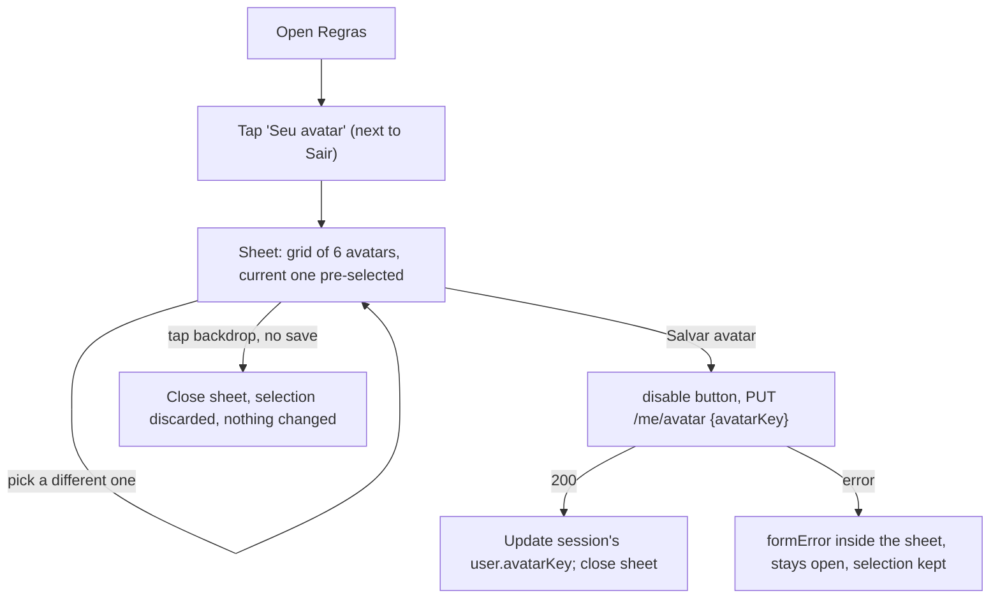

# Profile personalization: pick your avatar

Status: Ready
Last updated: 2026-10-09
Depends on: none (independent of `quest-entries.md`/`scoreboard.md` — touches a different part of the app; see Non-goals for the deliberate reason it doesn't touch the files those two are rewiring)

## Summary
A signed-in member can pick one of the platform's existing avatar icons for themselves from a new sheet reachable from Regras. The backend stores only a short reference (`avatarKey`, e.g. `"duda"`) on their `users` row; the front-end already owns the mapping from that key to the actual SVG file and keeps owning it. The chosen avatar is reflected back to the member via their own session (login response + the picker itself); it is not yet broadcast to other members, since no "list guild members" endpoint exists (a gap already called out in `quest-entries.md`/`scoreboard.md`).

## Problem
Every member's avatar today is a hardcoded, unchangeable mapping in `front-end/lib/data.ts:8-13` (`members[id].avatar`), the same four paths for the same four dev users, forever. There is also no account/profile concept anywhere in the backend beyond `name`/`email`/`password_hash` (`back-end/internal/src/infrastructure/postgres/migrations/0001_users.sql`). Meanwhile the design already ships **six** avatar SVGs, not four: `front-end/public/avatars/{beto,caio,duda,lia,nena,tom}.svg` — `duda` and `tom` exist as drawn assets but are not assigned to anyone. Those six are "the ones we already have on the platform" the user should be able to choose from.

## Goals
- A signed-in member can open a picker showing all six existing avatar icons, select one, save it, and see their own session immediately reflect the choice.
- The choice persists in the database as a short reference (`avatarKey`), never a URL/path/binary — the front-end keeps the only mapping from key to asset.
- The four seeded dev users keep their current look (`lia`→`lia.svg`, etc.) the moment the new column exists, with no visible change until someone actively picks something else.
- Picking an avatar is rejected if it isn't one of the six known keys — enforced in both the domain layer and a database `CHECK` constraint.

## Non-goals
- **Other members seeing your chosen avatar.** There is no "list guild members" API today (`guild.Guild` only has `UserIDs []string`, no names/avatars; already flagged as a gap in `quest-entries.md`'s and `scoreboard.md`'s Non-goals). Every screen that shows *someone else's* avatar still reads the hardcoded `front-end/lib/data.ts` `members` map, unchanged. Confirmed with the user: smallest slice now, a real "guild members" endpoint is a shared follow-up for whichever spec needs it first.
- **Retrofitting the few spots that already render *your own* avatar today** (Hoje's TopBar `Avatar`, Guilda's own `RankRow`) to read from your session instead of the hardcoded default. `quest-entries.md` and `scoreboard.md` are both already rewiring those exact pages top-to-bottom; touching them again here risks real merge conflicts for a cosmetic win. Confirmed with the user — tracked as a one-line follow-up once those land (see Out of scope).
- **Any other profile field.** No display-name editing, no email change, no password change. "Profile personalization" in this spec means avatar selection only, per the user's explicit ask.
- **Uploading a custom photo.** Only the existing six platform-drawn SVGs are selectable; there is no file upload, no image processing, no storage bucket.
- **A "list available avatars" endpoint.** The set of six keys is small and fixed; it's hardcoded once in the backend domain (for validation) and once in the front-end (for rendering), the same duplication pattern `guild.Default`/`lib/data.ts`'s `members` already use for guild membership. If a seventh avatar is ever drawn, both hardcoded lists need a manual update — acceptable for a sign this small, not solved here.
- **Sign-up / new members choosing an avatar at account creation.** No sign-up flow exists yet (`front-end/README.md:44`). This only affects the four already-seeded dev users today.
- **A 5th bottom-nav tab or a new top-level route.** Confirmed with the user — the picker is a sheet opened from Regras, consistent with BRAND.md's explicit four-tab structure and its "short decisions happen in a bottom sheet" rule.

## Current state
- `back-end/internal/src/domain/user/user.go`: `User{ID, Name, Email, PasswordHash}`. No avatar concept at all.
- `back-end/internal/src/infrastructure/postgres/migrations/0001_users.sql`: `users(id, name, email, password_hash)`, no avatar column.
- `back-end/internal/src/infrastructure/postgres/migrations/0003_seed_dev_users.sql`: seeds `lia, beto, nena, caio` — ids that already match four of the six avatar filenames exactly.
- `back-end/internal/src/infrastructure/postgres/user_repository.go`: one method, `FindByEmail`, used only by `AuthService.Login`.
- `back-end/internal/src/app/service/auth_service.go` / `back-end/internal/src/interface/http/controllers/auth_controller.go`: `Login` returns `LoginResponse{Token, User: UserResponse{ID, Name, Email}}` (`auth_controller.go:26-30`) — no avatar field.
- `front-end/lib/auth.ts`: `SessionUser = { id, name, email }` (`auth.ts:5`), persisted to `localStorage` under `bq.session`.
- `front-end/lib/data.ts:3-13`: `MemberId = "lia"|"beto"|"nena"|"caio"`; `members: Record<MemberId, Member>` hardcodes each one's `avatar: "/avatars/<id>.svg"`. This file is **not** touched by this spec (Non-goals) — it remains the source of truth for everyone else's displayed avatar.
- `front-end/public/avatars/*.svg` and `front-end/design/assets/Avatars/*.svg`: six files — `beto, caio, duda, lia, nena, tom`. `duda`/`tom` are unused by any member today; this spec is what makes them selectable.
- `front-end/components/ui.tsx`'s `Avatar({ member, size, selected, crown })` (`ui.tsx:37-48`) already renders a disc from `member.avatar` + `member.name` as `alt`, with a `selected` ring (`.bq-avatar--selected`) — reused for the new picker, with one signature change (see Architecture): its `member` prop is currently typed `Member` from `lib/data.ts`, whose `id: MemberId` only allows the four seeded ids. The picker needs to pass `id: "duda"`/`id: "tom"` too, which don't satisfy `MemberId` — this would not compile as a plain reuse.
- `front-end/app/(tabs)/regras/page.tsx:120-128`: `TopBar`'s `right` slot currently renders one `<Button variant="small" onClick={clearSession}>Sair</Button>`. This spec adds a second small button next to it.
- `.bq-pick` (`front-end/app/globals.css:142`) is the existing "choose one of several avatars" button style, already used by Hoje's slip-sheet member picker (`hoje/page.tsx:120-127`) — reused for the new avatar grid, without the name `<span>` (these options aren't people, see UX flow).

## User stories
- As any guild member, I want to pick an avatar that actually feels like mine, so that the four hardcoded look-alikes aren't the only option.
- As any guild member, I want my choice to survive logging out and back in, so that it's actually "mine" and not reset every session.

## UX flow



### Screen: Regras (`app/(tabs)/regras/page.tsx`) — small addition only
- `TopBar`'s `right` becomes two small buttons side by side: `Seu avatar` (new) and `Sair` (unchanged), each `variant="small"` (48px tap target, unchanged size).

### Sheet: "Seu avatar" (new)
- **Purpose**: pick one of the six platform avatar icons.
- **Layout**: `h2.bq-title` "Seu avatar"; a `size="lg"` preview `Avatar` of the currently-selected key; a wrapping row of six `.bq-pick` buttons, one per avatar key, each just the `Avatar` disc (no name label underneath — these are icon *styles*, not people; see Business rule 3) with `aria-pressed`/`aria-label="Avatar {n}"` (ordinal 1-6, stable across reloads — see Copy); one primary `Button block` "Salvar avatar".
- **States**:
  - **Default (open)**: the member's current `avatarKey` (from session) is pre-selected.
  - **Selecting**: tapping any disc updates the local selection only — no request yet, matching every other sheet in the app (Regras' own quest sheet doesn't save until "Salvar quest" either).
  - **Saving**: "Salvar avatar" is disabled and reads "Salvando…" while the request is in flight (mirrors `regras/page.tsx`'s `save()` pattern exactly).
  - **Error**: a `<p className="bq-note" role="alert">` with the error text inside the sheet (same place/pattern as Regras' `formError`), sheet stays open, selection is kept so the member doesn't have to re-pick.
  - **Success**: sheet closes; the session's `user.avatarKey` is updated in place (`setSession`) so the next time the sheet opens, or anywhere else the session is read, it reflects the new value.
  - **Discard**: tapping the scrim/backdrop closes the sheet without saving, exactly like every other `Sheet` in the app when no explicit save happened.
- **Primary action**: "Salvar avatar" — the one `.bq-btn` in this sheet, per BRAND's one-primary-action rule.

## Copy (pt-BR)
| Key / location | Text |
| --- | --- |
| Regras TopBar, new button | Seu avatar |
| Sheet title | Seu avatar |
| Sheet primary button, idle | Salvar avatar |
| Sheet primary button, busy | Salvando… |
| Avatar grid, `aria-label` per option (not visible text) | Avatar 1 … Avatar 6, in the fixed order `lia, beto, nena, caio, duda, tom` |
| Save error | Não deu para salvar. Tenta de novo. |

## Business rules
1. **A member's `avatarKey` must be one of exactly six known values**: `beto, caio, duda, lia, nena, tom`. Enforced in the Go domain (`user.ValidAvatarKey`) and again at the database level (`CHECK` constraint on the new column) — belt and suspenders, same pattern `rule.go`/`0002_rules.sql` already use for `frequency`/`scoreType`.
2. **A member can only change their own avatar.** The endpoint takes no id/target parameter — it always acts on the caller identified by their JWT (`middleware.UserID(c)`), the same pattern `rule_controller.go` uses for guild-scoping, simplified further here since there's no guild concept involved at all (not even a guild lookup — this is a pure per-user setting).
3. **The picker grid has no name labels**, only accessible ordinals ("Avatar 1"…"Avatar 6") — unlike the Hoje slip-sheet's member picker (which labels real people by name), these six options are interchangeable icon styles, not identities; nothing in the product says picking the icon historically named `lia.svg` means anything about "being Lia."
4. **The four seeded dev users keep their current look on migration day**: the schema migration sets `avatar_key = id` for `lia, beto, nena, caio` (their id already equals their current avatar's filename), so nothing visibly changes until a member actively opens the sheet and picks something else.
5. **Saving the avatar you already have is allowed and is a no-op success** (200, same value back) — no special-casing "nothing changed".

## Data model

### Backend
```go
// back-end/internal/src/domain/user/user.go — additions
var AvatarKeys = []string{"beto", "caio", "duda", "lia", "nena", "tom"}

var ErrInvalidAvatar = errors.New("user: invalid avatar")

// ValidAvatarKey reports whether key is one of the platform's known avatars.
func ValidAvatarKey(key string) bool {
	return slices.Contains(AvatarKeys, key)
}

// User additions: add AvatarKey string to the existing struct.
type User struct {
	ID           string
	Name         string
	Email        string
	PasswordHash string
	AvatarKey    string // new
}
```
No new domain package — this is a field and a validation helper on the existing `user` package, not a new aggregate.

### Frontend (new file `front-end/lib/avatars.ts`)
```ts
// The platform's six avatar icons. The backend only ever stores one of these keys
// (AvatarKey) against a user — this file is the only place that knows the key maps
// to an actual asset.
export type AvatarKey = "lia" | "beto" | "nena" | "caio" | "duda" | "tom";

/** Fixed display order in the picker grid; also the "Avatar N" aria-label order. */
export const AVATAR_KEYS: AvatarKey[] = ["lia", "beto", "nena", "caio", "duda", "tom"];

export const avatarSrc = (key: string): string => `/avatars/${key}.svg`;
```

### Frontend diff against `front-end/lib/auth.ts`
```ts
export type SessionUser = { id: string; name: string; email: string; avatarKey: string }; // + avatarKey
```

### Frontend diff against `front-end/lib/data.ts`
None. `members`/`memberList`/`Member` stay exactly as they are (Non-goals).

## Architecture & technical decisions

### Backend
| Layer | File | Change |
| --- | --- | --- |
| Domain | `back-end/internal/src/domain/user/user.go` | Add `AvatarKey` field, `AvatarKeys`, `ValidAvatarKey`, `ErrInvalidAvatar` (Data model). |
| App | `back-end/internal/src/app/service/profile_service.go` | New: `ProfileRepository` interface, `ProfileService.UpdateAvatar`. |
| Infrastructure | `back-end/internal/src/infrastructure/postgres/user_repository.go` | Add `UpdateAvatar` method to the existing `UserRepository` struct (it will then satisfy both `service.UserRepository`, used by `AuthService`, and `service.ProfileRepository`, used by `ProfileService` — one concrete type, two interfaces, no duplication). Also update `FindByEmail`'s `SELECT`/`Scan` to include the new `avatar_key` column. |
| Infrastructure | `back-end/internal/src/infrastructure/postgres/migrations/<next>_user_avatar.sql` | New column + seed update (below). **Pick the actual next sequential number at implementation time.** As of this writing the migrations folder has `0001_users.sql`, `0002_rules.sql`, `0003_seed_dev_users.sql`, `0004_guilds.sql`, `0005_prizes.sql` (added by `prizes.md`) — so the next free number is `0006`, unless `quest-entries.md`'s migration (reserved as `<next>_entries.sql` as of this writing) has landed first, in which case this one is `0007`. These two specs are independent and unordered relative to each other; whichever implementer runs second just checks the folder. |
| Interface | `back-end/internal/src/interface/http/controllers/profile_controller.go` | New: `ProfileController.UpdateAvatar`. Reuses `UserResponse` already defined in `auth_controller.go` (same `controllers` package) for the response body, adding its `avatarKey` field there too. |
| Routes | `back-end/cmd/webapp/routes/routes.go` | Add `Profile *controllers.ProfileController`; new `/me` group (`RequireAuth`), `PUT /me/avatar`. |
| Wiring | `back-end/cmd/webapp/main.go` | Reuse the existing `postgres.NewUserRepository(pool)` instance for both `AuthService` and the new `ProfileService`. |

```go
// back-end/internal/src/app/service/profile_service.go
package service

import (
	"context"

	"github.com/gabrielsp92/boraquest/back-end/internal/src/domain/user"
)

// ProfileRepository persists a member's own profile settings.
type ProfileRepository interface {
	// UpdateAvatar sets userID's avatar_key and returns the updated user.
	// Returns user.ErrNotFound if userID doesn't exist (defensive — userID always
	// comes from a valid JWT, so this should not happen in practice).
	UpdateAvatar(ctx context.Context, userID, avatarKey string) (user.User, error)
}

// ProfileService manages a signed-in member's own profile.
type ProfileService struct {
	profiles ProfileRepository
}

// NewProfileService builds a ProfileService.
func NewProfileService(profiles ProfileRepository) *ProfileService {
	return &ProfileService{profiles: profiles}
}

// UpdateAvatar validates avatarKey and saves it as callerID's avatar.
func (s *ProfileService) UpdateAvatar(ctx context.Context, callerID, avatarKey string) (user.User, error) {
	if !user.ValidAvatarKey(avatarKey) {
		return user.User{}, user.ErrInvalidAvatar
	}
	return s.profiles.UpdateAvatar(ctx, callerID, avatarKey)
}
```

```sql
-- +goose Up
ALTER TABLE users ADD COLUMN avatar_key TEXT NOT NULL DEFAULT 'lia'
    CHECK (avatar_key IN ('beto', 'caio', 'duda', 'lia', 'nena', 'tom'));

-- Preserve today's look for the four seeded dev users (Business rule 4).
UPDATE users SET avatar_key = id WHERE id IN ('beto', 'caio', 'lia', 'nena');

-- +goose Down
ALTER TABLE users DROP COLUMN avatar_key;
```

`profile_controller.go`'s `writeProfileError` mapping:
| Domain error | HTTP status |
| --- | --- |
| `user.ErrInvalidAvatar` | 400 |
| missing/empty `avatarKey` in body | 400 |
| `user.ErrNotFound` (defensive only) | 404 |

### Frontend
- `front-end/components/ui.tsx:37`: widen `Avatar`'s prop type from `{ member: Member; ... }` to `{ member: { id: string; name: string; avatar: string }; ... }` (drop the `Member` import if `Avatar` no longer needs it). This is a pure widening — every existing caller (`ui.tsx:189,256`, `guilda/page.tsx:59`, `hoje/page.tsx:53,68,123`, `fim-de-semana/page.tsx:45`) already passes a real `Member`, which still satisfies the new, looser shape — so this is safe and does not touch any of those call sites. Needed because the avatar picker must pass `id: "duda"`/`id: "tom"`, which aren't valid `MemberId`s.
- `front-end/lib/api.ts` additions:
  ```ts
  export const updateMyAvatar = (avatarKey: string) =>
    apiFetch<{ id: string; name: string; email: string; avatarKey: string }>("/me/avatar", "PUT", { avatarKey });
  ```
- `app/(tabs)/regras/page.tsx`: add `avatarOpen`/`avatarSelection`/`avatarBusy`/`avatarError` state (mirroring the existing `editing`/`busy`/`formError` state already in that file for the quest sheet); add the new `Sheet` per UX flow; on save success, call `setSession({ ...session, user: { ...session.user, avatarKey: updated.avatarKey } })` (via `useSession()`'s current value) so the change is visible immediately without a reload.
- The avatar grid reuses `.bq-pick` (`globals.css:142`) exactly as the Hoje slip-sheet does, minus the `<span>{name}</span>` (Business rule 3):
  ```tsx
  {AVATAR_KEYS.map((key, i) => (
    <button key={key} type="button" className="bq-pick" aria-pressed={key === avatarSelection} aria-label={`Avatar ${i + 1}`} onClick={() => setAvatarSelection(key)}>
      <Avatar member={{ id: key, name: `Avatar ${i + 1}`, avatar: avatarSrc(key) }} selected={key === avatarSelection} />
    </button>
  ))}
  ```
  `.bq-pick` is `flex:1` today, sized for four items in a single row (the slip-sheet's member list); with six items this needs to wrap (e.g. a `bq-row` with `flex-wrap: wrap` and each `.bq-pick` capped to a fixed width, three per row) — a small CSS adjustment left to the implementing agent's judgment, not specified pixel-for-pixel here since it doesn't change behavior, only layout.

## API / contracts

### `PUT /api/v1/me/avatar`
- **Auth**: required. Body: `{ "avatarKey": string }`.
- **200**: `{ id, name, email, avatarKey }` (the updated user; same shape as `LoginResponse.User` plus `avatarKey`).
- **400**: missing/empty `avatarKey`, or not one of the six known keys.
- **401**: missing/invalid token (same as every other authenticated route, via `RequireAuth`).

### `POST /api/v1/auth/login` (changed response)
- `LoginResponse.User` gains `avatarKey` (`UserResponse` in `auth_controller.go`). No change to the request or to any status code.

Add `avatarKey` to the existing `User`/`LoginResponse` schemas in `back-end/api/openapi.yaml`, and add a new `PUT /me/avatar` path with its own request/response schemas, following the same `security: [bearerAuth: []]` / `components.responses.Error` conventions as `/rules`.

## Edge cases
| Case | Expected behavior |
| --- | --- |
| `avatarKey` missing or empty string | 400. |
| `avatarKey` is a real string but not one of the six (e.g. `"astolfo"`, or a stale key from a removed future avatar) | 400, `user.ErrInvalidAvatar`. |
| Saving the same avatar you already have | 200, no-op (Business rule 5). |
| Two devices save different avatars for the same account in quick succession | Last write wins; no conflict detection needed — this is a single-owner field with no concurrent-edit scenario worth guarding (unlike `rules`' guild-shared limit). |
| A seeded dev user who never opens the sheet | Keeps the migration's default (their own name-matching avatar) forever — identical to today's hardcoded behavior. |
| Member signs out and back in after changing their avatar | Next login response includes the new `avatarKey`; the picker sheet, next time opened, pre-selects it correctly. |

## Accessibility, privacy & performance
- Accessibility: every avatar-grid button keeps `.bq-pick`'s existing `min-height: var(--tap-min)` (48px); selection state is conveyed both visually (the ink ring via `Avatar`'s `selected` prop) and in the DOM (`aria-pressed`), not color alone.
- Privacy: no new personal data — `avatarKey` is a six-value enum, not an image, a name, or anything identifying beyond what already exists.
- Performance: negligible — one small `PUT`, no new heavy assets (all six SVGs already ship with the app today, used or not).

## Decision log
| # | Decision | Rationale | Alternatives rejected |
| --- | --- | --- | --- |
| 1 | Entry point: a small "Seu avatar" button next to "Sair" on Regras, opening a sheet | No 5th tab (BRAND is explicit about four); Regras already hosts the one other account-ish action ("Sair"); a sheet matches BRAND's "short decisions" rule (confirmed by user) | Tap your own avatar on Hoje's TopBar — couples this spec to the exact page `quest-entries.md` is rewriting; a new `/perfil` route — no nav precedent to reach it from |
| 2 | Only the caller's own session reflects their avatar for now; no guild-members endpoint | Smallest slice; the "others can't see your live avatar" gap already exists and was already deferred twice (confirmed by user) | Build a `GET /guild/members`-style endpoint now so everyone sees everyone's avatar — real value, but duplicates/competes with the same deferred item in two other in-flight specs |
| 3 | Don't retrofit Hoje's TopBar / Guilda's own row to use the session avatar in this spec | Both files are actively being rewired by `quest-entries.md`/`scoreboard.md`; editing them again here is pure merge-conflict risk for a cosmetic win (confirmed by user) | Update them now too — more immediately satisfying, but at real integration risk across three in-flight specs |
| 4 | Migration sets each seeded dev user's `avatar_key` to their own id (`lia`→`lia`, etc.) | Zero visible change on migration day; matches what's already displayed today (confirmed by user) | Default everyone to one single avatar — simpler SQL, but visibly wrong for 3 of 4 users until noticed |
| 5 | `AvatarKey` and its validation live on the existing `user` domain package; no new `domain/profile` package | A field + an enum-membership check isn't a new aggregate; `ProfileService` is the only new app-layer concept needed | A separate `domain/profile` package — unnecessary ceremony, mirrors the same "don't over-build a projection/field" call made in `scoreboard.md`'s Decision log #6 |
| 6 | Picker grid shows no name labels, only ordinal `aria-label`s | These six icons aren't tied to identities; labeling them "Lia"/"Beto"/etc. would wrongly imply picking "Beto" means something about being Beto | Label each option with its filename-derived name (`"Lia"`, `"Duda"`, …) — reads naturally in the Hoje slip-picker (real people) but misleading here (arbitrary icon styles) |
| 7 | Widen `Avatar`'s `member` prop type to a structural `{ id: string; name: string; avatar: string }` instead of the exact `Member` type | `Member.id: MemberId` only allows the four seeded ids; the picker needs `"duda"`/`"tom"` too, so passing them as-is does not typecheck. Widening is backward-compatible with every existing caller (grounded by reading all seven call sites) | Add `"duda"`/`"tom"` to `MemberId` itself — leaks picker-only values into the domain type `lib/data.ts` relies on for real guild members everywhere else, including places this spec explicitly doesn't touch (Non-goals) |

## Implementation plan
1. **Backend domain**: add `AvatarKey` field, `AvatarKeys`, `ValidAvatarKey`, `ErrInvalidAvatar` to `back-end/internal/src/domain/user/user.go`. Unit tests: every valid key passes, a handful of invalid strings fail (including empty string and a near-miss like `"Lia"` with wrong casing).
2. **Backend migration**: new `back-end/internal/src/infrastructure/postgres/migrations/<next>_user_avatar.sql` exactly as in Architecture — check the migrations folder for the actual next number first (`0006` unless `quest-entries.md`'s migration landed first, then `0007` — `0005` is already taken by `prizes.md`'s `0005_prizes.sql`). Done when `make db-up && make run` boots cleanly and `SELECT id, avatar_key FROM users` shows the four seeded users matching their own id.
3. **Backend infrastructure**: add `UpdateAvatar` to `back-end/internal/src/infrastructure/postgres/user_repository.go`; update `FindByEmail`'s query/scan to include `avatar_key`. *(Depends on step 2.)*
4. **Backend app service**: new `back-end/internal/src/app/service/profile_service.go` exactly as in Architecture. Unit tests with a hand-written `ProfileRepository` fake: valid key passes through to the repository, invalid key short-circuits with `ErrInvalidAvatar` without calling the repository at all. *(Depends on step 1.)*
5. **Backend interface + routes**: `back-end/internal/src/interface/http/controllers/profile_controller.go` (bind `{avatarKey}`, call the service, map errors); add `avatarKey` to `UserResponse` in `auth_controller.go`; register the `/me` group in `back-end/cmd/webapp/routes/routes.go`. *(Depends on step 4.)*
6. **Backend wiring**: construct `ProfileService` in `main.go`, reusing the existing `postgres.NewUserRepository(pool)` instance; add `Profile` to `routes.Controllers`. Done when `make run` serves `PUT /api/v1/me/avatar` for a logged-in dev user and the subsequent `POST /auth/login` response shows the new value. *(Depends on step 5.)*
7. **Backend OpenAPI**: add `avatarKey` to the `User` schema and a new `PUT /me/avatar` path to `back-end/api/openapi.yaml`.
8. **Backend tests to 100%**: `back-end/test/unit/profile_service_test.go`, `profile_controller_test.go`, extend `user_test.go` for the new validation; extend `back-end/test/integration/auth_test.go` or add `profile_test.go` covering: save a valid avatar → subsequent login reflects it; save an invalid key → 400; add `Profile` to `newServer()` in `main_test.go`. Done when `make lint && make cover` pass at 100%.
9. **Frontend**: widen `Avatar`'s `member` prop type in `front-end/components/ui.tsx:37` per Architecture (do this first — it's a one-line, backward-compatible signature change the rest of this step depends on); new `front-end/lib/avatars.ts`; add `avatarKey` to `SessionUser` in `lib/auth.ts`; add `updateMyAvatar` to `lib/api.ts`; add the "Seu avatar" button + sheet to `app/(tabs)/regras/page.tsx` per UX flow/Architecture. *(Depends on step 7 for the exact response shape; can be stubbed earlier.)*
10. **Manual verification**: per Test plan below.

## Acceptance criteria
- [ ] Given a freshly migrated database, when any of the four seeded dev users logs in, then their `avatarKey` in the login response matches their own id.
- [ ] Given a signed-in member on Regras, when they tap "Seu avatar", then a sheet opens with all six avatars shown and their current one pre-selected (ring/`aria-pressed`).
- [ ] Given the sheet is open, when the member taps a different avatar and taps "Salvar avatar", then `PUT /me/avatar` is called with that key, the button shows "Salvando…" while in flight, and on success the sheet closes.
- [ ] Given the save just succeeded, when the member reopens the sheet without reloading the page, then the newly-saved avatar is the one pre-selected (session updated in place).
- [ ] Given the member signs out and back in after changing their avatar, when the login response returns, then it carries the new `avatarKey`.
- [ ] Given the member taps the backdrop without tapping "Salvar avatar", when the sheet closes, then nothing was sent to the server and their stored avatar is unchanged.
- [ ] Given `PUT /me/avatar` is called with a key outside the six known values (or missing/empty), then the API returns 400 and no row is changed.
- [ ] Given `PUT /me/avatar` is called with the member's current avatar key (no actual change), then the API returns 200 with the same value.
- [ ] Given the save request fails for any other reason (network, 5xx), when the response returns, then an inline "Não deu para salvar. Tenta de novo." appears inside the sheet, the sheet stays open, and the member's local selection is preserved (not reset to their last-saved value).
- [ ] Given any other member's avatar is shown anywhere else in the app (Hoje, Semana, Guilda), then it is unaffected by this spec — still the hardcoded `lib/data.ts` default, exactly as before.

## Test plan
No test-runner changes beyond what already exists. Back-end: extend `make test`/`make cover` with the unit/integration tests in the Implementation plan, keeping the 100% coverage gate. Front-end: manual verification only, on a 390px viewport:
1. Sign in as `lia@boraquest.dev`. Confirm Regras shows "Seu avatar" next to "Sair".
2. Open the sheet; confirm Lia's current avatar (the `lia.svg` disc) is pre-selected among all six options.
3. Pick "duda", tap "Salvar avatar"; confirm the button briefly reads "Salvando…", then the sheet closes.
4. Reopen the sheet; confirm "duda" is now the pre-selected one.
5. Sign out and back in as `lia@boraquest.dev`; open dev tools / inspect `localStorage`'s `bq.session`; confirm `user.avatarKey` is `"duda"`.
6. Open the sheet again, tap the backdrop without saving after picking a different option; reopen it; confirm it still shows "duda" (the discard worked).
7. With the back-end stopped, try to save a new avatar; confirm the inline error message appears and the sheet stays open with the attempted selection still visually selected.
8. Confirm Hoje's TopBar avatar and Guilda's row for Lia are unchanged (still the old hardcoded default) — expected per Non-goals, not a bug.

## Out of scope / follow-ups
- A real "list guild members" endpoint so everyone's live avatar (and name) is visible to everyone else — shared gap, already deferred in `quest-entries.md` and `scoreboard.md` too; whichever spec needs it first should build it.
- Updating Hoje's TopBar and Guilda's own `RankRow` to read the session's avatar instead of the hardcoded default — trivial once `quest-entries.md`/`scoreboard.md` land and those files stop being actively rewritten.
- Display-name editing, password change, or any other profile field.
- A seventh+ avatar option — would need a new SVG asset, a new key in both the backend's `AvatarKeys` and the frontend's `AVATAR_KEYS`/the DB `CHECK` constraint (a 3-file manual change, documented in Non-goals).

## Open questions
None.

## Notes for the implementing agent
- Read `front-end/AGENTS.md` and `front-end/design/BRAND.md` before touching front-end files; read the root `CLAUDE.md` before touching back-end files.
- Check `back-end/internal/src/infrastructure/postgres/migrations/` for the actual next free migration number before naming this spec's migration file — do not assume `0004` (see Architecture).
- Do not touch `front-end/lib/data.ts`, `app/(tabs)/hoje/page.tsx`, or `app/(tabs)/guilda/page.tsx` — all explicitly out of scope here (Non-goals, Decision log #2-3), regardless of whether `quest-entries.md`/`scoreboard.md` have landed yet.
- `UserRepository` in `postgres/user_repository.go` ends up implementing two different service-layer interfaces (`service.UserRepository` for login, `service.ProfileRepository` for this spec) on one concrete struct — this is intentional (Architecture table), not a mistake to "fix" by splitting the struct.
- Widen `Avatar`'s `member` prop type in `front-end/components/ui.tsx` before writing the picker grid (Architecture, Implementation plan step 9) — writing the grid against the unwidened `Member`/`MemberId` type will not compile, since the picker needs `"duda"`/`"tom"` which aren't valid `MemberId`s.
