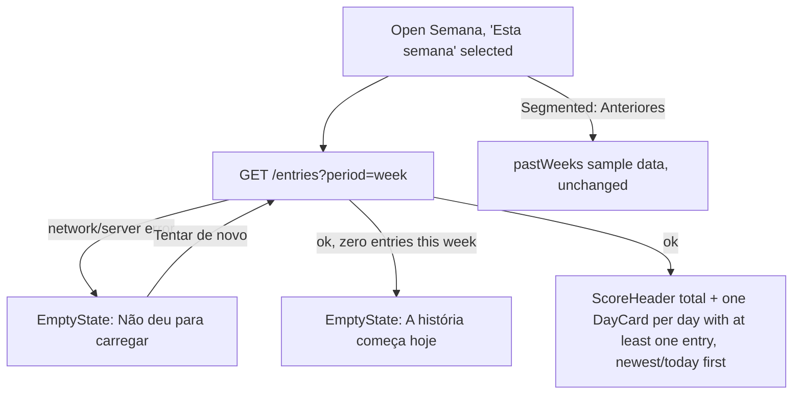

# Quest entries: mark quests done, log slips, and real scores on Hoje and Semana

Status: Done
Last updated: 2026-10-09
Depends on: none (builds on the Rules CRUD and the Postgres-backed guild model already shipped: `back-end/internal/src/domain/rule`, `back-end/internal/src/infrastructure/postgres/guild_repository.go`, `front-end/app/(tabs)/regras/page.tsx`)

## Summary
A new backend aggregate, **Entry**, records that a rule (quest) was scored for a guild member on a given day: checking off a daily positive quest, or logging a negative "slip" for anyone. `app/(tabs)/hoje/page.tsx` is rewired to create/remove entries through the real API instead of local sample state, so today's score is real. `app/(tabs)/semana/page.tsx`'s "Esta semana" tab is rewired the same way, replacing the hardcoded `week`/`sum` sample data with a real day-by-day history. Everything else (Guilda standings, "Anteriores" past weeks, the audit flow, photos) stays exactly as it is today.

## Problem
Today `app/(tabs)/hoje/page.tsx` and `app/(tabs)/semana/page.tsx` are fully driven by sample data in `front-end/lib/data.ts` (`quests`, `todayDone`, `todaySlips`, `today`, `week`, `sum`, and the hardcoded `me`). Nothing a member does on Hoje survives a reload, two people looking at Hoje on two devices never see each other's actions, and a slip logged for someone other than the hardcoded `me` is not persisted at all — `confirmSlip()` in `hoje/page.tsx:43-48` only shows a transient `Banner` for that case and throws the action away. There is no concept in the backend of "this quest happened" at all yet — only the quest *definition* (`rule.Rule`) exists, via the Rules CRUD shipped in `back-end/internal/src/domain/rule` and wired to `front-end/app/(tabs)/regras/page.tsx`.

## Goals
- A signed-in member can check a daily positive quest done on Hoje, see their score go up, and have that survive a reload and be visible from another device/session.
- Unchecking a quest they just checked removes the points, same day only.
- Anyone can log a negative quest ("slip") against any guild member (including themselves); it persists and affects that member's score, not just the logger's screen.
- Hoje's score and "Quinta, 8 de outubro"-style caption reflect the real current date, in a timezone shared by the whole household, not a hardcoded sample string.
- Semana's "Esta semana" tab shows the caller's real day-by-day history for the current week (what was done, what slipped, by whom) and the real weekly total.
- A rule can still be deleted from Regras at any time, even after it has logged entries; history already logged never breaks or disappears.

## Non-goals
- **Guilda tab** (weekly/monthly standings across the whole guild, "Pedir auditoria") — needs an all-members standings query and audit-pending bookkeeping that don't exist yet. Stays on `weekStandings`/`monthStandings` sample data. Follow-up spec.
- **Semana's "Anteriores" tab** (past weeks and their winners) — depends on a week being "closed" and a winner decided, which depends on the audit flow. Stays on `pastWeeks` sample data. Follow-up spec.
- **The audit flow** (`app/auditoria`, `app/auditoria/revisar`) and **`app/fim-de-semana`** — untouched. Separate, larger feature (photo proof storage, an approval state machine). Already called out as not done in `front-end/README.md:48`.
- **Persisting photos.** `front-end/README.md:45` already documents "Photos are kept in memory only; proof thumbnails are placeholders." This spec does not change that — the optional photo sheet on Hoje stays client-only/in-memory, and Semana's `DayCard` `photos` count is always `0` now (honest, since nothing is actually stored) instead of the sample data's fake counts.
- **Real guild membership / sign-up.** Guilds now live in Postgres (`back-end/internal/src/infrastructure/postgres/guild_repository.go`, migration `0004_guilds.sql`), but there is still only the one seeded guild (`"familia"`, the four dev users), and still no API to list "who's in my guild". `me` moves from a hardcoded constant to the real signed-in user's id, but the front-end keeps using `members`/`memberList` from `lib/data.ts` for avatars and display names, which happen to use the same four ids. Already a known gap (`front-end/README.md:44`).
- **Editing or backdating an entry.** An entry is created for "today" (server-computed) only; there is no edit endpoint and no way to log for a past day. A mistaken entry can only be removed (and only a same-day checklist completion can be removed at all — see Business rules).
- **Weekly-frequency positive ("sum") quests being checkable anywhere.** `myQuests` on Hoje already only lists `frequency === "daily"` positive quests (`hoje/page.tsx:9`) — this spec keeps that filter exactly. The backend still models weekly periods correctly (see Business rule 2) so this can be wired up later with no data-model change.
- **Real-time sync across devices/tabs.** Each page fetches once on mount; if another member changes something concurrently, you see it on your next navigation or reload, not live. No polling/websockets added.

## Current state
- `back-end/internal/src/domain/rule/rule.go`: `Rule` has `ID, GuildID, Name, Frequency (daily|weekly), ScoreType (sum|decrease), Score (1-100), CreatedBy, CreatedAt, UpdatedAt`. `rulePoints` helper in `front-end/lib/api.ts:52` turns `(scoreType, score)` into a signed int.
- `back-end/internal/src/app/service/rule_service.go` declares `RuleRepository`, `GuildRepository`, `IDGenerator` interfaces (reused by this spec's `EntryService`, same package) and `RuleService` (`List/Get/Create/Update/Delete`, all guild-scoped via `GuildRepository.FindByMember`).
- `back-end/internal/src/infrastructure/postgres/guild_repository.go` (reading `guilds`/`guild_members`, seeded by migration `0004_guilds.sql`): one guild (`"familia"`, members `lia, beto, nena, caio`). Unchanged by this spec — `EntryService` reuses the same `GuildRepository.FindByMember` already injected into `RuleService`.
- `back-end/internal/src/infrastructure/postgres/rule_repository.go`: `CreateWithLimit` uses `pg_advisory_xact_lock(hashtext($1))` inside a transaction to serialize a count-check-then-insert. This spec's entry repository reuses the same pattern for its own concurrency guard (see Architecture).
- `back-end/cmd/webapp/routes/routes.go` and `main.go` wire `Health`, `Auth`, `Rules`; `main.go:42` calls `postgres.Migrate` on boot (unchanged — the separate `ci-cd-deploy.md` spec proposes moving this to a standalone `cmd/migrate`; not assumed done here, this spec adds a migration file the same way `0002_rules.sql` was added).
- `front-end/lib/api.ts`: typed client over `/api/v1/*` via the `fetch` + `next.config.ts` rewrite; already has `Rule`, `listRules/createRule/updateRule/deleteRule`, `rulePoints`, and `ApiError`. This spec adds `Entry`-related exports to the same file.
- `front-end/lib/auth.ts`: `useSession()` exposes `{ token, user: { id, name, email } } | null | undefined`. `me` in `lib/data.ts:17` is a hardcoded constant (`"lia"`); this spec stops using it on Hoje/Semana in favor of `useSession().user.id`.
- `front-end/app/(tabs)/hoje/page.tsx`: fully described in Problem above. `QuestRow`, `Sheet`, `Button`, `ScoreHeader`, `Banner`, `Confetti`, `Points` from `front-end/components/ui.tsx` are reused as-is.
- `front-end/app/(tabs)/semana/page.tsx`: "Esta semana" view renders `ScoreHeader` + one `DayCard` per `week: Day[]` sample entry (`lib/data.ts:49-53`), each with `Badge`s for done quests and slips. "Anteriores" view renders `pastWeeks` sample data (untouched by this spec).
- `front-end/app/(tabs)/regras/page.tsx` is the closest existing reference for the fetch/loading/error/busy/inline-error conventions this spec's two pages should follow: `useEffect` + cleanup-flag fetch on mount, `rules === null` loading state, a `loadError` boolean with a retry `EmptyState`, `busy`/`formError` around an async mutation, and a specific-status-code `errorMessage()` helper. This spec mirrors that style exactly rather than introducing optimistic updates.
- `front-end/app/globals.css`: `.bq-quest` (`:150-157`) has no `:disabled` style — a disabled `<button className="bq-quest">` currently renders identically to an enabled one. This spec adds one rule for a mid-request state (see Architecture).
- No `AGENTS.md`-relevant Next.js API changes: both pages stay `"use client"` components doing `fetch`-based data loading exactly like `regras/page.tsx` already does. No new routing, server actions, metadata or caching behavior is introduced, so no `node_modules/next/dist/docs/` citation applies beyond what the existing Regras wiring already established.

## User stories
- As a guild member, I want to check off a daily quest I did today, so that my score goes up and stays up after I close the app.
- As a guild member, I want to undo a quest I checked by mistake today, so that I'm not stuck with wrong points.
- As a guild member, I want to log a slip for anyone in the guild (including myself), so that the household's rules actually get enforced.
- As a guild member, I want to see this week's day-by-day history, so that I understand how I got to this week's total.
- As the guild member who manages Regras, I want to delete a quest that's already been used, so that fixing the rules never gets blocked by history.

## UX flow

```mermaid
flowchart TD
  Load[Open Hoje] --> Fetch["GET /rules + GET /entries?period=today"]
  Fetch -->|network/server error| LoadError[EmptyState: Não deu para carregar]
  LoadError -->|Tentar de novo| Fetch
  Fetch -->|ok, zero daily sum rules| EmptyNoQuests[EmptyState: Nenhuma quest ainda]
  Fetch -->|ok| Checklist[Checklist + ScoreHeader]

  Checklist -->|tap an unchecked row| Check["disable row, POST /entries {ruleId, memberId: me}"]
  Check -->|201| PhotoSheet[Sheet: Quest concluída!]
  Check -->|409 already logged| Resync1[Refetch entries silently]
  Check -->|other error| RowError1[Inline banner on the row, stays unchecked]
  PhotoSheet -->|Adicionar foto| AttachLocal[Store photo in memory only, same as today]
  PhotoSheet -->|Pular or backdrop| CloseSheet[Close sheet]

  Checklist -->|tap a checked row| Uncheck["disable row, DELETE /entries/:id"]
  Uncheck -->|204| Removed[Row back to unchecked, points removed]
  Uncheck -->|404 already gone| Resync2[Refetch entries silently]
  Uncheck -->|other error| RowError2[Inline banner on the row, stays checked]

  Checklist -->|"Anotar deslize" (hidden if zero decrease rules)| SlipSheet[Sheet: pick member + slip]
  SlipSheet -->|Confirmar| LogSlip["disable button, POST /entries {ruleId, memberId: chosen}"]
  LogSlip -->|201, target = me| AddSelf[Appears in today's list immediately]
  LogSlip -->|201, target != me| Notice[Banner: Deslize anotado para X]
  LogSlip -->|error| SheetError[formError inside the sheet, stays open]
```



### Screens

**Hoje (`app/(tabs)/hoje/page.tsx`)** — closest reference: `design/components/TelaHoje`.
- **Loading**: while rules or today's entries haven't resolved yet, `<p className="bq-caption" role="status">Carregando quests…</p>` (same pattern as `regras/page.tsx:136-138`), under the `TopBar`.
- **Load error**: `EmptyState icon="sun" title="Não deu para carregar" text="Confira sua conexão e tente de novo."` with a `Button onClick={retry}>Tentar de novo</Button>` — same copy/pattern as Regras.
- **Empty (no daily positive quests)**: unchanged — the existing `EmptyState icon="sun" title="Nenhuma quest ainda" …` branch, now gated on the real `myQuests.length === 0` computed from fetched rules.
- **Success**: `TopBar` greeting uses the real session user's name (`Oi, ${session.user.name}!`) and the real `today` date (see Business rule 1) for the caption, formatted as `todayCaption(today)` → "Quinta, 8 de outubro". `ScoreHeader` shows the real score and `done/total` against `myQuests`. The checklist renders one `QuestRow` per `myQuests` rule exactly as today (`kind: entry ? "done" : "todo"`), each row's `onClick` now awaits the create/delete call and disables itself (`disabled={busyRuleId === rule.id}`) while in flight. Slips render below exactly as today, one `QuestRow` (`kind="loss"`) per slip entry whose `memberId === me`, `meta` = `` `anotado por ${displayName(entry.loggedBy)}` ``.
- **"Anotar deslize" button**: hidden entirely when there are zero decrease-type rules in the guild (new edge case — see Edge cases).
- **Photo sheet**: unchanged UX (`Adicionar foto`/`Pular`, same size, per BRAND — "A photo after checking a quest is optional"); now keyed off the created `Entry`'s id instead of the rule id, still client-only (no backend call).
- **Slip sheet**: unchanged UX (pick member, pick a decrease-type rule, `Confirmar`); the confirm action is now async with a `busy` flag disabling the button and a `formError` shown inline on failure, mirroring `regras/page.tsx`'s save flow.
- **Primary action**: one `.bq-btn` equivalent per context — none of the checklist/slip rows are the primary button (they're plain interactive list rows, consistent with how Regras's quest rows work); the sheets each have exactly one primary `Button` (`Adicionar foto` / `Confirmar …`), matching BRAND's one-primary-action rule.

**Semana (`app/(tabs)/semana/page.tsx`)** — closest reference: `design/components/TelaSemana`.
- **"Esta semana" loading**: `<p className="bq-caption" role="status">Carregando semana…</p>`.
- **"Esta semana" load error**: `EmptyState icon="calendar" title="Não deu para carregar" text="Confira sua conexão e tente de novo."` + retry `Button`.
- **"Esta semana" empty**: unchanged existing branch (`EmptyState icon="calendar" title="A história começa hoje" …` with the `Ir para Hoje` link), now gated on `entries.length === 0` for the fetched week.
- **"Esta semana" success**: `TopBar` caption uses `weekRangeLabel(from, to)` (see Architecture) instead of the hardcoded `today.week`. `ScoreHeader` shows the sum of every fetched entry's `points`. One `DayCard` per distinct `occurredOn` date that has at least one entry, ordered newest (today) first; `gained`/`lost` are the sum of that day's positive/negative entry points; badges render one `Badge kind="gain" icon="check"` per sum-type entry (text = `entry.ruleName`) and one `Badge kind="loss"` per decrease-type entry (text = `` `${entry.ruleName} · por ${displayName(entry.loggedBy)}` ``); `photos` is always `0` (see Non-goals).
- **"Anteriores"**: entirely unchanged, still sample data.
- **Primary action**: Semana has no primary button in its main view today (it's a read screen); unchanged.

## Copy (pt-BR)
| Key / location | Text |
| --- | --- |
| Hoje, loading | Carregando quests… |
| Hoje, load error title | Não deu para carregar |
| Hoje, load error text | Confira sua conexão e tente de novo. |
| Hoje/Semana, retry button | Tentar de novo |
| Hoje, row/sheet action error | Não deu para salvar. Tenta de novo. |
| Semana, loading | Carregando semana… |
| Semana, load error title | Não deu para carregar |
| Semana, load error text | Confira sua conexão e tente de novo. |
| Everything else on Hoje/Semana (greeting, "Quest concluída!", "Adicionar foto", "Pular", "Anotar deslize", "Confirmar … para X", "anotado por X", "Deslize anotado para X", empty states, badges) | Unchanged from the current `front-end/app/(tabs)/hoje/page.tsx` and `semana/page.tsx` — only the data behind them is now real. |

## Business rules
1. **"Today" and "this week" are computed server-side, fixed to `America/Sao_Paulo`**, regardless of the caller's device timezone. A day runs midnight-to-midnight in that zone; a week is Monday through Sunday in that zone. This is the single day/week boundary shared by every guild member, matching a household sharing one physical scoreboard.
2. **A daily-frequency `sum` rule can be completed at most once per calendar day per member; a weekly-frequency `sum` rule at most once per calendar week per member.** Enforced by a partial unique index on `(rule_id, member_id, period_key)` where `score_type = 'sum'`, where `period_key` is the day itself for a daily rule or that week's Monday for a weekly rule.
3. **Only the member themselves may create or remove their own `sum`-type (checklist) entry.** Nobody can check a quest off on someone else's behalf. Attempting otherwise is rejected (403).
4. **Any guild member may log a `decrease`-type ("slip") entry against any guild member, including themselves**, any number of times per day — there is no uniqueness constraint for `decrease` entries (confirmed: repeat slips are real, repeatable events, not a single daily toggle).
5. **Only a `sum`-type entry can ever be removed, and only on the same calendar day it was created.** A `decrease`-type entry can never be removed through this API (no "undo a slip" UI exists today). Trying to remove a `decrease` entry, someone else's entry, or a `sum` entry from a previous day is rejected (403).
6. **Every entry snapshots the rule's `name`, `scoreType`, and signed points at the moment it's created.** `entries.rule_id` carries no foreign key to `rules.id`. Deleting a rule afterward (via `DELETE /rules/:id`, unchanged) always succeeds and never touches or breaks already-logged entries — they keep rendering with their own snapshot data forever.
7. **Today's score on Hoje is the sum of every entry's `points` where `memberId = caller` and `occurredOn = today`**, regardless of whether the entry's rule still exists in the live rules list. The checklist's "`X de Y quests`" counter, however, is scoped to the live `myQuests` (daily `sum` rules) only — an entry whose rule was deleted mid-day still counts toward the score shown, but no longer has a row to display or un-check.
8. **This week's total on Semana is the sum of every entry's `points` where `memberId = caller` and `occurredOn` falls within the Monday-Sunday week containing today.**
9. **Hoje's checklist lists only daily, `sum`-type rules** (`myQuests = rules.filter(r => r.scoreType === "sum" && r.frequency === "daily")`), unchanged from today's filter. Weekly `sum` rules are not actionable from any screen (pre-existing gap, not fixed here).
10. **Hoje's slip picker lists every `decrease`-type rule regardless of frequency** (`negativeQuests = rules.filter(r => r.scoreType === "decrease")`), unchanged from today's filter.
11. **"Anotar deslize" is not rendered at all when the guild has zero `decrease`-type rules.**
12. **A target member for either a checklist completion or a slip must belong to the caller's guild**; an unknown or outside-the-guild `memberId` is rejected (400).

## Data model

### Backend (new)
```go
// back-end/internal/src/domain/entry/entry.go
package entry

import (
	"errors"
	"time"

	"github.com/gabrielsp92/boraquest/back-end/internal/src/domain/rule"
)

var (
	ErrNotFound         = errors.New("entry: not found")
	ErrAlreadyLogged    = errors.New("entry: already logged for this period")
	ErrWrongMember      = errors.New("entry: you can only complete a quest for yourself")
	ErrMemberNotInGuild = errors.New("entry: member is not in your guild")
	ErrNotOwn           = errors.New("entry: you can only remove your own entry")
	ErrNotRemovable     = errors.New("entry: only completed quests can be removed")
	ErrNotToday         = errors.New("entry: you can only remove today's entry")
)

// Entry records that a rule was scored for a member on a given day.
type Entry struct {
	ID         string
	GuildID    string
	RuleID     string         // reference only; no FK, see rule 6
	RuleName   string         // snapshot of rule.Name at creation time
	ScoreType  rule.ScoreType // snapshot of rule.ScoreType at creation time
	Points     int            // signed: +rule.Score for sum, -rule.Score for decrease
	MemberID   string         // whose score this entry affects
	LoggedBy   string         // who recorded it; equals MemberID for a self-checked quest
	OccurredOn time.Time      // date-only (UTC midnight), the calendar day it happened
	PeriodKey  time.Time      // date-only; OccurredOn for a daily rule, that week's Monday for a weekly rule
	CreatedAt  time.Time
}

// New builds a validated Entry. now must already be the caller's current wall-clock
// time *converted into the guild's timezone* (see Architecture) — New only reads its
// date components, it never consults a clock or a location itself.
func New(id, guildID, ruleID, ruleName string, scoreType rule.ScoreType, score int, memberID, loggedBy string, frequency rule.Frequency, now time.Time) (Entry, error) {
	if scoreType == rule.ScoreTypeSum && memberID != loggedBy {
		return Entry{}, ErrWrongMember
	}
	points := score
	if scoreType == rule.ScoreTypeDecrease {
		points = -score
	}
	occurredOn := DateOnly(now)
	periodKey := occurredOn
	if frequency == rule.FrequencyWeekly {
		periodKey = WeekStart(occurredOn)
	}
	return Entry{
		ID: id, GuildID: guildID, RuleID: ruleID, RuleName: ruleName, ScoreType: scoreType, Points: points,
		MemberID: memberID, LoggedBy: loggedBy, OccurredOn: occurredOn, PeriodKey: periodKey,
		CreatedAt: now.Truncate(time.Microsecond),
	}, nil
}

// DateOnly keeps only now's year/month/day, read in now's own location.
func DateOnly(now time.Time) time.Time {
	y, m, d := now.Date()
	return time.Date(y, m, d, 0, 0, 0, 0, time.UTC)
}

// WeekStart returns the Monday on/before d (d must already be date-only).
func WeekStart(d time.Time) time.Time {
	offset := (int(d.Weekday()) + 6) % 7 // Monday -> 0 ... Sunday -> 6
	return d.AddDate(0, 0, -offset)
}
```

No changes to `back-end/internal/src/domain/rule` or `back-end/internal/src/domain/guild`.

### Frontend (new, `front-end/lib/api.ts` additions)
```ts
export type EntryPeriod = "today" | "week";
export type Entry = {
  id: string;
  ruleId: string;
  ruleName: string;
  scoreType: ScoreType;
  points: number; // signed
  memberId: string;
  loggedBy: string;
  occurredOn: string; // "YYYY-MM-DD"
  createdAt: string;
};
export type EntryList = { entries: Entry[]; from: string; to: string; today: string }; // "YYYY-MM-DD"

export const listEntries = (period: EntryPeriod) => apiFetch<EntryList>(`/entries?period=${period}`);
export const createEntry = (ruleId: string, memberId: string) =>
  apiFetch<Entry>("/entries", "POST", { ruleId, memberId });
export const deleteEntry = (id: string) => apiFetch<void>(`/entries/${encodeURIComponent(id)}`, "DELETE");
```

### Frontend (new file `front-end/lib/date.ts`)
```ts
// pt-BR day/week labels for Hoje and Semana, anchored to the guild's fixed day
// boundary (America/Sao_Paulo) regardless of the viewing device's timezone.
// Entries arrive as "YYYY-MM-DD" date-only strings; every Date built here is pinned
// to UTC noon so formatting can never shift the calendar day in either direction.
//
// pt-BR weekday names are the colloquial short form used throughout the design
// ("quinta", not "quinta-feira") — Intl's {weekday:"long"} would produce the
// formal "-feira" form, so weekdays are a hardcoded lookup instead.

const WEEKDAYS = ["domingo", "segunda", "terça", "quarta", "quinta", "sexta", "sábado"]; // Date#getUTCDay() order
const DAY_MONTH = new Intl.DateTimeFormat("pt-BR", { day: "numeric", month: "long" });

function parseDateOnly(iso: string): Date {
  const [y, m, d] = iso.split("-").map(Number);
  return new Date(Date.UTC(y, m - 1, d, 12));
}

/** "Hoje · quinta" when isToday, else "Quarta" / "Terça" (capitalized). */
export function dayLabel(iso: string, isToday: boolean): string {
  const weekday = WEEKDAYS[parseDateOnly(iso).getUTCDay()];
  return isToday ? `Hoje · ${weekday}` : weekday[0].toUpperCase() + weekday.slice(1);
}

/** "Quinta, 8 de outubro" for Hoje's TopBar caption. */
export function todayCaption(iso: string): string {
  const date = parseDateOnly(iso);
  const weekday = WEEKDAYS[date.getUTCDay()];
  return `${weekday[0].toUpperCase()}${weekday.slice(1)}, ${DAY_MONTH.format(date)}`;
}

/** "5 a 11 de outubro" (same month) or "28 de setembro a 4 de outubro" (crosses months). */
export function weekRangeLabel(fromIso: string, toIso: string): string {
  const from = parseDateOnly(fromIso);
  const to = parseDateOnly(toIso);
  const sameMonth = from.getUTCMonth() === to.getUTCMonth() && from.getUTCFullYear() === to.getUTCFullYear();
  const toLabel = DAY_MONTH.format(to);
  return sameMonth ? `${from.getUTCDate()} a ${toLabel}` : `${DAY_MONTH.format(from)} a ${toLabel}`;
}
```

### Diff against `front-end/lib/data.ts`
**No changes to this file.** `Quest`, `quests`, `questById`, `sum` stay as-is — still used, unchanged, by `app/auditoria/**` (out of scope here). `members`, `memberList`, `prizes`, `pastWeeks`, `monthStandings`, `weekStandings` stay as-is — still used by Guilda/Regras/Semana-Anteriores (out of scope here). Only `hoje/page.tsx` and `semana/page.tsx` stop importing `me`, `today`, `todayDone`, `todaySlips`, `week` from this file.

## Architecture & technical decisions

### Timezone handling (backend)
- `back-end/cmd/webapp/main.go` adds a blank import `_ "time/tzdata"` and calls `loc, err := time.LoadLocation("America/Sao_Paulo")` (fatal on error), so day/week boundaries work correctly even in a minimal container image with no OS tzdata installed (relevant once `back-end/Dockerfile` from the separate `ci-cd-deploy.md` spec ships — `alpine:3.20` does not include `tzdata` by default).
- `EntryService` is constructed with that `*time.Location` and always computes "now" as `s.clock.Now().In(s.loc)` before deriving `entry.DateOnly`/`entry.WeekStart` from it — never from the bare UTC time `Clock.Now()` returns (`back-end/internal/src/infrastructure/clock/system_clock.go:10-12`). Getting this conversion wrong (calling `DateOnly` on the raw UTC time) is the one bug that would make the day roll over at 9pm/predawn Brasília time instead of midnight — call this out explicitly in review.

### Backend layering (new files, following the `rule` slice exactly)
| Layer | File | Notes |
| --- | --- | --- |
| Domain | `back-end/internal/src/domain/entry/entry.go` | As in Data model above. |
| App | `back-end/internal/src/app/service/entry_service.go` | `EntryService` with `Create`, `Delete`, `List`. Declares `EntryRepository`; **reuses** the already-declared `RuleRepository`, `GuildRepository`, `IDGenerator` from `rule_service.go` (same `service` package — no duplicate interface). |
| Infrastructure | `back-end/internal/src/infrastructure/postgres/entry_repository.go` | `EntryRepository` over the new `entries` table. |
| Infrastructure | `back-end/internal/src/infrastructure/postgres/migrations/0006_entries.sql` (**check the migrations folder for the actual next free number at implementation time** — `prizes.md`'s migration landed as `0005_prizes.sql`, taking the number this table originally reserved; `profile-avatar.md` is also competing for whichever number comes after) | New table + indexes. |
| Interface | `back-end/internal/src/interface/http/controllers/entry_controller.go` | `EntryController`: `List`, `Create`, `Delete`. |
| Routes | `back-end/cmd/webapp/routes/routes.go` | Add `Entries *controllers.EntryController` to `Controllers`; new `/entries` group. |
| Wiring | `back-end/cmd/webapp/main.go` | Load the timezone; construct `postgres.NewEntryRepository(pool)` and `service.NewEntryService(...)`; reuse the same `postgres.NewRuleRepository(pool)` instance already built for `RuleService`. |

```go
// back-end/internal/src/app/service/entry_service.go (sketch — full validation/error
// wiring is in Edge cases and the controller's error mapping below)
type EntryInput struct{ RuleID, MemberID string }

type EntryPeriod string

const (
	PeriodToday EntryPeriod = "today"
	PeriodWeek  EntryPeriod = "week"
)

type EntryRepository interface {
	// Create inserts e. For e.ScoreType == rule.ScoreTypeSum it enforces one entry per
	// (rule, member, period_key); returns entry.ErrAlreadyLogged when one already exists.
	Create(ctx context.Context, e entry.Entry) error
	// Get returns entry.ErrNotFound when no entry with id exists in the guild.
	Get(ctx context.Context, guildID, id string) (entry.Entry, error)
	// Delete returns entry.ErrNotFound when no entry with id exists in the guild.
	Delete(ctx context.Context, guildID, id string) error
	// ListByMember returns a member's entries with occurredOn in [from, to], newest first.
	ListByMember(ctx context.Context, guildID, memberID string, from, to time.Time) ([]entry.Entry, error)
}

type EntryService struct {
	entries EntryRepository
	rules   RuleRepository // reused interface from rule_service.go
	guilds  GuildRepository
	ids     IDGenerator
	clock   Clock
	loc     *time.Location
}

func (s *EntryService) Create(ctx context.Context, callerID string, in EntryInput) (entry.Entry, error) {
	g, err := s.guilds.FindByMember(ctx, callerID)
	if err != nil {
		return entry.Entry{}, err
	}
	r, err := s.rules.Get(ctx, g.ID, in.RuleID)
	if err != nil {
		return entry.Entry{}, err // rule.ErrNotFound
	}
	if in.MemberID == "" || !g.HasMember(in.MemberID) {
		return entry.Entry{}, entry.ErrMemberNotInGuild
	}
	now := s.clock.Now().In(s.loc)
	e, err := entry.New(s.ids.NewID(), g.ID, r.ID, r.Name, r.ScoreType, r.Score, in.MemberID, callerID, r.Frequency, now)
	if err != nil {
		return entry.Entry{}, err // entry.ErrWrongMember
	}
	if err := s.entries.Create(ctx, e); err != nil {
		return entry.Entry{}, err // entry.ErrAlreadyLogged
	}
	return e, nil
}

func (s *EntryService) Delete(ctx context.Context, callerID, id string) error {
	g, err := s.guilds.FindByMember(ctx, callerID)
	if err != nil {
		return err
	}
	e, err := s.entries.Get(ctx, g.ID, id)
	if err != nil {
		return err // entry.ErrNotFound
	}
	if e.MemberID != callerID {
		return entry.ErrNotOwn
	}
	if e.ScoreType != rule.ScoreTypeSum {
		return entry.ErrNotRemovable
	}
	if !e.OccurredOn.Equal(entry.DateOnly(s.clock.Now().In(s.loc))) {
		return entry.ErrNotToday
	}
	return s.entries.Delete(ctx, g.ID, id)
}

func (s *EntryService) List(ctx context.Context, callerID string, period EntryPeriod) (entries []entry.Entry, from, to, today time.Time, err error) {
	g, err := s.guilds.FindByMember(ctx, callerID)
	if err != nil {
		return nil, time.Time{}, time.Time{}, time.Time{}, err
	}
	today = entry.DateOnly(s.clock.Now().In(s.loc))
	if period == PeriodWeek {
		from = entry.WeekStart(today)
		to = from.AddDate(0, 0, 6)
	} else {
		from, to = today, today
	}
	entries, err = s.entries.ListByMember(ctx, g.ID, callerID, from, to)
	return entries, from, to, today, err
}
```

`entry_controller.go` validates the `period` query param itself (400 if missing or not `today`/`week`) before calling `List` — request-shape validation stays in the interface layer, exactly like `bindRuleInput` already does for `rule_controller.go`. Error mapping in `writeEntryError` mirrors `writeRuleError` (`rule_controller.go:152-167`):

| Domain error | HTTP status |
| --- | --- |
| `guild.ErrNotMember` | 403 |
| `rule.ErrNotFound` | 404 |
| `entry.ErrMemberNotInGuild` | 400 |
| `entry.ErrWrongMember` | 403 |
| `entry.ErrAlreadyLogged` | 409 |
| `entry.ErrNotFound` | 404 |
| `entry.ErrNotOwn` | 403 |
| `entry.ErrNotRemovable` | 403 |
| `entry.ErrNotToday` | 403 |
| malformed body / missing `ruleId`/`memberId` | 400 |
| missing/invalid `period` query param | 400 |

### Postgres (`0006_entries.sql` or next free number — see Architecture)
```sql
-- +goose Up
CREATE TABLE entries (
    id          TEXT PRIMARY KEY,
    guild_id    TEXT NOT NULL,
    rule_id     TEXT NOT NULL, -- no FK: deleting a rule must never fail or cascade (rule 6)
    rule_name   TEXT NOT NULL,
    score_type  TEXT NOT NULL CHECK (score_type IN ('sum', 'decrease')),
    points      INTEGER NOT NULL,
    member_id   TEXT NOT NULL REFERENCES users (id),
    logged_by   TEXT NOT NULL REFERENCES users (id),
    occurred_on DATE NOT NULL,
    period_key  DATE NOT NULL,
    created_at  TIMESTAMPTZ NOT NULL
);

CREATE INDEX entries_member_occurred_idx ON entries (guild_id, member_id, occurred_on);

-- One checklist completion per rule per member per period (day or week, per rule 2).
CREATE UNIQUE INDEX entries_sum_unique_idx ON entries (rule_id, member_id, period_key) WHERE score_type = 'sum';

-- +goose Down
DROP TABLE entries;
```

`EntryRepository.Create` mirrors `rule_repository.go`'s `CreateWithLimit` style — an advisory-lock-then-check inside a transaction, for a friendly `entry.ErrAlreadyLogged` instead of a raw unique-violation reaching the generic 500 handler, with the partial unique index above as the real data-integrity guarantee underneath:
```go
func (r *EntryRepository) Create(ctx context.Context, e entry.Entry) error {
	return pgx.BeginFunc(ctx, r.pool, func(tx pgx.Tx) error {
		if e.ScoreType == rule.ScoreTypeSum {
			key := e.RuleID + "|" + e.MemberID + "|" + e.PeriodKey.Format("2006-01-02")
			if _, err := tx.Exec(ctx, `SELECT pg_advisory_xact_lock(hashtext($1))`, key); err != nil {
				return err
			}
			var exists bool
			if err := tx.QueryRow(ctx,
				`SELECT EXISTS (SELECT 1 FROM entries WHERE rule_id=$1 AND member_id=$2 AND period_key=$3 AND score_type='sum')`,
				e.RuleID, e.MemberID, e.PeriodKey).Scan(&exists); err != nil {
				return err
			}
			if exists {
				return entry.ErrAlreadyLogged
			}
		}
		_, err := tx.Exec(ctx, `INSERT INTO entries (id, guild_id, rule_id, rule_name, score_type, points, member_id, logged_by, occurred_on, period_key, created_at)
			VALUES ($1,$2,$3,$4,$5,$6,$7,$8,$9,$10,$11)`,
			e.ID, e.GuildID, e.RuleID, e.RuleName, e.ScoreType, e.Points, e.MemberID, e.LoggedBy, e.OccurredOn, e.PeriodKey, e.CreatedAt)
		return err
	})
}
```
`Get`/`Delete`/`ListByMember` follow `rule_repository.go`'s plain-query style (`expectOne`-equivalent inline, since that helper is hardcoded to `rule.ErrNotFound` — write a self-contained equivalent for `entry.ErrNotFound` rather than changing `rule_repository.go`'s helper).

### Frontend: non-optimistic, row-level busy state
Both pages follow `regras/page.tsx`'s convention exactly: **await the API call, then update state** — no optimistic update-then-rollback. Each interactive row/button disables itself for the duration of its own request (new `disabled?: boolean` prop threaded through to the native `<button>` in `QuestRow`, `components/ui.tsx:67`), which is both the double-tap guard and the "something's happening" affordance. Add one CSS rule to `front-end/app/globals.css` (near `.bq-quest` at line 150-157):
```css
.bq-quest:disabled{opacity:.6;cursor:default}
```
`me` on both pages is `useSession().user?.id` (render the loading caption while `session === undefined`, matching how `AuthGate` already keeps the page mounted during that window — see `components/AuthGate.tsx:16-18`); the greeting on Hoje uses `session.user.name` directly rather than looking up `members[me]`. `members[me as MemberId]` (from `lib/data.ts`) is still used for the TopBar `Avatar` and for resolving `loggedBy`/slip-target display names, guarded with `members[id]?.name ?? id` so an id outside the four known dev users degrades to showing the raw id instead of crashing.

## API / contracts

### `GET /api/v1/entries?period={today|week}`
- **Auth**: required.
- **200**: `{ entries: EntryResponse[], from: "YYYY-MM-DD", to: "YYYY-MM-DD", today: "YYYY-MM-DD" }`, entries sorted newest `occurredOn`/`createdAt` first, scoped to the caller (`memberId === caller`) only.
- **400**: `period` missing or not `today`/`week`.
- **403**: caller belongs to no guild.

### `POST /api/v1/entries`
- **Auth**: required. Body: `{ "ruleId": string, "memberId": string }`.
- **201**: the created `EntryResponse`.
- **400**: missing `ruleId`/`memberId`, or `memberId` not a member of the caller's guild.
- **403**: caller belongs to no guild; or the rule is `sum`-type and `memberId !== caller`.
- **404**: `ruleId` doesn't exist in the caller's guild.
- **409**: a `sum`-type entry already exists for that rule/member/period.

### `DELETE /api/v1/entries/:id`
- **Auth**: required.
- **204**: removed.
- **403**: caller belongs to no guild; entry belongs to someone else; entry is `decrease`-type; entry's `occurredOn` isn't today.
- **404**: no such entry in the caller's guild.

### `EntryResponse` shape
```json
{
  "id": "…", "ruleId": "…", "ruleName": "Beber 2 L de água",
  "scoreType": "sum", "points": 10,
  "memberId": "lia", "loggedBy": "lia",
  "occurredOn": "2026-10-08", "createdAt": "2026-10-08T14:03:00Z"
}
```

Add `Entry`, `EntryRequest`, `EntryList` schemas and the three paths above to `back-end/api/openapi.yaml`, following the existing `Rule`/`RuleRequest`/`RuleList` style exactly (same `components.responses.Error`, same `security: [bearerAuth: []]` on every operation).

## Edge cases
| Case | Expected behavior |
| --- | --- |
| Double-tap "check" on the same row | Row disables on first tap; second tap is a client-side no-op. If a second request still reaches the server (two devices), the advisory lock + unique index reject it with 409; the client silently refetches entries to reconcile instead of showing an error. |
| Double-tap "uncheck" | Same pattern; a 404 on delete is treated as already-removed and resolved by a silent refetch. |
| Logging a slip for yourself | Allowed, behaves like logging it for anyone else; no `Banner` notice (unchanged from today — the notice only fires for `slipWho !== me`), and it does appear in your own today/week lists. |
| Logging the same slip for the same member twice in one day | Allowed; two independent entries, each subtracting points (Business rule 4). |
| Guild has zero `decrease`-type rules | "Anotar deslize" is not rendered on Hoje at all. |
| Guild has zero daily `sum`-type rules | Hoje shows the existing "Nenhuma quest ainda" EmptyState, even if `decrease`-type rules exist (unchanged condition from today's code). |
| A rule with existing entries gets deleted via Regras | Delete succeeds (Business rule 6). Already-logged entries keep showing their snapshot name/points on Semana. On Hoje, a completed-then-rule-deleted entry still counts toward today's score but no longer has a checklist row (Business rule 7) — a known, accepted, rare edge for a 4-person household, not engineered around further. |
| Member travels and opens the app in a different timezone | "Today"/"this week" still follow `America/Sao_Paulo` (Business rule 1), not the device's local time — the app may say it's already "tomorrow" relative to where they physically are. |
| Trying to check a quest for someone else (`memberId !== caller` on a `sum` rule) | 403, `entry.ErrWrongMember`. No UI path produces this (Hoje only ever sends `memberId: me` for checklist rows), but the API rejects it regardless of client trust. |
| `memberId` not in the caller's guild (garbage id, or a future multi-guild world) | 400, `entry.ErrMemberNotInGuild`. |
| Trying to remove a slip, someone else's completion, or a past day's completion | 403 (`ErrNotRemovable` / `ErrNotOwn` / `ErrNotToday` respectively) — no UI path produces any of these today (no "undo" control exists for slips or other days), defense in depth only. |
| A brand-new guild with zero entries ever | Hoje: checklist all unchecked, score 0 (handled by existing empty-list math). Semana: "Esta semana" shows the EmptyState. |

## Accessibility, privacy & performance
- Accessibility: `QuestRow` buttons keep their existing ≥48px (`min-height:64px`, `.bq-quest`) tap target whether enabled or disabled; the new `:disabled{opacity:.6}` is a visual-only cue, never the sole signal — the row is also genuinely non-interactive (`disabled` attribute) during the request. No new color-only status indicators are introduced.
- Privacy: no new personal data categories. Entries reference existing user ids (`member_id`, `logged_by`) already present in the `users` table; no photos, free text or location are stored (Non-goals).
- Performance: both pages do at most two `GET` requests on mount (`rules` + `entries`), bounded to a handful of rows for a 4-person household; the week query is bounded to 7 days. No pagination needed. No polling.

## Decision log
| # | Decision | Rationale | Alternatives rejected |
| --- | --- | --- | --- |
| 1 | Fixed `America/Sao_Paulo` for day/week boundaries, via `time/tzdata` blank import | One shared "today" for the whole household regardless of each device's clock; works in a minimal container with no OS tzdata | Per-device local time — wrong product behavior (your "today" would differ from your sibling's); server host's local time — ties rollover to wherever the process happens to run (confirmed by user) |
| 2 | Unlimited repeat slips per rule/member/day; uniqueness only for `sum` entries | A slip is a real, repeatable event; no "already logged today" UI exists to support a one-per-day limit anyway (confirmed by user) | One slip per rule/member/day — simpler but doesn't match real household behavior |
| 3 | Rule delete always succeeds; entries snapshot `ruleName`/`scoreType`/`points`, no FK from `entries.rule_id` | History must never block a quest-definition fix; snapshotting also protects history from later rule edits, not just deletes (confirmed by user) | Block delete with a 409 while entries exist (mirrors the rule-limit pattern) — would make a mistaken quest permanent with no "force delete" UI to resolve it |
| 4 | Scope: Hoje (checklist + slips) and Semana's "Esta semana" day list; Guilda standings, "Anteriores", audits stay sample data | Smallest slice that makes today's score and this week's history real; standings-across-everyone and audit approval are materially bigger (new aggregation + a state machine) (confirmed by user, scope expanded once from "Hoje only") | Also wire Guilda's standings now — needs an all-members query this spec's single-member-scoped `ListByMember` doesn't provide, and audit-pending bookkeeping that doesn't exist |
| 5 | Non-optimistic UI (await, then update state), row-level `disabled` while in flight | Matches `regras/page.tsx`'s existing convention exactly ("align with the current front-end page" per this spec's own brief); simpler than optimistic-update-with-rollback and just as effective at preventing double-taps | Optimistic update + rollback on failure — more code, a different pattern than every other page in the app, no real UX win for a same-device, low-latency action |
| 6 | `GET /entries` requires an explicit `period=today\|week` query param, no implicit default | Only two periods are needed by this spec's two pages; an explicit contract is clearer than a silent default that would surprise a future caller | Default to `today` when omitted — saves one query param, costs a layer of implicitness for no real benefit yet |
| 7 | `me` becomes `useSession().user.id`; `lib/data.ts`'s `members`/`memberList` stay the only avatar/name source | Smallest change that makes Hoje/Semana reflect the real signed-in user without inventing a guild-members API this spec doesn't need | Add a `GET /guild/members` endpoint now — real value eventually, not needed until the hardcoded four-dev-user guild goes away |
| 8 | Hoje's checklist rendering stays a straight `myQuests.map(...)` (unchanged structure), accepting that a deleted rule's already-counted entry has no row | Keeps the page's structure maximally aligned with today's code or implementation detail of this spec; the alternative only matters for a vanishingly rare sequence (complete a quest, then delete it, same day) | Union `myQuests` with any orphaned `done` entries so a deleted rule's completed row still renders read-only — correct in theory, adds real complexity for a rare edge in a 4-person household app |
| 9 | Semana's badges show the entry's full `ruleName` snapshot, not a shortened label | `rule.Rule` (unlike the old sample `Quest`) has no `short` field, and Regras/Hoje already render the full `name` everywhere else post-Rules-CRUD; `.bq-badge` is `white-space:nowrap` inside a `flex-wrap` row, so a longer chip just wraps to its own line instead of breaking | Add a `shortName`/alias field to `Rule` so Semana can keep today's shorter sample labels — new schema and UI (name + short name) for a cosmetic difference nothing else in the app still uses |

## Implementation plan
1. **Backend domain**: `back-end/internal/src/domain/entry/entry.go` as specified in Data model. Done when `entry.New`, `entry.DateOnly`, `entry.WeekStart` compile and have unit tests covering: sum/decrease point sign, `ErrWrongMember` when a sum entry's `memberID != loggedBy`, daily vs weekly `periodKey`, and `WeekStart` across a Sunday→Monday boundary and a month/year boundary.
2. **Backend app service**: `back-end/internal/src/app/service/entry_service.go` (`EntryRepository` interface, `EntryInput`, `EntryPeriod`, `EntryService.Create/Delete/List`), reusing `RuleRepository`/`GuildRepository`/`IDGenerator`/`Clock` from the `service` package. Unit tests with hand-written fakes covering every branch (guild-not-member, rule-not-found, member-not-in-guild, wrong-member, already-logged, not-found/not-own/not-removable/not-today on delete, both `List` periods). *(Depends on step 1.)*
3. **Backend infrastructure**: `back-end/internal/src/infrastructure/postgres/migrations/<next>_entries.sql` (check the migrations folder for the actual next free number — `0005` is now taken by `prizes.md`'s `0005_prizes.sql`), then `back-end/internal/src/infrastructure/postgres/entry_repository.go`. Done when `make db-up && make run` boots cleanly against the migrated schema and a manual `psql` insert/select round-trips all columns. *(Can start in parallel with step 2; both depend on step 1.)*
4. **Backend interface**: `back-end/internal/src/interface/http/controllers/entry_controller.go` (request/response types, `writeEntryError`), then register the `/entries` group in `back-end/cmd/webapp/routes/routes.go` (add `Entries` to `Controllers`). *(Depends on step 2.)*
5. **Backend wiring**: `back-end/cmd/webapp/main.go` — blank-import `time/tzdata`, `time.LoadLocation("America/Sao_Paulo")` (fatal on error), construct `postgres.NewEntryRepository(pool)` and `service.NewEntryService(...)` reusing the existing `postgres.NewRuleRepository(pool)` instance, pass `Entries` into `routes.Controllers`. Done when `make run` serves `GET /api/v1/entries?period=today` for a logged-in dev user with an empty `entries: []`. *(Depends on step 4.)*
6. **Backend OpenAPI**: add `Entry`/`EntryRequest`/`EntryList` schemas and the three `/entries` operations to `back-end/api/openapi.yaml`, mirroring the `Rule` section. *(Can be done any time after step 4, in parallel with step 7.)*
7. **Backend tests to 100%**: `back-end/test/unit/entry_test.go`, `entry_service_test.go`, `entry_controller_test.go` (mirroring `rule_test.go`/`rule_service_test.go`/`rule_controller_test.go`); `back-end/test/integration/entries_test.go` (mirroring `rules_test.go`, including a concurrency test for the 409 path like the existing rule-limit concurrency test); add an `Entries` field to `newServer()` in `back-end/test/integration/main_test.go` and a `resetEntries` helper next to the existing `resetRules` helper (also in `main_test.go`). Done when `make lint && make cover` both pass at 100%. *(Depends on steps 1-6.)*
8. **Frontend API client**: add the `Entry`/`EntryPeriod`/`EntryList` types and `listEntries`/`createEntry`/`deleteEntry` to `front-end/lib/api.ts`. *(Depends on step 6, so the shapes match; can be stubbed earlier against the plan above.)*
9. **Frontend date helper**: new `front-end/lib/date.ts` exactly as in Data model. Done when `dayLabel`, `todayCaption`, `weekRangeLabel` have been sanity-checked by hand against a same-month and a cross-month week.
10. **Frontend shared component tweak**: add `disabled?: boolean` to `QuestRow`'s props in `front-end/components/ui.tsx` (threaded to the native `<button>`); add the `.bq-quest:disabled` rule to `front-end/app/globals.css`.
11. **Frontend Hoje rewrite**: `front-end/app/(tabs)/hoje/page.tsx` per UX flow/Architecture above — fetch rules+entries on mount, real `me`/`today`, async `toggle`/`confirmSlip` with row/button-level `disabled` and inline error banners, hide "Anotar deslize" when there are no decrease rules. *(Depends on steps 8-10.)*
12. **Frontend Semana rewrite**: `front-end/app/(tabs)/semana/page.tsx`'s "Esta semana" branch per UX flow/Architecture above — fetch the week's entries, group by `occurredOn`, real `weekRangeLabel` caption; "Anteriores" branch untouched. *(Depends on steps 8-10; can be done in parallel with step 11.)*
13. **Manual verification**: run through the Test plan below against a local `make db-up && make run` (back-end) and `npm run dev` (front-end), on a 390px viewport, signed in as two different dev users in two browser profiles to see cross-member slip behavior.

## Acceptance criteria
- [ ] Given a signed-in member on Hoje, when rules and entries are loading, then a "Carregando quests…" status is shown and no checklist renders yet.
- [ ] Given the initial fetch fails, when Hoje renders, then an EmptyState with "Não deu para carregar" and a "Tentar de novo" button is shown, and tapping it retries the fetch.
- [ ] Given the guild has zero daily `sum` rules, when Hoje renders, then the "Nenhuma quest ainda" EmptyState with a "Criar quests" link to `/regras` is shown.
- [ ] Given a daily `sum` rule not yet done today, when the member taps its row, then `POST /entries` is called with `{ruleId, memberId: me}`, the row becomes checked, the score increases by the rule's points, and the photo sheet opens.
- [ ] Given a checked rule today, when the member taps its row again, then `DELETE /entries/:id` is called, the row becomes unchecked, and the score decreases back.
- [ ] Given a second device completes the same rule for the same member in the same period first, when the first device's `POST /entries` reaches the server, then it receives 409 and the first device silently refetches entries instead of showing an error.
- [ ] Given the guild has at least one `decrease` rule, when a member opens the slip sheet, picks any guild member and a slip, and taps "Confirmar", then `POST /entries` is called with that `memberId`, and on success: if the target is the caller, the slip appears in their own list immediately; if not, a "Deslize anotado para X" banner appears.
- [ ] Given the guild has zero `decrease` rules, when Hoje renders, then "Anotar deslize" is not rendered.
- [ ] Given a `POST`/`DELETE /entries` call fails for a reason other than 409/404, when the response returns, then an inline "Não deu para salvar. Tenta de novo." message appears and the row/sheet state is left exactly as it was before the attempt.
- [ ] Given a rule is `sum`-type, when `POST /entries` is sent with `memberId` different from the caller, then the API returns 403.
- [ ] Given a rule is `decrease`-type, when `POST /entries` is sent with any guild member's id (including the caller's), then it succeeds (201) regardless of who's targeted.
- [ ] Given the same `decrease` rule and member, when `POST /entries` is sent twice in the same day, then both succeed as two independent entries.
- [ ] Given a `sum` rule and member already has an entry for the current period, when `POST /entries` is sent again for the same rule/member, then the API returns 409.
- [ ] Given an entry is `decrease`-type, or belongs to someone else, or is a `sum` entry from a previous day, when `DELETE /entries/:id` is sent, then the API returns 403.
- [ ] Given a rule has logged entries, when `DELETE /rules/:id` is called, then it returns 204 and every existing entry referencing that rule still returns its original snapshot `ruleName`/`scoreType`/`points` unchanged.
- [ ] Given it is currently a given moment in UTC, when the backend computes "today"/"this week", then both are computed in `America/Sao_Paulo`, not UTC and not the host machine's local zone.
- [ ] Given a signed-in member on Semana with "Esta semana" selected, when entries are loading, then "Carregando semana…" is shown.
- [ ] Given the week fetch fails, when Semana renders, then the "Não deu para carregar" EmptyState with retry is shown.
- [ ] Given the caller has zero entries in the current week, when Semana renders "Esta semana", then the existing "A história começa hoje" EmptyState (with "Ir para Hoje") is shown.
- [ ] Given the caller has entries on three distinct days this week, when Semana renders "Esta semana", then exactly three `DayCard`s render, newest/today first, each showing the correct `gained`/`lost` totals and one badge per entry that day (gain badges show the rule name; loss badges show "`ruleName · por <logger's name>`"), and every `DayCard`'s `photos` is `0`.
- [ ] Given the caller's week total is the sum of all their entries' points this week, when the `ScoreHeader` renders, then it matches that sum exactly.
- [ ] Given "Anteriores" is selected on Semana, when the view renders, then it is unchanged from today (sample `pastWeeks` data).

## Test plan
No test-runner changes beyond what already exists. Back-end: extend `make test`/`make cover` (unit fakes in `test/unit/`, real-Postgres integration in `test/integration/`) to the new entry slice, enforcing the existing 100% coverage gate on `./internal/...` and `./cmd/webapp/routes/...`. Front-end: no automated test runner exists yet (unchanged); manual verification only, on a 390px viewport:
1. Sign in as `lia@boraquest.dev` / `boraquest-dev`. On Hoje, check a daily quest, confirm the score and dots update, confirm the photo sheet opens and "Pular" closes it. Uncheck it, confirm the score reverts.
2. Reload the page; confirm the checked state and score persisted.
3. Open a second browser profile signed in as `beto@boraquest.dev`. From Beto's Hoje, log a slip targeting Lia. Confirm Beto sees no change to his own score/list (only the "Deslize anotado para Lia" banner). Reload Lia's tab; confirm the slip now appears in Lia's list and her score is reduced.
4. On Lia's session, open Semana → "Esta semana"; confirm today's checked quest and the slip Beto logged both appear under today's `DayCard`, with the right `gained`/`lost` split and the slip badge crediting "por Beto".
5. In Regras, delete the rule Lia just completed. Return to Semana; confirm today's `DayCard` still shows that entry with its original name and points. Return to Hoje; confirm the score still includes those points even though the row is gone from the checklist.
6. Create a guild-local test for "zero decrease rules": delete every `decrease` rule via Regras, reload Hoje, confirm "Anotar deslize" is gone; re-create one to restore state.
7. With the back-end stopped, reload Hoje and Semana; confirm both show the "Não deu para carregar" retry state, and that restarting the back-end and tapping "Tentar de novo" recovers.

## Out of scope / follow-ups
- Guilda's weekly/monthly standings across the whole guild, and "Pedir auditoria" — needs an all-members aggregation query and audit-pending bookkeeping this spec doesn't build (Non-goals).
- Semana's "Anteriores" tab (past weeks, winners) — depends on a week-closing concept this spec doesn't build (Non-goals).
- The audit flow (`app/auditoria`, `app/auditoria/revisar`) and `app/fim-de-semana` — separate, larger feature; unrelated to marking a quest done (Non-goals).
- Persisting proof photos — already a known gap (`front-end/README.md:45`); this spec deliberately keeps it client-only (Non-goals).
- A `GET /guild/members` endpoint — would let the front-end stop hardcoding `members`/`memberList`; not needed until the guild model itself grows beyond the four seeded dev users.
- Editing or backdating an entry, or undoing a slip — no product need identified yet; the API has no surface for either.

## Open questions
None.

## Notes for the implementing agent
- Read `front-end/AGENTS.md` and `front-end/design/BRAND.md` in full before touching any front-end file; read this repo's root `CLAUDE.md` before touching any back-end file (DDD layering, 100% coverage gate, `make lint`/`make cover`).
- `back-end/internal/src/app/service/rule_service.go` already declares `RuleRepository`, `GuildRepository`, `IDGenerator` — do not redeclare these interfaces in `entry_service.go`; import nothing extra, they're already in the same `service` package.
- The one correctness detail most likely to be gotten wrong: convert to `America/Sao_Paulo` (`clock.Now().In(loc)`) *before* calling `entry.DateOnly`/`entry.WeekStart`, never after storing/comparing in UTC. Write the unit test for this explicitly (e.g. a UTC time of `02:30` on a given date, which is `23:30` the *previous* day in `America/Sao_Paulo`).
- `front-end/lib/date.ts`'s weekday names are deliberately hardcoded, not from `Intl` — see the comment in that file's spec above for why.
- Do not touch `front-end/lib/data.ts`, `app/auditoria/**`, `app/fim-de-semana/**`, or the Guilda/`"anteriores"` code paths — everything there is explicitly unchanged by this spec.
- Mirror `front-end/app/(tabs)/regras/page.tsx`'s fetch/loading/error/busy conventions as closely as possible on both pages touched here; this was an explicit instruction from the user who requested this spec ("use the current front-end page as reference, and try to be as much aligned with that as possible").
