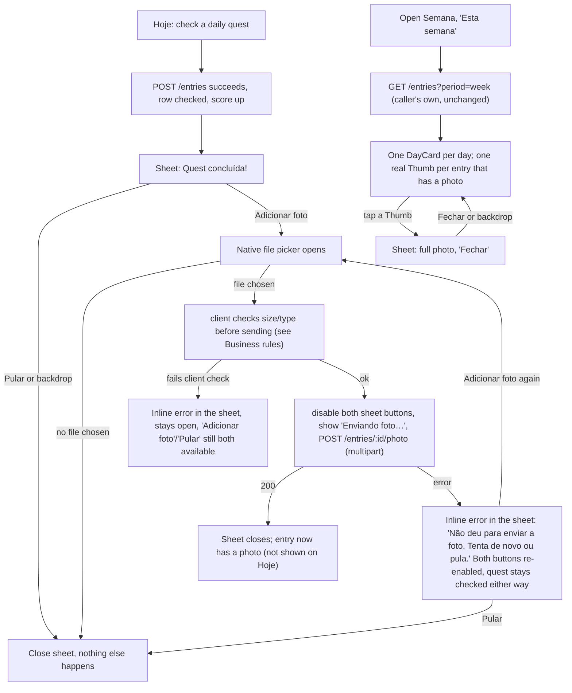

# Quest photo uploads: optional proof photo on Hoje, guild-visible thumbnail on Semana

Status: Ready
Last updated: 2026-10-10
Depends on: [`quest-entries.md`](./quest-entries.md) (Ready, real `entries` table/aggregate already implemented on disk) — this spec extends the existing `entry.Entry` aggregate instead of creating a new one. Also supersedes `quest-entries.md`'s Non-goal "Persisting photos" (that spec deliberately kept the photo sheet client-only/in-memory; this spec is what makes it real).

## Summary
After checking off a daily quest on Hoje, a member can optionally attach a photo as proof. The photo uploads through the back-end to Cloudinary (the back-end holds the Cloudinary credentials; the browser never talks to Cloudinary directly) and is saved on that quest's `Entry` row. Semana's "Esta semana" day cards show a tappable thumbnail for every entry that has a photo, using the `Thumb`/`DayCard` components that already exist for exactly this purpose. Skipping the photo (or a failed upload) never undoes the already-logged completion — the photo is always optional, never blocking.

## Problem
Today, per `front-end/README.md:45` and `front-end/app/(tabs)/hoje/page.tsx:135-141`, a photo attached after checking a quest is kept in a local `useState` only (`URL.createObjectURL(file)`), never sent anywhere. It disappears on reload, is invisible to anyone else, and `Semana`'s `DayCard` always renders `photos={0}` (`front-end/app/(tabs)/semana/page.tsx:94`) because there is nothing real to count. `quest-entries.md` (now shipped) explicitly deferred this ("Persisting photos... this spec does not change that"). There is no backend concept of a photo anywhere, and no third-party media storage is wired into the project at all (confirmed: no image/upload code exists outside that one in-memory `attachPhoto` stub; no Cloudinary or similar dependency in `back-end/go.mod` or `front-end/package.json`).

## Goals
- After checking a daily quest on Hoje, a member can optionally pick a photo from their device and have it actually persisted, surviving a reload.
- A photo is stored on the specific `Entry` it proves, keyed by that entry's id — not by rule, not by day.
- Semana's "Esta semana" day cards show a real thumbnail (not a placeholder) for every one of the caller's own entries that has a photo; tapping it shows the full photo.
- The underlying access rule is guild-scoped, not uploader-scoped: nothing in the data model, the API, or the Cloudinary configuration restricts who may ever retrieve a given entry's photo to "only the person who uploaded it" — the only real gate is "can this caller see this entry at all." Today that still means *only the entry's own member*, because Semana itself has no guild-wide view yet (confirmed with the user: ships self-scoped now, see Decision log #5); this spec's design is forward-compatible with a future guild-wide view without any rework.
- Skipping the photo, or an upload that fails, never affects the quest completion itself — the entry it would attach to already exists and already counts.

## Non-goals
- **Any icon or indicator on Hoje.** The optional-photo *prompt* (the "Quest concluída!" sheet with "Adicionar foto"/"Pular") still lives on Hoje, unchanged in position — but once a photo is attached, Hoje shows nothing new about it. (Explicit correction from the user during drafting: the resulting thumbnail belongs on Semana only.) This also means removing Hoje's current in-memory `meta="com foto"` row caption (`hoje/page.tsx:207`) — it was a stub for a feature that didn't exist yet; now that photos are real but Semana-only, that caption is actively misleading and must go.
- **Photos on slips ("deslize" entries).** The photo sheet only ever appears right after creating a `sum`-type (checklist) entry today (`hoje/page.tsx:99-133`); this spec keeps that exactly as is. A `decrease`-type entry can never have a photo attached — there is no UI path to it and the API rejects it (see Business rules).
- **Replacing or removing an already-attached photo.** One photo per entry, set at most once, forever. No "retake"/"remove photo" UI or endpoint. If someone attaches the wrong photo, the fix is the same as fixing a wrong quest completion today: nothing exists for that either (`quest-entries.md` has no edit endpoint); living with it or having an adult delete+recreate the rule's underlying day in some other way is out of scope here.
- **Multiple photos per entry.** Exactly zero or one.
- **Image moderation, cropping UI, filters, or any client-side editing.** The file picked (`accept="image/*" capture="environment"`, unchanged from today) is uploaded as-is; the backend only validates type/size and lets Cloudinary's own `eager` transform produce one delivery-sized variant (see Architecture) — no crop/rotate UI.
- **Cloudinary account/plan provisioning.** Creating the Cloudinary account and reading off its cloud name/API key/secret is a manual, one-time step for whoever implements this (see Prerequisites in Implementation plan), the same way Supabase/Fly/Vercel account creation is a manual prerequisite in `ci-cd-deploy.md`.
- **Updating `ci-cd-deploy.md`'s Fly secrets list.** That spec is already `Status: Ready` and is explicitly off-limits for edits in this task. The three new `CLOUDINARY_*` secrets this spec needs on Fly are called out in this spec's own Implementation plan/Notes instead — whoever runs the deploy must set them by hand in addition to what `ci-cd-deploy.md` already lists.
- **Retention/deletion of a photo when an account or guild is removed.** No account-deletion flow exists anywhere in the app yet; not solved here.
- **Widening Semana (or any other screen) into a guild-wide, multi-member activity feed.** Confirmed with the user: this spec ships the self-scoped slice (a member can only ever see their own entries' photos, exactly like every other field on Semana today) and explicitly defers "let any guild member browse any other member's week, including their photos" to a separate, larger follow-up spec — see Decision log #5 and Out of scope. That follow-up would need to redesign Semana's day cards to show *whose* entry each badge/photo belongs to (today only slip badges say "por X"; gain badges and photos would need the same treatment), which is materially bigger than "add an optional photo."

## Current state
- `back-end/internal/src/domain/entry/entry.go`: real, shipped `entry.Entry{ID, GuildID, RuleID, RuleName, ScoreType, Points, MemberID, LoggedBy, OccurredOn, PeriodKey, CreatedAt}`, `entry.New`, `entry.DateOnly`, `entry.WeekStart`. No photo field.
- `back-end/internal/src/infrastructure/postgres/migrations/`: `0001_users.sql` … `0006_entries.sql` all exist on disk. **`0006_entries.sql` is the real, already-applied migration for the `entries` table** — `quest-entries.md`'s own text still says "`0005`/`0006`, check at implementation time"; that has since resolved to `0006` for real. `0005_prizes.sql` is also real (from `prizes.md`). `profile-avatar.md` (Ready, not yet implemented) still says it needs "the next free number" — as of this writing that is **`0007`**, and this spec is claiming it. **Check the migrations folder again before naming this spec's file** — if `profile-avatar.md` lands first, this spec's migration becomes `0008`.
- `back-end/internal/src/app/service/entry_service.go`: real, shipped `EntryRepository` interface (`Create`, `Get`, `Delete`, `ListByMember`) and `EntryService.Create/Delete/List`, reusing `RuleRepository`/`GuildRepository`/`IDGenerator`/`Clock` already declared in `rule_service.go`, plus a `*time.Location` for `America/Sao_Paulo` built once in `main.go`.
- `back-end/internal/src/infrastructure/postgres/entry_repository.go`: real, shipped `EntryRepository{pool}` over the `entries` table (columns: `id, guild_id, rule_id, rule_name, score_type, points, member_id, logged_by, occurred_on, period_key, created_at`).
- `back-end/internal/src/interface/http/controllers/entry_controller.go`: real, shipped `EntryController{List, Create, Delete}`, `EntryResponse`, `writeEntryError`.
- `back-end/cmd/webapp/routes/routes.go` / `main.go`: `/entries` (`GET`, `POST`, `DELETE /:id`) already registered and wired exactly as `quest-entries.md` specified.
- `back-end/go.mod`: no Cloudinary SDK, no multipart/upload library beyond what `net/http`/Gin already provide. Gin's `(*gin.Context).FormFile`/`MultipartForm` already handle `multipart/form-data` parsing out of the box — no new parsing dependency needed, only a Cloudinary client.
- `front-end/app/(tabs)/hoje/page.tsx`: real, shipped. `attachPhoto(file)` (`:135-141`) does `URL.createObjectURL(file)` into a local `photos: Record<string, string>` state, keyed by the just-created entry's id (`justChecked`), then clears `justChecked`. `QuestRow`'s `meta` for a done quest (`:207`) reads that same local map to show `"com foto"`. The hidden `<input type="file" accept="image/*" capture="environment">` (`:252`) already exists and already fires `attachPhoto` on change — this spec changes what `attachPhoto` *does*, not the input itself.
- `front-end/app/(tabs)/semana/page.tsx`: real, shipped, strictly self-scoped — `listEntries("week")` (`front-end/lib/api.ts:74`) returns only the caller's own entries (back-end's `ListByMember` is hardcoded to `callerID`, per `quest-entries.md`'s Business rules 7-8 and `scoreboard.md`'s own confirmation that "Esta semana"/"Anteriores" stay untouched/self-scoped). `DayCard`/`Thumb` (`front-end/components/ui.tsx:210-236`) already exist and already take a `photos` count, rendering one placeholder `Thumb` (no `src`, so it shows the `image` icon) per unit — today always called with `photos={0}` (`semana/page.tsx:94`) because nothing real exists yet.
- `front-end/lib/api.ts`: real, shipped `Entry`/`EntryList`/`listEntries`/`createEntry`/`deleteEntry`. `apiFetch<T>` (`:32-45`) always sets `Content-Type: application/json` and `JSON.stringify`s its body — it cannot send a file as-is; a sibling helper is needed for multipart bodies (see Architecture).
- No `AGENTS.md`-relevant Next.js API changes: both touched front-end files stay `"use client"` components doing `fetch`-based calls exactly like `regras/page.tsx`/`hoje/page.tsx`/`semana/page.tsx` already do. No new routing, server actions, metadata or caching behavior — no `node_modules/next/dist/docs/` citation needed beyond what's already established.
- **Cloudinary free tier** (confirmed via Cloudinary's own billing documentation, updated 2026-05-28, and corroborated by a third-party cost breakdown): the no-credit-card free plan grants **25 credits/month**, where "1 credit" is interchangeably ~1,000 transformations, 1 GB of managed storage, or 1 GB of delivered bandwidth from one shared pool — more than enough headroom for a 4-person household's occasional proof photos, as long as delivered images are transformed down to a sane size (see Architecture) rather than served at full phone-camera resolution. Crossing the quota doesn't cut off service immediately (warnings start around 90%); there is no documented hard rate limit specifically on the Upload API (the only published API-specific limit found is on the unrelated Admin API, 500 req/hour on free plans — irrelevant here, this spec never calls the Admin API).

## User stories
- As a guild member who just checked off a quest, I want to optionally attach a photo as proof, so that it's recorded, not just trusted on my word.
- As a guild member who doesn't want to bother with a photo, I want "Pular" to work exactly as it does today, so that the game never feels like homework.
- As a guild member looking at Semana, I want to see a real thumbnail for any day I actually attached a photo, so that the "com foto" claim is backed by something real, not a placeholder.
- As a guild member, I want a failed upload to never cost me the points I already earned, so that a flaky connection can't undo real progress.

## UX flow



### Screen: Hoje — photo sheet (same sheet, new behavior only)
- **Unchanged**: the sheet's shape, its two same-size actions ("Adicionar foto" / "Pular"), the confetti, the points shown — exactly as `quest-entries.md`/today's code already builds it. The only thing that changes is what happens after a file is actually chosen.
- **Picking a file**: unchanged (`<input type="file" accept="image/*" capture="environment">`, still hidden, still triggered by "Adicionar foto").
- **Client-side pre-check** (new, before sending): if the chosen file's `type` isn't one of `image/jpeg`, `image/png`, `image/webp`, or its `size` exceeds 8 MB, show the inline error immediately without ever calling the API (`"Essa imagem não dá. Use jpg, png ou webp até 8 MB."`), sheet stays open, both buttons stay available.
- **Uploading** (new): both buttons disabled; the "Adicionar foto" button's label changes to "Enviando foto…" for the duration of the request (mirrors the busy-label pattern `prizes.md` already uses for "Salvando…").
- **Upload success** (new): sheet closes immediately — no new confirmation screen, no confetti repeat (BRAND: "two celebrations only," already spent on the check itself).
- **Upload failure** (new): inline `<p className="bq-note" role="alert">` inside the sheet: `"Não deu para enviar a foto. Tenta de novo ou pula."`; both buttons re-enabled; the member can either pick a file again (re-triggers the flow) or tap "Pular" to give up — **the already-created entry is never touched by this failure**, it stays checked and scored exactly as it was the instant `POST /entries` succeeded.
- **Primary action**: still none of these two buttons is more "primary" than the other — BRAND already established this sheet as "Adicionar foto"/"Pular" being the *same size*, and this spec doesn't change that.

### Screen: Semana — "Esta semana" day cards (new real thumbnails)
- **Unchanged**: everything about loading/error/empty states, the badges, the gained/lost split, the caller-only scope.
- **New**: `photos` is no longer always `0` — each `DayCard` receives the real list of that day's entries that have a photo (`sumEntriesWithPhoto`, always a subset of `sum`-type entries only — slips never have photos per Non-goals), rendered as one real `Thumb` per photo, `src` = that entry's `photoUrl`.
- **Tapping a thumbnail** (new): opens a `Sheet` showing that one photo at a larger size (`` with `object-fit: contain`, capped to a sensible max height so it doesn't overflow a 390px viewport) and nothing else interactive except the sheet's own backdrop-tap-to-close (no explicit "Fechar" button needed — BRAND has no precedent requiring one when the backdrop already closes every other sheet in the app the same way).
- **Primary action**: unchanged — Semana still has no primary button on this view.

## Copy (pt-BR)
| Key / location | Text |
| --- | --- |
| Hoje, photo sheet, invalid file (client-side) | Essa imagem não dá. Use jpg, png ou webp até 8 MB. |
| Hoje, photo sheet, uploading button label | Enviando foto… |
| Hoje, photo sheet, upload failed | Não deu para enviar a foto. Tenta de novo ou pula. |
| Semana, thumbnail `aria-label` (unchanged from `Thumb`'s existing one) | Foto de prova |
| Everything else on Hoje/Semana | Unchanged from `quest-entries.md`'s already-shipped copy. |

## Business rules
1. **A photo can only be attached to a `sum`-type entry, and only by that entry's own member** (`memberId === loggedBy === caller`, which for a `sum` entry is always true per `quest-entries.md`'s Business rule 3 — there is no case where someone else's id reaches this endpoint from the real UI, but the API enforces it regardless of client trust).
2. **A photo can only be attached on the same calendar day the entry was created** (`entry.OccurredOn == entry.DateOnly(now in America/Sao_Paulo)`), mirroring `quest-entries.md`'s Business rule 5 for deleting a `sum` entry — same reasoning: no "go back and add proof for yesterday" feature exists.
3. **At most one photo per entry, forever.** Once `photoUrl` is non-empty, any further attempt to attach a photo to that entry (even by its own owner, even with a different file) is rejected.
4. **A `decrease`-type entry (a slip) can never have a photo.** No UI path produces this; the API rejects it regardless.
5. **Allowed image types are exactly `image/jpeg`, `image/png`, `image/webp`; max size is 8 MB**, checked both client-side (fast feedback, no wasted upload) and server-side (the real enforcement — never trust the client).
6. **A failed or skipped photo upload never affects the entry it would have attached to.** The entry already exists (created by the earlier, separate `POST /entries` call) and already counts toward the score the moment that call succeeded; this endpoint only ever adds a photo to an entry that's already real.
7. **Retrieving an entry's `photoUrl` is gated only by "can this caller see this entry at all," never by "is this caller the one who uploaded it."** Today, that means only the entry's own member can see it (because `GET /entries` is itself caller-scoped, unchanged by this spec) — but nothing added here checks `loggedBy`/uploader identity on the read path, so this is ready for a future screen that shows other members' entries without any rework. Confirmed with the user: widening Semana into that future guild-wide screen is explicitly a separate follow-up spec, not part of this one (Decision log #5).
8. **Cloudinary delivery is unsigned** (a plain public `secure_url`, not Cloudinary's "authenticated"/signed-delivery asset type). The only real access control is "do you have a valid Boraquest session that can see this entry via the API" — the Cloudinary URL itself, once known, is reachable by anyone who has it (acceptable: these are household chore-proof photos, not sensitive content, and the URL's `public_id` is an unguessable entry id, not something enumerable from outside the API).

## Data model

### Backend (extends the existing `entry` package — no new aggregate)
```go
// back-end/internal/src/domain/entry/entry.go — additions

const (
	MaxPhotoBytes = 8 << 20 // 8 MB
)

var AllowedPhotoTypes = []string{"image/jpeg", "image/png", "image/webp"}

var (
	ErrPhotoNotAllowed = errors.New("entry: only a completed quest can have a photo")
	ErrPhotoNotOwn     = errors.New("entry: you can only add a photo to your own entry")
	ErrPhotoTooLate    = errors.New("entry: you can only add a photo on the same day")
	ErrPhotoExists     = errors.New("entry: this entry already has a photo")
	ErrInvalidPhoto    = errors.New("entry: image must be jpg, png or webp, up to 8MB")
)

// Entry gains two fields (both empty string = no photo):
//   PhotoURL      string // Cloudinary secure_url of the (transformed) delivery asset
//   PhotoPublicID string // Cloudinary public_id, kept for any future admin/cleanup tooling

// ValidatePhotoAttach checks every attach-time invariant that doesn't require
// talking to storage. It does not mutate e; the caller applies PhotoURL/PhotoPublicID
// itself once the actual upload has succeeded (see EntryService.AttachPhoto).
func (e Entry) ValidatePhotoAttach(callerID string, now time.Time) error {
	if e.ScoreType != rule.ScoreTypeSum {
		return ErrPhotoNotAllowed
	}
	if e.MemberID != callerID {
		return ErrPhotoNotOwn
	}
	if e.PhotoURL != "" {
		return ErrPhotoExists
	}
	if !e.OccurredOn.Equal(DateOnly(now)) {
		return ErrPhotoTooLate
	}
	return nil
}

// ValidPhotoFile reports whether contentType/size are acceptable for an attach.
func ValidPhotoFile(contentType string, size int64) bool {
	return slices.Contains(AllowedPhotoTypes, contentType) && size > 0 && size <= MaxPhotoBytes
}
```

### Frontend (extends the existing `Entry` type in `front-end/lib/api.ts`)
```ts
export type Entry = {
  id: string;
  ruleId: string;
  ruleName: string;
  scoreType: ScoreType;
  points: number;
  memberId: string;
  loggedBy: string;
  occurredOn: string;
  createdAt: string;
  photoUrl: string; // "" when no photo; added by this spec
};

export const uploadEntryPhoto = (id: string, file: File) => {
  const form = new FormData();
  form.append("photo", file);
  return apiFetchForm<Entry>(`/entries/${encodeURIComponent(id)}/photo`, form);
};
```

### New frontend helper (`front-end/lib/api.ts` addition, sibling to `apiFetch`)
```ts
async function apiFetchForm<T>(path: string, form: FormData): Promise<T> {
  const session = getSession();
  const headers: Record<string, string> = {};
  if (session) headers.Authorization = `Bearer ${session.token}`;
  // No Content-Type header: the browser sets the multipart boundary itself.
  const res = await fetch(`/api/v1${path}`, { method: "POST", headers, body: form });
  if (res.status === 401 && session) clearSession();
  if (!res.ok) {
    const data = (await res.json().catch(() => null)) as { error?: string } | null;
    throw new ApiError(res.status, data?.error ?? res.statusText);
  }
  return (await res.json()) as T;
}
```

### Diff against `front-end/lib/data.ts`
No changes. This spec touches no sample data.

## Architecture & technical decisions

### Upload path: back-end-proxied, not client-direct-to-Cloudinary
The browser uploads the file to the Boraquest API (`multipart/form-data`); the API validates it, forwards the bytes to Cloudinary using a server-held API secret, and only then saves the resulting URL on the entry. The browser never sees a Cloudinary credential and never talks to Cloudinary directly.
- **Why**: a signed-direct-upload alternative (sign a short-lived upload token server-side, let the browser upload straight to Cloudinary, then call a second "confirm" endpoint with the resulting URL) needs two round trips instead of one and, worse, means the "confirm" endpoint must *trust* whatever URL/public_id the browser hands back — which opens the door to a forged confirm call attaching an arbitrary external URL to any entry. Proxying keeps every invariant (ownership, same-day, one-photo-only, type/size) enforced server-side *before* any bytes ever leave the browser's control, in one request, with no separate trust-the-client step. For a 4-person household app's phone-camera-sized photos, the extra bandwidth through the Go API (always small, one requester at a time) is not a real cost.
- **DDD placement**: `interface/http/controllers/entry_controller.go`'s new handler only parses the multipart form and extracts the raw file/bytes/content-type — zero business logic. `app/service/entry_service.go`'s new `AttachPhoto` method does every validation and orchestrates the upload. `infrastructure/cloudinary/uploader.go` is a new adapter implementing an interface the app layer declares — it knows nothing about entries, guilds, or HTTP.

### Backend layering (new/changed files)
| Layer | File | Notes |
| --- | --- | --- |
| Domain | `back-end/internal/src/domain/entry/entry.go` | Add `PhotoURL`/`PhotoPublicID` fields, `MaxPhotoBytes`, `AllowedPhotoTypes`, the five new errors, `ValidatePhotoAttach`, `ValidPhotoFile` (Data model above). |
| App | `back-end/internal/src/app/service/entry_service.go` | Add `PhotoUploader` interface and `EntryService.AttachPhoto` (below). Extend the existing `EntryRepository` interface with `SetPhoto`. |
| Infrastructure | `back-end/internal/src/infrastructure/cloudinary/uploader.go` | New package. `CloudinaryUploader{cld *cloudinary.Cloudinary}` implementing `service.PhotoUploader`. |
| Infrastructure | `back-end/internal/src/infrastructure/postgres/entry_repository.go` | Add `SetPhoto` to the existing `EntryRepository` struct. |
| Infrastructure | `back-end/internal/src/infrastructure/postgres/migrations/0007_entry_photos.sql` (check the migrations folder for the real next free number at implementation time — see Current state) | `ALTER TABLE entries ADD COLUMN photo_url TEXT NOT NULL DEFAULT ''`, same for `photo_public_id`. |
| Interface | `back-end/internal/src/interface/http/controllers/entry_controller.go` | Add `UploadPhoto` handler, parsing `c.Request.FormFile("photo")`; extend `EntryResponse` with `photoUrl`; extend `writeEntryError`'s mapping. |
| Routes | `back-end/cmd/webapp/routes/routes.go` | Add `entries.POST("/:id/photo", c.Entries.UploadPhoto)` inside the existing `/entries` group (already `RequireAuth`-guarded — no new middleware). |
| Wiring | `back-end/cmd/webapp/main.go` | Read `CLOUDINARY_CLOUD_NAME`/`CLOUDINARY_API_KEY`/`CLOUDINARY_API_SECRET` (all required, `log.Fatal` if any is unset — same pattern as `JWT_SECRET`); construct `cloudinary.NewUploader(...)`; pass it into `service.NewEntryService(...)` alongside the existing arguments. |

```go
// back-end/internal/src/app/service/entry_service.go — additions

// PhotoUploader uploads image bytes to external storage and returns a public
// delivery URL plus a storage-specific identifier (opaque to the app layer).
type PhotoUploader interface {
	Upload(ctx context.Context, folder, publicID, contentType string, file io.Reader) (url, storedID string, err error)
}

// EntryRepository gains:
//   SetPhoto(ctx context.Context, guildID, id, photoURL, photoPublicID string) (entry.Entry, error)
//   // Atomically sets the photo only if none is set yet (WHERE photo_url = '').
//   // Returns entry.ErrNotFound if id doesn't exist in the guild, or
//   // entry.ErrPhotoExists if a photo was already set (lost a concurrent race).

func (s *EntryService) AttachPhoto(ctx context.Context, callerID, id string, contentType string, size int64, file io.Reader) (entry.Entry, error) {
	g, err := s.guilds.FindByMember(ctx, callerID)
	if err != nil {
		return entry.Entry{}, err
	}
	e, err := s.entries.Get(ctx, g.ID, id)
	if err != nil {
		return entry.Entry{}, err // entry.ErrNotFound
	}
	now := s.clock.Now().In(s.loc)
	if err := e.ValidatePhotoAttach(callerID, now); err != nil {
		return entry.Entry{}, err
	}
	if !entry.ValidPhotoFile(contentType, size) {
		return entry.Entry{}, entry.ErrInvalidPhoto
	}
	url, storedID, err := s.photos.Upload(ctx, g.ID, e.ID, contentType, file)
	if err != nil {
		return entry.Entry{}, err
	}
	return s.entries.SetPhoto(ctx, g.ID, e.ID, url, storedID)
}
```

```go
// back-end/internal/src/infrastructure/cloudinary/uploader.go (sketch)
package cloudinary

import (
	"context"
	"io"

	"github.com/cloudinary/cloudinary-go/v2"
	"github.com/cloudinary/cloudinary-go/v2/api/uploader"
)

type Uploader struct{ cld *cloudinary.Cloudinary }

func New(cloudName, apiKey, apiSecret string) (*Uploader, error) {
	cld, err := cloudinary.NewFromParams(cloudName, apiKey, apiSecret)
	if err != nil {
		return nil, err
	}
	return &Uploader{cld: cld}, nil
}

func (u *Uploader) Upload(ctx context.Context, folder, publicID, contentType string, file io.Reader) (url, storedID string, err error) {
	res, err := u.cld.Upload.Upload(ctx, file, uploader.UploadParams{
		Folder:         "boraquest/" + folder + "/entries",
		PublicID:       publicID,
		Overwrite:      boolPtr(false), // defense in depth; the DB's WHERE photo_url='' is the real guard
		UniqueFilename: boolPtr(false),
		Eager: []uploader.Eager{{
			Transformation: "w_1600,h_1600,c_limit,q_auto", // caps storage/bandwidth credits, see Current state
		}},
	})
	if err != nil {
		return "", "", err
	}
	deliveryURL := res.SecureURL
	if len(res.Eager) > 0 {
		deliveryURL = res.Eager[0].SecureURL
	}
	return deliveryURL, res.PublicID, nil
}
```

`entry_controller.go`'s `writeEntryError` mapping gains:
| Domain error | HTTP status |
| --- | --- |
| `entry.ErrPhotoNotAllowed` | 403 |
| `entry.ErrPhotoNotOwn` | 403 |
| `entry.ErrPhotoTooLate` | 403 |
| `entry.ErrPhotoExists` | 409 |
| `entry.ErrInvalidPhoto` | 400 |
| multipart form missing a `photo` file | 400 |

### Postgres (`0007_entry_photos.sql` or next free number — see Current state)
```sql
-- +goose Up
ALTER TABLE entries ADD COLUMN photo_url TEXT NOT NULL DEFAULT '';
ALTER TABLE entries ADD COLUMN photo_public_id TEXT NOT NULL DEFAULT '';

-- +goose Down
ALTER TABLE entries DROP COLUMN photo_public_id;
ALTER TABLE entries DROP COLUMN photo_url;
```

`EntryRepository.SetPhoto` (mirrors the existing file's plain-query style):
```go
func (r *EntryRepository) SetPhoto(ctx context.Context, guildID, id, photoURL, photoPublicID string) (entry.Entry, error) {
	row := r.pool.QueryRow(ctx, `
		UPDATE entries SET photo_url = $3, photo_public_id = $4
		WHERE guild_id = $1 AND id = $2 AND photo_url = ''
		RETURNING `+entryColumns+`, photo_url, photo_public_id`,
		guildID, id, photoURL, photoPublicID)
	found, err := scanEntryWithPhoto(row)
	if errors.Is(err, pgx.ErrNoRows) {
		// Distinguish "never existed" from "lost the one-photo race" with one extra read.
		if _, getErr := r.Get(ctx, guildID, id); errors.Is(getErr, entry.ErrNotFound) {
			return entry.Entry{}, entry.ErrNotFound
		}
		return entry.Entry{}, entry.ErrPhotoExists
	}
	return found, err
}
```
(The second `Get` only runs on the rare 0-row path — effectively never in real traffic — so this isn't a meaningful extra-query cost.)

### Frontend
- `front-end/lib/api.ts`: add `apiFetchForm`, `uploadEntryPhoto`, extend `Entry` with `photoUrl` (Data model above).
- `front-end/app/(tabs)/hoje/page.tsx`: replace `attachPhoto`'s body. New local state: `photoBusy: boolean`, `photoError: string | null` (both reset whenever the sheet opens for a newly-checked entry). `attachPhoto(file)`:
  1. If no file, close the sheet (unchanged "Pular"/no-op-cancel path).
  2. Client-check `file.type`/`file.size` against the limits in Business rule 5; on failure, set `photoError`, keep the sheet open, return.
  3. Otherwise set `photoBusy = true`, call `uploadEntryPhoto(justChecked, file)`, on success replace that entry in `entries` state with the response (now carrying `photoUrl`) and close the sheet (`setJustChecked(null)`); on failure set `photoError` to the fixed copy string and leave the sheet open with `photoBusy = false`.
  Remove the `photos` in-memory state and the `meta={... "com foto" ...}` line entirely (Non-goals) — the row's `meta` for a done quest goes back to `undefined` always, matching every other `kind="done"` row style-wise (no information lost that wasn't already fake).
- `front-end/app/(tabs)/semana/page.tsx`: for each day, compute `const dayPhotos = dayEntries.filter(e => e.scoreType === "sum" && e.photoUrl)`; pass `photos={dayPhotos}` to `DayCard` (signature change below); add local state `viewingPhoto: string | null` for the full-size sheet, with a `<Sheet open={!!viewingPhoto} onClose={() => setViewingPhoto(null)}></Sheet>` block.
- `front-end/components/ui.tsx`: change `DayCard`'s `photos` prop from `number` to `{ id: string; url: string }[]`, and add an `onPhotoClick?: (url: string) => void` prop; render one `<Thumb key={p.id} src={p.url} onClick={onPhotoClick && (() => onPhotoClick(p.url))} />` per item instead of the current `Array.from({length: photos}, ...)`. Add an optional `onClick` to `Thumb` itself, rendering a `<button type="button" className="bq-thumb" ...>` instead of a plain `<span>` when `onClick` is passed (falls back to the current non-interactive `<span>` when it isn't, so any other future caller with a plain count — there is none today — still compiles). This is the one shared-component signature change in this spec; both of its call sites (only `semana/page.tsx` today) are updated in the same change.

## API / contracts

### `POST /api/v1/entries/:id/photo`
- **Auth**: required. Body: `multipart/form-data` with one file field named `photo`.
- **200**: the updated `EntryResponse` (now including `photoUrl`).
- **400**: no `photo` file in the form; or the file's content-type/size fails `entry.ValidPhotoFile` (`entry.ErrInvalidPhoto`).
- **403**: caller belongs to no guild; entry is `decrease`-type (`ErrPhotoNotAllowed`); entry belongs to someone else (`ErrPhotoNotOwn`); entry's `occurredOn` isn't today (`ErrPhotoTooLate`).
- **404**: no such entry in the caller's guild.
- **409**: the entry already has a photo (`ErrPhotoExists`), including the rare lost-race case.

### `EntryResponse` shape (changed — one new field)
```json
{
  "id": "…", "ruleId": "…", "ruleName": "Beber 2 L de água",
  "scoreType": "sum", "points": 10,
  "memberId": "lia", "loggedBy": "lia",
  "occurredOn": "2026-10-08", "createdAt": "2026-10-08T14:03:00Z",
  "photoUrl": "https://res.cloudinary.com/.../boraquest/familia/entries/<id>.jpg"
}
```
`photoUrl` is `""` on every existing `GET`/`POST /entries` response shape too (both already-shipped endpoints gain this field for free once `toEntryResponse` is updated — no separate opt-in).

Add the new `photoUrl` field to the existing `Entry` schema and a new `POST /entries/{id}/photo` (`multipart/form-data` request body) path to `back-end/api/openapi.yaml`, following the same `security: [bearerAuth: []]`/`components.responses.Error` conventions as the rest of `/entries`.

## Edge cases
| Case | Expected behavior |
| --- | --- |
| Member picks "Pular" | Nothing sent; entry keeps `photoUrl: ""` forever (no later retry UI exists, by design — matches "no edit/backdate" across the whole entries API). |
| Upload fails (network, Cloudinary error, backend 5xx) | Entry is untouched, already-earned points are untouched; inline error, member can retry or skip. |
| Member double-taps "Adicionar foto" | The sheet's buttons are disabled the instant the first file is chosen and the request starts (`photoBusy`), so a second tap before the first request resolves is a client-side no-op. |
| Two devices somehow race to attach a photo to the same entry (e.g. two tabs) | The DB `WHERE photo_url = ''` guard means only one write wins; the loser gets `ErrPhotoExists` (409) and the uploaded Cloudinary asset for the loser is simply orphaned (never referenced by any row) — an accepted, rare edge for a 4-person household, no cleanup job built for it. |
| Member tries to attach a photo to a `decrease` entry via a crafted request (no UI path does this) | 403, `ErrPhotoNotAllowed`. |
| Member tries to attach a photo to someone else's entry via a crafted request | 403, `ErrPhotoNotOwn`. |
| Member tries to attach a photo to a past day's entry | 403, `ErrPhotoTooLate`. |
| A 9 MB photo, or a HEIC/GIF/video file | 400 both client-side (immediate, no request sent) and server-side (if the client check is bypassed) — `entry.ErrInvalidPhoto`. |
| The rule behind the entry gets deleted after the photo was attached | Unaffected — exactly like every other field on an entry, the photo is a snapshot on the entry row, not tied to the live rule (`quest-entries.md` Business rule 6). |
| `CLOUDINARY_*` env vars missing at boot | `main.go` fails fast (`log.Fatal`), same pattern as a missing `JWT_SECRET` — the API never starts half-configured. |

## Accessibility, privacy & performance
- Accessibility: the new interactive `Thumb` keeps a real `aria-label="Foto de prova"`; its tap target should meet the 48px minimum (`.bq-thumb`'s existing CSS already sizes it as a square chip — confirm it's ≥48px at implementation time, bump the CSS if not, per BRAND). The full-photo sheet's `` has an empty `alt=""` (decorative — the meaningful label is already on the `Thumb` that opened it) per standard practice for a "view the real thing" image.
- Privacy: this is the first spec to store real, uploaded personal photos (potentially of minors, since the guild includes children — see `design/BRAND.md`'s framing of the whole app as kid-usable). The photo is guild-scoped and tied to a household chore ("I did this"), not posted anywhere public; Cloudinary's unsigned delivery URL (Business rule 8) means anyone who obtains the exact URL could view it without authentication, but the URL is never exposed outside the authenticated API response and contains no guessable pattern tying it to a real name beyond the entry id itself. No retention/deletion policy exists yet (Non-goals) — flagged, not solved.
- Performance: one multipart upload per photo, phone-camera sized (capped at 8 MB client+server), transformed down to a 1600×1600-max delivery asset by Cloudinary's `eager` transform to keep free-tier credit usage (Current state) low. No polling, no new heavy client-side work.

## Decision log
| # | Decision | Rationale | Alternatives rejected |
| --- | --- | --- | --- |
| 1 | Back-end-proxied upload (browser → Boraquest API → Cloudinary), not a client-direct signed upload | Keeps the Cloudinary API secret server-only; lets every invariant (ownership, same-day, one-photo-only, type/size) be enforced before any bytes leave the browser's control, in one request; avoids a "confirm" endpoint that has to trust a client-supplied URL | Signed direct-to-Cloudinary upload + a confirm call — fewer bytes through the Go API, but a materially weaker trust boundary and two round trips instead of one, for an app whose photos are small and infrequent |
| 2 | Extend the existing `entry.Entry` aggregate with `PhotoURL`/`PhotoPublicID`, no new `domain/photo` package | A photo has no independent lifecycle or identity beyond "belongs to exactly one entry, settable once" — the entry is already the right owning aggregate (same reasoning `scoreboard.md` used for *not* creating a package, applied in the opposite direction here: this does have real invariants, but they're invariants of accessing an existing entry, not of a new thing) | A `domain/photo` package referencing `entry_id` — adds a join/lookup for no behavior a flat field on `Entry` doesn't already give for free |
| 3 | One photo per entry, immutable once set; no replace/remove | Matches the product's existing "optional, add it or skip" framing exactly; an edit/replace flow is real scope with no product ask behind it yet | Allow replacing before a day ends — real flexibility, but a feature nobody asked for, and it reopens the "which Cloudinary asset is now orphaned" question for every replace, not just the rare race case |
| 4 | Icon/thumbnail lives on Semana only, never on Hoje | Explicit correction from the user during drafting — the completion + optional-photo prompt stays on Hoje (unchanged), but the resulting indicator that lets people *view* the photo is Semana-only | Also show a "com foto" indicator on Hoje (what today's stub code already does) — explicitly rejected by the user; removed as part of this spec (see Non-goals) |
| 5 | Access control for reading a photo is guild-scoped in principle (no uploader check on the read path), but this spec does not widen Semana into a guild-wide view — Semana stays self-scoped exactly as `quest-entries.md`/`scoreboard.md` already established | Smallest slice that is still internally consistent and forward-compatible: nothing added here would need to be reworked if a future spec adds a guild-wide activity view, since the photo field was never gated by uploader identity to begin with (confirmed by user) | Widen `GET /entries?period=week` (or add a new endpoint) to return every guild member's entries now, and redesign Semana's day cards to show whose entry each badge/photo belongs to — a materially bigger, separately-reviewable feature (new API scope, new per-badge "by X" UI for *every* entry not just slips, a decision about whether "Esta semana" becomes a shared household feed); explicitly deferred to a future follow-up spec, not part of this one |
| 6 | 8 MB max size, `image/jpeg`/`image/png`/`image/webp` only | Confirmed by user as-is; a modern phone photo is usually 2-6 MB, so 8 MB gives headroom without inviting an accidental multi-shot/video pick | No change proposed |
| 7 | `CLOUDINARY_*` env vars are required; the API fails fast (`log.Fatal`) at boot if any is missing, same pattern as `JWT_SECRET` | Confirmed by user; consistency with the existing `JWT_SECRET` convention, and a half-working photo feature is worse than a clear boot error | Degrade gracefully (feature simply unavailable) when unset, so a contributor without Cloudinary credentials can still run the rest of the app — rejected by the user in favor of consistency with `JWT_SECRET` |

## Implementation plan

### Prerequisites (manual, one-time, outside the codebase)
1. Create a Cloudinary account (free tier, no card required per Current state) and note its **Cloud name**, **API key**, **API secret** from the dashboard.
2. For local development, add `CLOUDINARY_CLOUD_NAME`, `CLOUDINARY_API_KEY`, `CLOUDINARY_API_SECRET` to `back-end/.env` (git-ignored) and document them in `back-end/.env.example` alongside the existing `SEED_USER_*`/`DATABASE_URL` entries.
3. For the deployed environment (per `ci-cd-deploy.md`, already Ready — do not edit that file): run `fly secrets set CLOUDINARY_CLOUD_NAME=... CLOUDINARY_API_KEY=... CLOUDINARY_API_SECRET=...` against the Fly app as an extra one-time step beyond what that spec's Prerequisites already list.

### Steps
1. **Backend dependency**: `go get github.com/cloudinary/cloudinary-go/v2` in `back-end/`. Done when `go.mod`/`go.sum` show the new module and `go build ./...` succeeds.
2. **Backend domain**: add the fields/constants/errors/`ValidatePhotoAttach`/`ValidPhotoFile` to `back-end/internal/src/domain/entry/entry.go` (Data model). Unit tests: every combination of `ValidatePhotoAttach`'s four checks (wrong score type, wrong caller, already has a photo, wrong day) returns the right error and the happy path returns `nil`; `ValidPhotoFile` accepts each allowed type at the size boundary (exactly `MaxPhotoBytes`) and rejects one byte over, a disallowed type, and a zero/negative size.
3. **Backend infrastructure — Cloudinary adapter**: new `back-end/internal/src/infrastructure/cloudinary/uploader.go` per Architecture. No unit test needed for the real network call itself (nothing to assert against a live third party in `make cover`'s scope) — covered instead by `EntryService.AttachPhoto`'s unit tests against a hand-written `PhotoUploader` fake (step 4) and, for a true end-to-end check, the manual verification in Test plan. *(Depends on step 1.)*
4. **Backend app service**: extend `EntryRepository` with `SetPhoto`; add `PhotoUploader` and `EntryService.AttachPhoto` to `back-end/internal/src/app/service/entry_service.go`. Unit tests with hand-written `EntryRepository`/`PhotoUploader` fakes covering: guild-not-member, entry-not-found, every `ValidatePhotoAttach` error, `ErrInvalidPhoto`, the uploader failing, and the happy path (uploader called with the right folder/publicID/contentType, repository's `SetPhoto` called with the uploader's returned URL/id). *(Depends on steps 2-3.)*
5. **Backend migration**: `back-end/internal/src/infrastructure/postgres/migrations/<next>_entry_photos.sql` (check the folder for the real next number — see Current state) exactly as in Architecture. Done when `make db-up && make run` boots cleanly and `SELECT photo_url, photo_public_id FROM entries LIMIT 1` works against an existing seeded row (defaulting to `''`).
6. **Backend infrastructure — repository**: add `SetPhoto` to `back-end/internal/src/infrastructure/postgres/entry_repository.go`; update `entryColumns`/`scanEntry` (or a parallel `scanEntryWithPhoto`) to include the two new columns everywhere an entry is read, so `photoUrl` is present on every existing `GET`/`POST /entries` response too. *(Depends on step 5.)*
7. **Backend interface + routes**: add `UploadPhoto` to `entry_controller.go` (parse the multipart file, call `AttachPhoto`, map errors per the new table); add `photoUrl` to `EntryResponse`/`toEntryResponse`; register `POST /entries/:id/photo` in `routes.go`. *(Depends on step 4.)*
8. **Backend wiring**: read the three `CLOUDINARY_*` env vars in `main.go` (fatal if any missing); construct the uploader and pass it into `NewEntryService`. Done when `make run` serves a successful `POST /api/v1/entries/:id/photo` for a real entry against a real (free-tier) Cloudinary account, and the resulting `GET /api/v1/entries?period=today` response shows the new `photoUrl`. *(Depends on step 7 and Prerequisites 1-2.)*
9. **Backend OpenAPI**: add `photoUrl` to the `Entry` schema and the new `POST /entries/{id}/photo` path (multipart request body) to `back-end/api/openapi.yaml`.
10. **Backend tests to 100%**: extend `back-end/test/unit/entry_test.go`/`entry_service_test.go`/`entry_controller_test.go` with the new cases from steps 2/4/7; add an integration test (`back-end/test/integration/entries_test.go` or a new file) that exercises `POST /entries/:id/photo` against a **fake/stub `PhotoUploader`** wired into the integration test server instead of a real Cloudinary call (the integration suite must not depend on live third-party network access or real credentials — wire a trivial in-memory fake that returns a deterministic fake URL, the same spirit as the testcontainers Postgres already used for the DB side). Done when `make lint && make cover` both pass at 100%. *(Depends on steps 1-9.)*
11. **Frontend API client**: add `apiFetchForm`, `uploadEntryPhoto`, extend `Entry` with `photoUrl` in `front-end/lib/api.ts`. *(Depends on step 9 for the final shape; can be stubbed earlier.)*
12. **Frontend shared component**: `DayCard`/`Thumb` signature changes in `front-end/components/ui.tsx` (Architecture).
13. **Frontend Hoje**: rewrite `attachPhoto` per UX flow/Architecture; remove the `photos`/`"com foto"` stub. *(Depends on step 11.)*
14. **Frontend Semana**: wire real `photos`/`onPhotoClick` into `DayCard`, add the full-photo viewing `Sheet`. *(Depends on steps 11-12; can be done in parallel with step 13.)*
15. **Manual verification**: per Test plan below, against a real (free-tier) Cloudinary account.

## Acceptance criteria
- [ ] Given a member just checked a daily quest, when the "Quest concluída!" sheet opens and they tap "Pular", then nothing is sent and the entry's `photoUrl` stays `""`.
- [ ] Given the sheet is open, when the member picks a valid jpg/png/webp under 8 MB, then `POST /entries/:id/photo` is called with that file, the button reads "Enviando foto…" while in flight, and on success the sheet closes with no error shown.
- [ ] Given the member picks a 9 MB file, or a non-image/disallowed-type file, then no request is sent and the inline "Essa imagem não dá..." message appears immediately.
- [ ] Given the upload request fails for any reason, when the response returns, then the inline "Não deu para enviar a foto..." message appears, both sheet buttons re-enable, and the entry's score/checked state on Hoje is completely unaffected.
- [ ] Given an entry already has a photo, when `POST /entries/:id/photo` is called again for it (by anyone, even its own owner), then the API returns 409 and the entry's existing `photoUrl` is unchanged.
- [ ] Given an entry is `decrease`-type, when `POST /entries/:id/photo` is called for it, then the API returns 403 regardless of who calls it.
- [ ] Given an entry belongs to a different member than the caller, when `POST /entries/:id/photo` is called, then the API returns 403.
- [ ] Given an entry's `occurredOn` is not today (in `America/Sao_Paulo`), when `POST /entries/:id/photo` is called for it by its own owner, then the API returns 403.
- [ ] Given a file with a disallowed content-type or over 8 MB reaches the server (client check bypassed), then the API returns 400 and no Cloudinary upload is attempted.
- [ ] Given a successful upload, when `GET /entries?period=today` or `?period=week` is subsequently called by that same member, then the entry's `photoUrl` reflects the real Cloudinary delivery URL.
- [ ] Given a signed-in member opens Semana "Esta semana" and one of their entries that day has a photo, then that day's `DayCard` shows a real `Thumb` with that photo as its background image (not the placeholder icon).
- [ ] Given the member taps that `Thumb`, then a sheet opens showing the full photo, and tapping the backdrop closes it.
- [ ] Given a day has zero entries with a photo, then that day's `DayCard` renders with no thumbnail row at all (same as today's `photos > 0` gate, just driven by a real, possibly-empty list instead of a hardcoded `0`).
- [ ] Given Hoje renders a checked quest that has a photo attached, then its row shows no "com foto" or any other photo-related indicator (Non-goal/Decision log #4) — Hoje's row rendering for a done quest is visually identical whether or not it has a photo.
- [ ] Given any of the three `CLOUDINARY_*` env vars is missing, when the API process starts, then it fails fast (non-zero exit, logged error) instead of starting in a broken state.

## Test plan
Back-end: extend `make test`/`make cover` per the Implementation plan (hand-written fakes for `PhotoUploader` everywhere except the one manual, real-Cloudinary check below), keeping the 100% coverage gate on `./internal/...` and `./cmd/webapp/routes/...`. Front-end: no automated test runner exists yet (unchanged); manual verification only, on a 390px viewport, **using a real free-tier Cloudinary account** (this is the one genuinely external-dependent check in this whole spec — everything else is covered by fakes):
1. Sign in as `lia@boraquest.dev`. On Hoje, check a daily quest; in the sheet, tap "Adicionar foto" and pick a real photo under 8 MB. Confirm "Enviando foto…" appears briefly, then the sheet closes with no error.
2. Open the Cloudinary dashboard's Media Library; confirm the photo actually landed under `boraquest/familia/entries/`.
3. Open Semana → "Esta semana"; confirm today's `DayCard` shows a real thumbnail of that exact photo (not the placeholder icon). Tap it; confirm the full photo opens in a sheet, and tapping the backdrop closes it.
4. Reload the page; confirm the thumbnail is still there (persisted, not in-memory).
5. Check a second daily quest and tap "Pular" in its sheet; confirm that entry shows no thumbnail on Semana.
6. Try picking an obviously oversized file (a multi-photo "Live Photo" export, or any file over 8 MB) in the sheet; confirm the inline size/type error appears immediately with no network request (check devtools' network tab).
7. With the back-end's `CLOUDINARY_API_SECRET` temporarily set to a wrong value (simulating a Cloudinary-side failure), attempt an upload; confirm the inline "Não deu para enviar..." error appears and the quest stays checked with its points intact; restore the correct secret afterward.
8. Confirm nowhere on Hoje (TopBar, the checked row, its `meta` caption) shows any indication that a photo exists — only Semana does.

## Out of scope / follow-ups
- Widening Semana (or any screen) into a guild-wide activity view so a member can see *another* member's photo — confirmed with the user as a separate, larger follow-up spec (new API scope, new per-entry "by X" UI on every badge, not just slips), analogous to how `quest-entries.md` deferred Guilda's all-members standings into `scoreboard.md`. This spec's access-control design (Business rule 7, Decision log #5) is forward-compatible with that follow-up and needs no rework when it ships.
- Replacing or removing an already-attached photo (Non-goals).
- Multiple photos per entry (Non-goals).
- Image moderation/review, or tying photo review into the still-deferred audit flow (`app/auditoria`) — `quest-entries.md` already deferred the whole audit flow; this spec doesn't touch it either.
- Retention/deletion policy for stored photos (Non-goals).
- A Cloudinary asset-cleanup job for the rare orphaned-upload race (Edge cases) — accepted debt, not solved here.

## Open questions
None. All three were confirmed by the user:
1. Ship the self-scoped slice now (a member only ever sees their own entries' photos, via their own Semana); widening to a guild-wide, multi-member Semana view is a separate, larger follow-up spec (Decision log #5).
2. 8 MB max size, jpg/png/webp only — kept as drafted (Decision log #6).
3. `CLOUDINARY_*` env vars are required; the API fails fast at boot if any is missing, matching `JWT_SECRET`'s pattern (Decision log #7).

## Notes for the implementing agent
- Do not start this spec's backend work until `quest-entries.md` is fully merged — every file this spec touches already exists for real, this is a pure extension, not a parallel build.
- Read `front-end/AGENTS.md` and `front-end/design/BRAND.md` before touching front-end files; read the root `CLAUDE.md` before touching back-end files (DDD layering, 100% coverage gate, `make lint`/`make cover`).
- Check the migrations folder for the actual next free number before naming this spec's migration file (`0007` as of this writing, assuming `profile-avatar.md` hasn't landed first — see Current state).
- The integration test for `POST /entries/:id/photo` must use a fake `PhotoUploader`, never a real Cloudinary call — `make cover` must not depend on live network access or real secrets being present in CI.
- `DayCard`'s `photos` prop type change (`number` → `{id, url}[]`) and `Thumb`'s new optional `onClick` are the only shared-component signature changes in this spec; grep for every existing call site before changing them (as of this writing, only `semana/page.tsx` calls `DayCard`, and no other file calls `Thumb` directly).
- Do not add anything to Hoje beyond what already exists today (the sheet itself) — the explicit, twice-repeated correction from the user during drafting was that the photo indicator is Semana-only.
